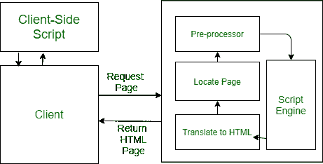

# 网页脚本及其类型

> 原文:[https://www.geeksforgeeks.org/web-scripting-and-its-types/](https://www.geeksforgeeks.org/web-scripting-and-its-types/)

在网页中创建和嵌入脚本的过程被称为**网页脚本**。脚本或计算机脚本是通常嵌入到网页中的命令列表，由某个程序或脚本引擎解释和执行。

*   脚本可以出于各种目的而编写，例如在本地计算机上实现过程自动化或生成网页。
*   编写脚本的编程语言称为脚本语言，今天有许多脚本语言可用。
*   常见的脚本语言有 [VBScript](https://www.geeksforgeeks.org/vbscript-introduction/) 、 [JavaScript](https://www.geeksforgeeks.org/javascript-tutorial/) 、 [ASP](https://www.geeksforgeeks.org/asp-full-form/) 、 [PHP](https://www.geeksforgeeks.org/php/) 、 [PERL](https://www.geeksforgeeks.org/perl-programming-language/) 、 [JSP](https://www.geeksforgeeks.org/introduction-to-jsp/) 等。

**文字类型:**
文字大致有以下两种类型:

网页脚本

**客户端脚本:**

1.  客户端脚本负责网页内的交互。客户端脚本首先在客户端下载，然后由浏览器(系统的默认浏览器)解释和执行。
2.  客户端脚本依赖于浏览器。即客户端浏览器必须启用脚本才能运行脚本
3.  当使用客户端交互时，使用客户端脚本。客户端脚本的一些示例用途可能是:
    *   从用户屏幕或浏览器获取数据。
    *   玩网络游戏。
    *   自定义页面在浏览器中的显示，无需重新加载或重新打开页面。
4.  这里有一些流行的客户端脚本语言 VBScript、JavaScript、超文本处理器(PHP)。

**服务器端脚本:**

1.  服务器端脚本负责在服务器端完成或执行任务，然后将结果发送给客户端。
2.  在服务器端脚本中，客户端使用哪个浏览器并不重要，因为所有的工作都是由服务器完成的。
3.  服务器端脚本主要用于将信息发送到服务器并在服务器端进行处理。服务器脚本的一些示例用途可以是:
    *   密码保护。
    *   浏览器定制(根据客户端浏览器的要求发送信息)
    *   表单处理
    *   构建/创建和显示从数据库创建的页面。
    *   动态编辑更改或添加内容到网页。
4.  这里有一些流行的服务器端脚本语言 PHP、Perl、ASP(活动服务器页面)、JSP ( Java 服务器页面)。