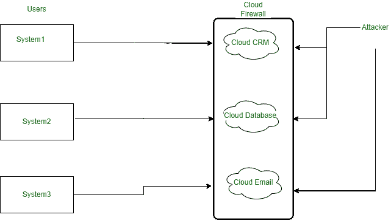

# 什么是云防火墙？

> 原文:[https://www.geeksforgeeks.org/what-are-cloud-firewalls/](https://www.geeksforgeeks.org/what-are-cloud-firewalls/)

A [防火墙](https://www.geeksforgeeks.org/introduction-of-firewall-in-computer-network/)是一款安全产品，主要功能是过滤掉未授权和恶意的流量，它们运行在可信和不可信的网络之间，即私有网络和互联网。这些防火墙阻止恶意网络，只允许授权流量绕过它们，这是通过管理员配置的一组规则指定的。

**云防火墙:**
云防火墙无非是部署在云中的防火墙，这些云防火墙形成了一个虚拟屏障，为了防止云中的恶意网络流量，它们的功能与传统防火墙相同，但唯一的区别是云防火墙托管在云平台上。

云防火墙作为一种安全产品，充当防护物，防止未经授权的网络流量，这种保护提供给不同的云组件，如云客户关系管理、云数据库、电子邮件云。

**云防火墙的需求:**
云防火墙在提供针对恶意和不想要的网络流量的安全性方面非常重要。云是虚拟空间的来源，虚拟空间存储了大量属于企业的关键数据，非常需要安全机制来保护它，因为防火墙已经在内部物理基础架构中取得了成功。
云提供商还为虚拟工作空间配置了强大的防火墙环境。

这些云防火墙的设计可以阻挡针对虚拟云工作区的网络攻击，并为[云组件](https://www.geeksforgeeks.org/features-components-of-private-cloud/)提供 24/7 的安全性，我们可以假设这些与守卫银行的安全卫士相同，这些虚拟工作区即云服务器可以被视为银行资产。

**云防火墙的类型:**
云防火墙大致分为两种类型，即:

1.  下一代防火墙
2.  SaaS 防火墙

这些解释如下。

**1。下一代防火墙(NGfw)–**
这些是云防火墙服务，旨在部署在数据中心，旨在保护组织的服务器 [*基础架构即服务*](https://www.geeksforgeeks.org/difference-between-iaas-paas-and-saas/) 或*平台即服务*模型。在这些模型中，部署了云防火墙软件，并在云操作中保护网络流量。

**2。SaaS 防火墙–**
这些防火墙的配置方式使得它们的主要工作是保护虚拟空间的网络，与传统防火墙相同，但唯一的区别是托管在云中。这些有各种其他名称和类型，如:

1.  **安全即服务–**
    这是 IT 行业中使用的一种业务模式，其中提供安全服务的责任由服务提供商承担，即客户根据其要求每月或每年订阅的任何第三方咨询公司。
2.  **SECaas–**
    它为用户提供互联网安全，提供免受网络攻击和威胁的保护，例如不断检查接入点以破坏网站的 DDOS。
3.  **软件即服务(SaaS)–**
    [软件即服务](https://www.geeksforgeeks.org/software-as-a-service-saas/)是 IT 中的一种业务交付模式，软件集中托管，用户通过有效的许可证使用，一般在[云计算](https://www.geeksforgeeks.org/cloud-computing/)中主要考虑 SaaS，用户通过 web 等瘦客户端访问这些 SaaS 应用，这可能包含各种软件，如办公软件、CAD 软件、开发软件、游戏化软件、银行软件等。
4.  **防火墙即服务(FWaaS)–**
    云服务器上托管的防火墙即服务云防火墙生态系统，在访问管理、身份管理、网址过滤、高级威胁防护、域名系统安全、入侵防御系统、域名系统安全方面提供第 7 层功能。FWaaS 使组织能够拥有-
    1。简化他们的信息技术基础设施
    2。从单一控制台集中管理消除了补丁程序管理的挑战
    3。策略管理
    4。协调整个组织中用户协调的停机窗口。

**云防火墙的工作方式:**
云防火墙的工作方式与传统防火墙相似，唯一不同的是云防火墙是在云环境中托管的。这些云防火墙的功能类似于包扫描防火墙，在包扫描防火墙中，它们在传入数据进入网络之前过滤掉这些数据，这涉及到评估云网络的活动连接，基于这些连接，防火墙将决定哪些包是安全的并且可以通过它，因此典型的云防火墙执行以下功能:

**包过滤:**
网络中的少量数据称为数据包。这些数据包在绕过防火墙之前会暴露给特定的一组过滤器，在防火墙中会针对某些威胁对数据包进行扫描，如果它们与这些威胁匹配，防火墙会阻止它们进入网络。

**代理服务:**
这些[代理服务](https://www.geeksforgeeks.org/proxy-server/)防止客户端设备和传入数据包之间的直接连接，从而保护网络区域免受未经授权的访问。

**状态检测:**
云防火墙还对传入的数据包进行状态检测，这些防火墙检查源和目的地之间的一些策略，以便在它们之间建立会话，如果所需的策略不在源和目的地之间，则不会提供访问，用户需要为它们注册新的策略。

云防火墙

**优势:**

1.  **部署和可扩展性–**
    云防火墙由于其自身的软件特性，易于扩展和部署，与部署在云上的传统防火墙相比，这些防火墙花费的时间非常少，对业务造成的中断也更少，并且非常易于维护。与传统防火墙不同的是，随着带宽的增加，防火墙具有无限的规模，防火墙会进行调整以保持对等性，因此企业无需担心网络中的流量大小。
2.  **访问和身份管理–**
    云防火墙旨在过滤不同租户和网络分区之间来自多个来源的流量，因此它们可以轻松区分机器人和人类，从而防止机器人攻击。它们控制访问管理和身份验证，以确保云服务器上的粒度控制。
3.  **更新–**
    防火墙设计有实时自动更新功能，可针对防火墙上启用的高级威胁过滤系统提供保护。
4.  **可用性–**
    云防火墙全天候可用，这在传统防火墙中是不可能的，因为云防火墙具有内置冗余(电力、暖通空调、网络)，因此它们可以随时应对任何类型的事故。

**缺点:**

1.  基于云的防火墙真的不知道访问者是谁，它们根据防火墙注册表中创建的策略盲目扫描数据包，如果攻击者设法创建了任何现有策略的假副本，那么他可以轻松地欺骗防火墙并绕过防火墙进入云网络。
2.  基于云的防火墙缺乏对站点如何真正运行、什么是基于软件的环境、谁是经过身份验证的用户以及需要什么权限的理解。
3.  由于这些防火墙遵循通用用例，它们可能无法检测到特定于软件的漏洞，如插件漏洞。
4.  云防火墙后面的站点依赖于防火墙服务提供商，如果服务中断，很可能会导致云网络中断。