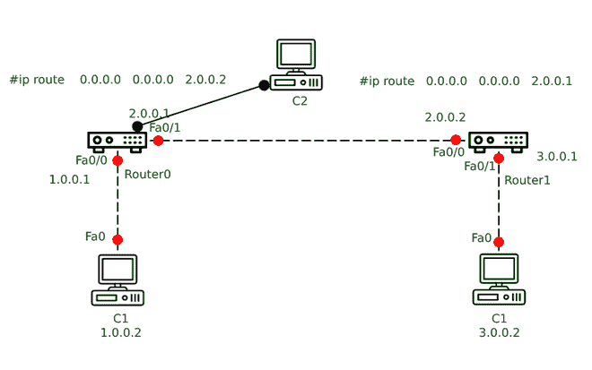

# 在保护思科路由器时使用了哪些不同类型的密码？

> 原文:[https://www . geeksforgeeks . org/不同类型的密码用于保护思科路由器/](https://www.geeksforgeeks.org/what-are-different-types-of-passwords-used-in-securing-cisco-router/)

密码是思科路由器访问控制方法的重要组成部分。这些用于限制对 CISCO 路由器的访问；由于路由器没有自动或默认的密码防御，因此使用了不同类型的密码，例如用于设置控制台端口密码的控制台密码、用于设置辅助端口密码的辅助密码、用于 SSH 和 Telnet 连接以及控制台端口的秘密密码、用于路由器中的 [Telnet 或 SSH](https://www.geeksforgeeks.org/telnet-and-ssh-in-cisco-devices/) 会话的启用密码或 Vty 密码。此外，可以在密码上设置特权[执行模式](https://www.geeksforgeeks.org/cisco-router-modes/)。



**密码类型:**
密码主要有五种:

1.  控制台密码
2.  辅助或辅助密码
3.  启用密码
4.  启用密码
5.  VTY 密码

这些解释如下。

**1。控制台密码:**
用于设置控制台端口密码，如果路由器的控制台上没有设置密码，默认情况下，用户可以使用访问用户模式。当配置了密码或写入了现有配置时，真正的加密过程随之而来。设置控制台端口密码至关重要，因为它可以防止有人连接、物理移动到路由器或进入用户模式等。由于路由器只有一个控制台端口，用户需要在全局配置模式下使用命令行控制台 0。

```
Router1# config t
Router1(config)# line console 0
Router1(config-line)# password MkcbDtGfRblw3#$577DF
Router1(config-line)# login
Router1(config-line)#exit
```

**2。辅助密码或辅助密码:**
辅助密码用于设置辅助端口的密码，该端口是路由器上的物理访问端口。辅助端口用于通过调制解调器访问路由器。不过，并非所有路由器都有这个端口。

```
Router1# config t
Router1(config)# line aux 0
Router1(config-line)# password MkcbDtGfRblw3#$577DF
Router1(config-line)# login
Router1(config-line)# end
```

**3。启用密码:**
启用密码是一个全局命令，用于限制对特权执行模式的访问。这些密码没有加密。这些通常用于更改路由器上的安全级别(从 0 级到 15 级)。不过，通常情况下，它用于从用户模式切换到特权模式。

```
Router1# config t
Router1(config)# enable password MkcbDtGfRblw3#$577DF
Router1(config)# exit  
```

**4。启用密码:**
它具有与启用密码相同的功能，尽管密码是以更安全的加密形式存储的。它分配 10.3 版和更新版本中可用的单向加密秘密密码。

```
Router1(config)# enable secret MkcbDtGfRblw3#$577DF
```

**5。Vty 密码:**
Vty 用于路由器中的 Telnet 或 SSH 会话。Vty 密码可以在控制台配置路由器时设置。用户可以随时更改这些密码。所有 vty 可以有一个密码，或者每个虚拟终端可以有不同的密码(即 vty 0–vty 4)。

```
Router1# config t
Router1(config)# line vty 0 4
Router1(config-line)# password MkcbDtGfRblw3#$577DF
Router1(config-line)# login
```

**例如**，通过服务密码加密命令加密所有文本密码:

```
Router1#show run
Building configuration...Current configuration:
976 bytes version 12.4 no service timestamps log datetime msec
no service timestamps debug datetime msec no service password-encryption!
hostname Router1
enable secret 5 $5$eWMd$Qxl6RCoPutSnLoBaR047N/
enable password dSFsvr433
username smdh password 0 dSFsvr43345
username btcan password 0 linux
username mtcan secret 5 $5$eWMd$Qxl6RCoPutSnLoBaafdefR047Ncs
username mmlel password 0 68445
interface FastEthernet0/0
ip address 1.0.0.1 255.0.0.0
duplex auto speed
auto!
Interface FastEthernet0/1
ip address 2.0.0.1 255.0.0.0
ip classless
ip route 0.0.0.0 0.0.0.0 2.0.0.2
password mmlel684
Login
line aux 0
password 684
login
!line vty 0 4
login local
```

现在，运行服务密码加密命令

```
Router1# config t
Router1(config)# service password-encryption
```

现在运行密码加密命令后检查状态。

```
Router1#show run
Building configuration...Current configuration: 926 bytes
version 12.4
no service timestamps log datetime msec
no service timestamps debug datetime msec
service password-encryption
hostname Router1
enable secret 5 $5$eWMd$Qxl6RCoPutSnLoBaR047N/
enable password 7 54893F4571269843
username smdh password 7 54893F457126984365E
username btcan password 7 548D93F457C12
username mtcan secret 5 $5$eWMd$Qxl6RCoPutSnLoBaafdefR047Ncs
username mmlel password 7 59531E1D5D8C
interface FastEthernet0/0
ip address 1.0.0.1 255.0.0.0 duplex auto
speed auto
!interface FastEthernet0/1
ip address 2.0.0.1 255.0.0.0
duplex auto
speed auto
ip classless
ip route 0.0.0.0 0.0.0.0 2.0.0.2
line con 0
password 7 01863D9A110A0D494078
login
line aux 0
password 7 02803W1F
login
line vty 0 4
login local
```

现在配置带有密码保护的 telnet。

```
Router1(config)# username mmlel password 68445
Router1(config)# username smdh password dSFsvr43345
Router1(config)#line vty 0 4
Router1(config-line)# login local
Router1(config-line)# exit
```

**提示:**

*   用户应该在所有路由器上使用服务密码加密。
*   用户应该确保密码是强密码。
*   所有路由器都应该有不同的密码。
*   应该始终从安全系统访问路由器。