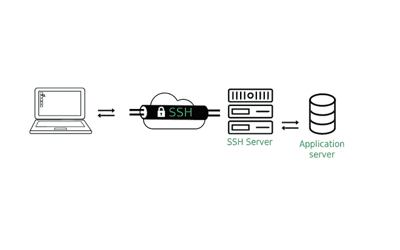
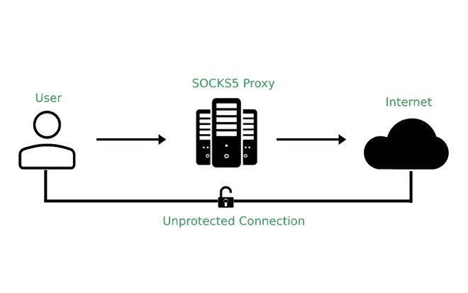

# socks 5 代理有什么好处？

> 原文:[https://www . geeksforgeeks . org/socks 5-proxy 的好处是什么/](https://www.geeksforgeeks.org/what-are-the-benefits-of-socks5-proxy/)

在计算机网络中，代理服务器是驻留在用户和服务器之间的计算机。它充当本地网络和大规模网络(如互联网)之间的网关或中间人。

**什么是 SOCKS？**
SOCKS 代表 Socket Secure 这是一种互联网协议，通过[代理服务器](https://www.geeksforgeeks.org/what-is-proxy-server/)在客户端和服务器之间交换网络数据包，通过[防火墙](https://www.geeksforgeeks.org/introduction-of-firewall-in-computer-network/)与服务器进行通信。SOCKS 旨在转发任何程序或协议产生的任何流量。

SOCKS 是 OSI 模型的第 5 层([会话层](https://www.geeksforgeeks.org/session-layer-in-osi-model/))协议，这意味着它不能用于隧道协议在第 5 层以下运行。由于在第 5 层使用，它可以处理来自第 5 层及以上的各种类型的请求，如 HTTP、FTP、HTTPS、SMTP、POP3 等。因此，SOCKS 可以用于网络浏览、电子邮件、文件传输等。

SOCKS 代理服务器代表客户端创建一个到防火墙后面的另一个服务器的 TCP 连接，然后它在客户端和实际服务器之间交换网络数据包。SOCKS 服务器接受 TCP 端口 1080 上的所有传入客户端连接。

**SOCKS 代理的类型:**

1.  SOCKS4 和，
2.  SOCKS5

SOCKS5 是 SOCKS 的最新版本。SOCKS5 和 SOCKS4 的主要区别在于 SOCKS5 支持 UPD 代理，而 SOCKS4 不支持。

**什么是 SOCKS5？**
SOCKS5 是 SOCKS 协议的改进和最新版本，SOCKS5 代理比 SOCKS4 更安全，因为它[建立了一个完整的 TCP 连接](https://www.geeksforgeeks.org/tcp-connection-establishment/)，它还使用 [SSH](https://www.geeksforgeeks.org/introduction-to-sshsecure-shell-keys/) 加密隧道方法来中继流量，即用户可以建立一个 SSH 隧道，通过加密通道在网络上发送他们的未加密数据。

SSH 隧道

**SOCKS5 的工作方式:**
SOCKS5 的工作方式是通过代理服务器路由互联网流量，代理服务器在到达目的地之前会生成一个随机的 IP 地址。它使用代理服务器通过随机的 IP 地址形成 TCP 或 UDP 连接。

*例如***–**假设用户的 IP 地址是 3.3.3.3，他们的流量是通过 IP 地址为 5.5.5.5 的 SOCKS5 代理路由的，那么目的地服务器会认为请求来自 SOCKS5 代理服务器。目标服务器将无法看到用户的原始 IP 地址。这就是隐藏位置的方法。

**socks 5 代理的好处:**

1.  **绕过地理限制–**
    有时，内容提供商会根据用户的地理位置限制他们的一些内容和服务。*例如*，你可以在不同的流媒体平台上找到各种各样的节目，这些节目可能在美国有，但在印度没有。它允许像网飞、Hulu、亚马逊 Prime 这样的网站根据地理位置限制他们的内容。因此，为了克服这一点，可以使用 SOCKS5 代理，该代理将使用内容所在国家的 IP 地址来更改 IP 地址。

2.  **规避互联网封锁–**
    网站会记录访问其网站的用户，有时甚至会将任何他们认为对其安全有潜在风险的用户列入黑名单(封锁用户的 IP)。比如在短时间内发送许多请求会让用户被列入黑名单。SOCKS5 代理可以帮助用户规避这些互联网屏蔽。因此，即使该 IP 地址被网站列入黑名单，用户也可以通过 SOCKS5 代理路由互联网流量来绕过该阻止，这将改变用户的 IP 地址。

3.  **更快更可靠的连接–**
    在较早版本的 SOCKS 代理中，使用了 TCP 协议，该协议要求客户端和服务器之间的安全连接，以确保所有数据包到达目的地时没有任何丢失，并且在另一端或目的地的顺序相同。SOCKS5 使用 UDP 协议广播数据包，不关注以相同顺序到达的数据包。因此，在 SOCKS5 中，连接更可靠，传输更快。

4.  **无流量、程序或协议约束–**
    与只能与 HTTP 和 HTTPS 一起工作的 HTTP 代理不同，SOCKS5 代理没有这样的限制或约束。因为 SOCKS5 是第 5 层协议，所以与第 7 层协议的 HTTP 代理相比，它没有那么具体和高级。因此，SOCKS5 代理可以处理各种程序或协议，如 FTP、HTTPS、SMTP 等。

5.  **SOCKS5 比 VPN 更快–**
    SOCKS 代理经常被误认为是 VPN。尽管虚拟专用网和 SOCKS 代理有许多相似之处，但有一点将它们区分开来，那就是加密。SOCKS5 代理会更改用户的 IP 地址，但不会像 VPN 那样加密数据。加密降低了速度，因为 SOCKS5 代理比虚拟专用网更快。

**结论:**
浏览互联网并不完全安全，现在人们越来越意识到保护自己的网络隐私和安全。一些恶意用户、政府或互联网服务提供商有可能正在监视或监视用户的活动。因此，保护在线活动免受这些类型的威胁对于安全浏览变得更加重要。因此，像 SOCKS5 这样的代理在保护用户免受这些威胁方面发挥着重要作用。