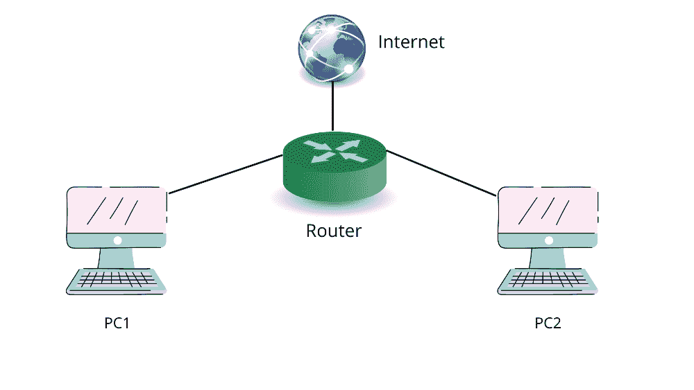

# 思科路由器中使用的内存有哪些不同？

> 原文:[https://www . geeksforgeeks . org/什么是思科路由器中使用的不同内存/](https://www.geeksforgeeks.org/what-are-the-different-memories-used-in-a-cisco-router/)

在讨论思科路由器中使用的内存之前，让我们先了解一下路由器的基本概念。

当我们想要将两个或多个 IP 网络或子网连接在一起时，就需要一个硬件，这个硬件被称为路由器。它通常有两个目的:

1.  允许多个设备使用单个互联网连接。
2.  通过将数据包转发到指定的 IP 地址，可以监控这些网络之间的流量。

PC1 和 PC2 连接到连接到互联网服务的路由器。

**路由器是如何工作的？**

每个数据包都有不同的目的地，并通过不同的路径到达目的地，这些数据包由路由器引导。路由器还确保每个数据包都成功传送到目的地，传输之间没有任何干扰。在路由协议 RIP(路由互联网协议)/OSPF(开放最短路径优先)的帮助下选择最佳路由。

路由器内部使用路由表，其中既存储静态地址(这些类型的地址由 ISP(互联网服务提供商)分配，并且这些类型的地址不会改变)，也存储动态地址(这些类型的地址是使用 DHCP(动态主机配置协议)分配的，并且这些地址会随着时间的推移而改变，它们不是固定的)。

**路由器中不同类型的存储器:**

**1。随机存取存储器(RAM)–**
路由器中的随机存取存储器类似于安装在我们的电脑、手机和笔记本电脑中的随机存取存储器。记录和档案管理分为两个领域:

*   *主处理器内存，*存储/保存与正在运行的路由器配置(我们当前正在运行的命令)、路由表和 ARP(地址解析协议)缓存相关的信息。
*   *共享输入/输出内存，*作为存储队列中数据包的临时存储内存。

每当路由器重新启动或重新启动时，存储在内存中的所有数据和信息都会被删除。数据被删除是因为内存中的所有信息都暂时存储在路由器中。我们可以将数据永久存储在 NVRAM 中。

**2。非易失性随机存取存储器(NVRAM) :**
NVRAM 用于存储启动配置文件。启动配置文件是思科路由器配置文件的副本，在路由器重启或重新启动后会保留下来。在非易失性随机存取存储器中，如果路由器重新启动或关闭，数据不会丢失，很容易恢复。如果我们想永久保存正在运行的配置文件，那么我们可以将这些文件从内存移动到非易失性内存。

**3。只读存储器:**
思科路由器的引导程序从只读存储器部分开始。只读存储器由开机自检和引导程序等编程指令组成。开机自检用于验证硬件组件(如中央处理器、内存和接口)是否正常工作。如果它们工作不正常，开机自检会发送一条错误消息。此后，引导应用程序用于设置路由器的中央处理器和引导功能。引导程序负责发现和加载路由器的操作系统。所有这些信息都保存/存储在只读存储器中，即使路由器关闭或重新启动，数据也会保留下来。

**4。闪存:**
这是一个可擦除可编程只读存储器芯片(EPROM)。在闪存中，路由器的操作系统，即 IOS(互联网操作系统)是可用的。与只读存储器不同，它很容易升级，不需要任何硬件改变。在闪存中，每当路由器关闭或重新启动时，内容都会保留下来。

**总结思科路由器中使用的不同内存–**

*   **RAM** 存储当前工作任务。
*   **启动配置发生的 NVRAM** 。
*   **只读存储器**，其中有开机自检和引导程序的信息。
*   以及**闪存**，其中存在路由器 IOS 的操作系统。