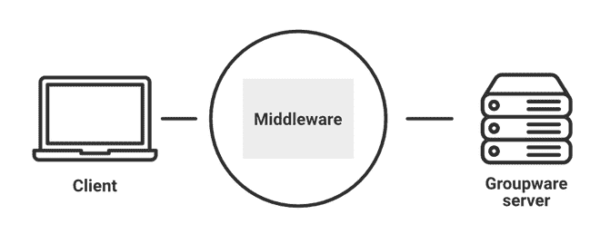

# 客户端服务器环境中中间件的两大类是什么？

> 原文:[https://www . geeksforgeeks . org/客户端-服务器环境中的两大类中间件是什么/](https://www.geeksforgeeks.org/what-are-the-two-broad-classes-of-middleware-in-client-server-environment/)

**服务器**:服务器是向其他计算机程序提供服务、数据、信息的计算机程序。

**客户端:**客户端是主机，向服务器请求服务或信息。客户端也被称为用户。在计算机系统中，客户机是一个向服务器请求信息的计算机程序，服务器将信息返回给客户机。

**中间件:**是帮助连接操作系统和应用的软件。或者是运行在客户端和服务器进程之间的软件。一般来说，这个软件的编写方式是用户永远不会注意到中间件的存在。它还有助于向用户提供安全透明的服务。

### 中间件服务的类型:

*中间件服务的不同类型有 RDA、RPC 和 MOM。*

*   **RDA:** 远程数据访问(RDA)，它实现了一个 RDA 协议，用于将数据操作语言语句发送到适当的数据库服务器进行处理，并将结果传输回调用进程。
*   **RPC:** 远程过程调用(RPC)。RPC 用于网络操作系统服务。
*   **MOM:** 面向消息的中间件(MOM)被用作存储和转发消息队列的机制。当客户端和服务器进程异步通信时，它会有所帮助。

### **中间件对**有用

1.  安全
2.  事务管理
3.  消息队列
4.  应用服务器
5.  网络服务器

### **中间件类型:**

1.  **面向消息的中间件:**它是一种基础设施，有助于通过分布式应用程序发送和接收消息/它有助于应用程序在不同平台上付费，并使创建软件应用程序的过程比许多操作系统和网络协议更简单。

2.  **面向对象中间件**:这个方法也叫对象请求代理。对象中间件使应用程序能够通过面向对象的系统发送对象和请求服务。对象中间件的主要用途是管理对象之间的通信。

3.  **远程过程调用(RPC)中间件:** RPC 用于通过远程调用过程来执行应用程序之间的同步或异步交互，在软件应用程序中使用。

4.  **数据库中间件:**允许直接交互访问数据库。市场上有许多数据库网关和连接选项，我们可以根据自己的需求选择任何人。它是包含 SQL 数据库软件的常见中间件类型之一。

### **中间件在客户端-服务器架构中的角色:**

中间件

1.  在客户机-服务器体系结构中，最重要的实体是客户机和浏览器。这种客户机-服务器体系结构中的一个问题是客户机可能是异构的。例如，考虑一下，我们的服务器是为一个餐厅管理案例设置的。在这种情况下，客户端请求可以来自移动应用程序、网络浏览器，甚至来自其他应用程序。所以我们的服务器应该通过分别服务不同类型的客户端来处理这个问题。
2.  此外，有时服务器需要与其他软件或实体进行通信。在这种情况下，为了将数据提供给客户端，服务器需要从其他应用程序获得一些帮助。这个帮助服务器提供一些帮助的应用程序被称为中间件。几乎所有的客户机-服务器架构师都将拥有中间件。在上面的例子中，(餐厅管理)客户端发送的数据应该存储在服务器中。对于数据的结构化存储和管理，我们将使用数据库。数据库管理系统是帮助我们的服务器处理数据的另一个中间件。
3.  同样，有多个中间件将执行单个操作来帮助服务器。

### **客户端-服务器**环境中的两大类中间件:****

**1。通用中间件:**

通用中间件是客户端-服务器环境中广泛的中间件类别之一，包括通信栈、分布式目录、身份验证服务、网络时间、RPC、排队服务以及网络操作系统扩展，如分布式文件和打印服务。打印服务和分布式文件服务也属于这一类别

*例如，*分布式计算环境是通用中间件的一个例子，其中一组通用的分布式服务可供应用程序使用。

分布式计算环境为支持分布式应用提供的主要服务有安全服务、RPC、时间服务、IDL 编译器、线程服务、目录服务。

**2。服务专用中间件:**

特定于服务的中间件是客户端-服务器环境中的另一大类中间件，需要实现特定的客户端/服务器类型的服务，包括:

1.  **数据库专用中间件**:允许直接访问数据结构，直接提供与数据库的交互。*比如*、ORACLE、SQL、ODBC 等。
2.  **OLTP 专用中间件**:是一种事务调度、消息队列的类型，客户端连接到中间件，再连接到数据库后端。*比如*，RPC，ATMI。
3.  **对象专用中间件**:有助于分布式对象的复用性和互操作性。*比如*、CORBA、微软 DCOM。
4.  **工作流管理中间件**:专注于客户端或服务器系统中的活动流管理。
5.  **互联网专用中间件**:是由 HTTP、S-HTTP、SSL 等工具组成的一种通信中间件。
6.  **面向消息的中间件**:作为存储转发消息队列的机制。当客户端和服务器进程异步通信时，它会有所帮助。