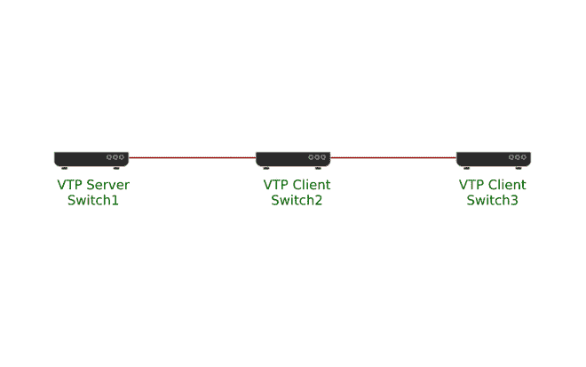

# 有哪些 VTP 模式？

> 原文:[https://www.geeksforgeeks.org/what-are-the-vtp-modes/](https://www.geeksforgeeks.org/what-are-the-vtp-modes/)

VLAN 中继协议是思科专有协议，用于通过思科交换机传送 VLAN 信息。通过 VTP，用户可以同步 VLAN 姓名、VLAN 身份证等 VLAN 信息；思科交换机在同一个域内。这些 VTP 域是一组集群交换机，具有相似的 VTP 域名、版本、密码和一些其他 VTP 设置。同一个域内的所有思科交换机相互共享其 VLAN 数据。

有三个 VTP 版本，即 V1、V2 和 V3。V1 和 V2 版本是相似的，除了 V2 支持令牌环虚拟局域网和 V3 是非常不同的，因为它增加了以下功能:

1.  V3 支持扩展的虚拟局域网(1006 到 4094)。而 V1 和 V2 只能广播虚拟局域网 1 到 1005。
2.  V3 支持二等兵 VLAN。
3.  V3 支持 VTP 主服务器和辅助服务器。
4.  它还支持增强的身份验证。
5.  V3 向后兼容 V1 和 V2。
6.  V3 能够基于每个端口进行配置。

**VTP 模式:**
用户可以将交换机配置为在以下任一 VTP 模式下工作:

1.  **服务器–**
    在 VTP 服务器模式下，用户可以制作 VLANs、修改、删除，还可以为整个域指定 VTP 修剪、VTP 版本等附加配置约束。这些服务器将它们的 VLAN 配置提升到存在于同一域中的其他交换机，并且它们还根据通过中继链路确认的通告，将它们的配置与其他交换机同步。VTP 的默认模式是服务器。
2.  **客户端–**
    VTP 客户端的行为方式与 VTP 服务器类似，尽管在这里用户不能更改、创建或删除虚拟局域网。
3.  **透明–**
    VTP 透明开关不参与 VTP。VTP 透明交换机不会升级其 VLAN 配置，也不会根据已确认的通知同步其 VLAN 配置，但是，这些交换机会传输从 VTP 版本 2 的中继端口接收的 VTP 通知。
4.  **VTP 模式关闭–**
    在上述三种模式中，一旦交换机进入管理域状态，就会确认并转发 VTP 公告。在关闭模式下，开关的工作方式与 VTP 透明模式下相似，但有一点不同，那就是 VTP 公告不会被转发。

当交换机处于透明模式或 VTP 服务器时，用户可以在 Catalyst 1900、2820 和 4500 系列交换机上配置虚拟局域网。当交换机处于透明模式或服务器模式时，用户可以使用管理信息库、命令行界面或控制台菜单来修改 VLAN 配置。

以 VTP 服务器模式配置的交换机通过其中继将 VLAN 配置提升到相邻交换机，并从这些相邻交换机处学习新的 VLAN 配置。用户还可以使用服务器模式，通过使用 CLI、VTP MIB 或控制台来添加或删除 VLAN 以及修改 VLAN 信息。例如，每当用户添加 VLAN，服务器和客户端都准备在其中继端口上接收流量时，VTP 就会推广新 VLAN。

随后，交换机自动切换到 VTP 客户端模式，转发公告并从公告中学习新数据。但是，用户不能通过控制台、命令行界面或管理信息库添加、修改或删除 VLAN。VTP 客户端不在非易失性存储器中保存 VLAN 信息；因此，它一启动，就通过从中继端口获取通知来学习配置。

在 VTP 透明模式下，交换机不会从网络中学习或升级 VLAN 配置。只要交换机处于透明模式，用户就可以通过命令行界面、管理信息库或控制台添加、修改或删除虚拟局域网。

**VTP 配置:**
交换 VTP 消息需要满足一些基本条件。

1.  两台交换机上的 VTP 域名应该相同。
2.  VTP 的版本应该是一样的。
3.  VTP 域密码应该相同。
4.  交换机应该配置为 VTP 客户端或 VTP 服务器。
5.  交换机之间应该使用中继链路。



VTP

在上图中，三个交换机通过中继链路连接。在交换机 1 上，将使用“vtp 域”命令配置 vtp 域名，并使用“VTP 密码”命令配置 VTP 密码。

```
Switch1(config)#vtp domain mlkjr
Changing VTP domain name from NULL to mlkjr
Switch1(config)#vtp password kjtmkcbb
Setting device VLAN database password to kjtmkcbb
```

现在将交换机 2 和交换机 3 配置为 VTP 客户端。

```
Switch2(config)#vtp mode client
Setting device to VTP CLIENT mode.
Switch2(config)#vtp domain mlkjr
Changing VTP domain name from NULL to mlkjr
Switch2(config)#vtp password kjtmkcbb
Setting device VLAN database password kjtmkcbb
```

```
Switch3(config)#vtp mode client
Setting device to VTP CLIENT mode.
Switch3(config)#vtp domain mlkjr
Changing VTP domain name from NULL to mlkjr
Switch3(config)#vtp password kjtmkcbb
Setting device VLAN database password kjtmkcbb
```

现在在交换机 1 上创建一个新的 VLAN，VTP 将被发送到交换机 2 和交换机 3，在交换机 2 和交换机 3 上自动创建一个新的 VLAN。

```
Switch1(config)#vlan 30
```

开关 2 和开关 3 将自动创建 VLAN 30。现在检查它是否已经创建。

```
Switch2#show vlan
VLAN     Name                                  Status             Ports
----     --------------------------------     ---------         -----------------------------
1         default                             active             Fa0/1, Fa0/2, Fa0/3, Fa0/4
                                                               Fa0/5, Fa0/6, Fa0/7, Fa0/8
                                                               Fa0/9, Fa0/10, Fa0/11, Fa0/12
                                                            Fa0/13, Fa0/14, Fa0/15, Fa0/16
                                                               Fa0/17, Fa0/18, Fa0/19, Fa0/20
                                                               Fa0/21, Fa0/22, Fa0/23, Fa0/24
2         Accounting                             active             Fa/05
30         VLAN0030                             active
1002     fddi-default                         act/unsup
1003     token-ring-default                     act/unsup
1004     fddinet-default                     act/unsup
1005    trnet-default                         act/unsup
```

现在检查开关 3

```
Switch3#show vlan
VLAN     Name                                 Status             Ports
----     --------------------------------     ---------         -----------------------------
1         default                             active             Fa0/1, Fa0/2, Fa0/3, Fa0/4
                                                            Fa0/5, Fa0/6, Fa0/7, Fa0/8
                                                            Fa0/9, Fa0/10, Fa0/11, Fa0/12
                                                            Fa0/13, Fa0/14, Fa0/15, Fa0/16
                                                            Fa0/17, Fa0/18, Fa0/19, Fa0/20
                                                            Fa0/21, Fa0/22, Fa0/23, Fa0/24
2         Accounting                             active             Fa/05
30         VLAN0030                             active
1002     fddi-default                         act/unsup
1003     token-ring-default                     act/unsup
1004     fddinet-default                     act/unsup
1005     trnet-default                         act/unsup
```