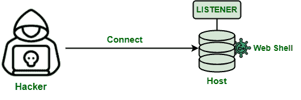
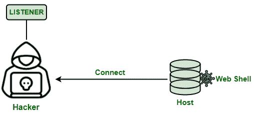
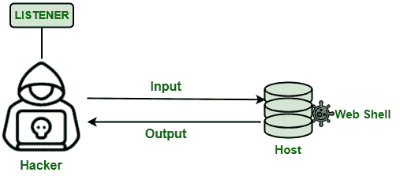

# 什么是网壳？

> 原文:[https://www.geeksforgeeks.org/what-are-web-shells/](https://www.geeksforgeeks.org/what-are-web-shells/)

网络外壳是一种恶意程序，用于在网络攻击期间远程访问网络服务器。这是一个类似外壳的界面，黑客使用它来访问通过一些预定义的网络钓鱼方法入侵的应用程序。web shell 本身并不能攻击整个调查，因此它总是在开发后阶段与其他技术结合使用。

它可以用任何服务器端编程语言编写，如 PHP 等。网络外壳现在越来越多地被使用，因为它们很难追踪，并且可以用于许多目的。

### **工作**

为了访问远程服务器，攻击者找到了一个交付 web shell 的位置。攻击者寻找系统中可以充当主机站点的漏洞，并在该位置提供 web shell。

一旦 web shell 成功交付，它就可以用来发出 shell 命令来执行所需的任务。攻击者可能能够上传、删除、下载和执行文件。

腹板壳通常用于:

*   使用水洞方法感染网站用户恶意软件，这是一种计算机攻击策略，攻击者猜测或观察组织经常访问的网站，并感染其中一个或多个网站。
*   通过不恰当地修改文件来丑化品牌。
*   [分布式拒绝服务(DDoS)攻击。](https://www.geeksforgeeks.org/denial-of-service-ddos-attack/)
*   在网络中传输无法通过互联网访问的命令。
*   充当用于攻击其他外部网络的指挥和控制基地。

### **网壳类型**

**1。绑定外壳:**绑定外壳是一种安装在目标设备上的外壳。它被绑定到主机上的某个端口，并侦听设备的传入连接。然后黑客可以远程访问这个 web shell，并使用它在目标主机上执行脚本。

绑定外壳

**2。反向外壳:**反向外壳也称为“连接-反向外壳”。黑客需要寻找一个远程命令执行漏洞，并利用它来交付 web shell。与 bind shell 不同，目标主机连接回黑客的设备，监听传入的连接。

反向外壳

**3。双反转壳:**双反转壳是反转壳的特例。目标主机连接回黑客的设备，该设备已经在监听传入的连接。然而，在这种情况下，有两个不同的端口连接回黑客的设备。输入和输出流量被分成两个不同的通道。

双反转外壳

### **黑客如何使用网页外壳？**

为了使用 web shell，攻击者首先会在系统中找到一个可以交付 web shell 的脆弱点。它们通常通过利用服务器或服务器配置的漏洞来安装。这可能包括:

*   应用程序、文件系统和服务中的漏洞。
*   远程文件包含(RFI)和[本地文件包含(LFI)](https://www.geeksforgeeks.org/local-file-inclusion-lfi/) 中的漏洞。
*   远程代码执行。
*   公开的管理界面。

一旦成功安装了 web shell，攻击者就可以使用它在目标主机上远程运行脚本，这可以让他访问存储在组织服务器中的敏感信息。

### **检测**

以下内容表明系统中可能存在 web shell–

*   非常高的服务器使用率(发生这种情况是因为黑客通常上传和下载大量数据)
*   文件上的时间戳错误。
*   服务器上存在外来文件。
*   名字可疑的文件。
*   服务器端日志中存在未知连接。

### **预防和缓解**

为了避免安装腹板外壳，可以采取以下预防措施:

*   **提示修补 web 服务器和插件漏洞:**思路是通过尽快修补来修复系统的漏洞。这将减少黑客利用的攻击面。
*   **减少插件的使用:**这样会减少系统的漏洞。减少插件的数量将减少服务器上潜在攻击面的数量。
*   **文件完整性监控:**这将持续监控存储在服务器端的文件，并删除无法识别的文件。由于 web shell 需要驻留在 web 服务器的代码目录中，因此，删除该文件会使其变得无用。
*   **恶意软件扫描/端点保护软件:**使用恶意软件检测软件扫描存储的服务器端文件，发现存储的恶意软件。然而，这种方法不太可靠，因为 web shell 脚本看起来像是一个真正的脚本。
*   **从源代码重新发布应用程序:**没有开发人员的帮助，在服务器端不可能对应用程序的代码库进行彻底的检查。因此，为了检测代码库中的意外文件，请在将它们从开发环境中完全清除后重新发布它们。
*   **网络分段防止横向移动:**通过隔离网段，避免黑客横向穿越访问整个网络。
*   **服务器配置审查和强化:**通过运行完整的服务器配置检查，识别和纠正应用服务器和操作系统中的漏洞。
*   **缓解远程文件包含(RFI)和本地文件包含(LFI)漏洞:**在发送用户输入数据之前验证该数据，以缓解远程文件包含(RFI)和本地文件包含(LFI)漏洞。
*   **部署防火墙:**使用专门的[防火墙](https://www.geeksforgeeks.org/introduction-of-firewall-in-computer-network/)，如[网络应用防火墙](https://www.geeksforgeeks.org/identification-of-web-application-firewall-using-wafw00f-in-kali-linux/) (WAF)，专门为防止网络外壳注入系统而设计。