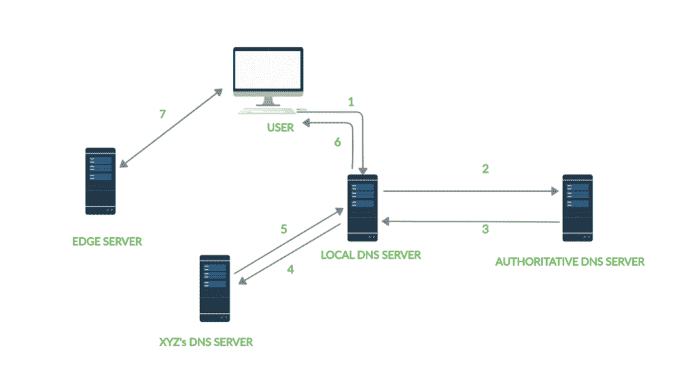
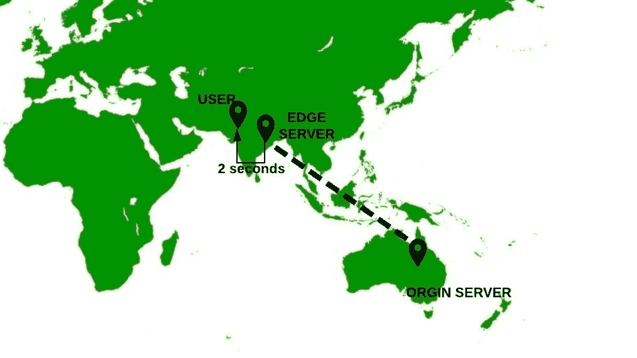

# 什么是内容分发网络，它是如何工作的？

> 原文:[https://www . geesforgeks . org/什么是内容分发网络及其工作原理/](https://www.geeksforgeeks.org/what-is-a-content-distribution-network-and-how-does-it-work/)

在过去的几年里，互联网用户的数量有了巨大的增长。仅 YouTube 在全球就有 20 亿用户，而网飞有超过 1.6 亿用户。将内容流式传输给如此广泛的用户群并不是一件容易的事情。人们可以认为，一个简单的方法是构建一个大型数据中心，将所有内容存储在服务器中，并提供给全球用户。但是当采用这种方法时会出现一些问题-

1.  首先，如果数据中心在美国，而用户在印度，那么内容的交付将会变慢。
2.  其次，单个数据中心代表单点故障。
3.  第三，如果一些内容经常从远程区域被访问，那么它很可能遵循相同的链接，这反过来导致带宽的浪费。

**CDN–内容分发网络或内容交付网络**是一种解决方案，可为分布在全球的用户提供更快的内容交付。
**什么是 CDN？**
CDN 本质上是一组战略性地分布在全球各地的服务器，目的是加速网络内容的交付。一个 CDN-

1.  管理地理上分布在不同位置的服务器。
2.  将网页内容存储在其服务器中。
3.  尝试将每个用户定向到作为 CDN 一部分的服务器，以便快速传递内容。

**CDN 是如何工作的？**
为了最大限度地缩短访问者与网站服务器之间的距离，CDN 会在多个地理位置(也称为存在点/持久性有机污染物)存储原始内容的缓存版本。每个 PoP 包含许多缓存服务器，称为边缘服务器，负责向其附近的访问者传递内容。CDN 一次在许多地方缓存内容，确保内容的快速传递。
**我们来考虑一个例子:**
假设你在托管一个网站，其中你的源服务器(包含你网站数据的主要来源的服务器，网站文件托管在那里)位于澳大利亚，XYZ 的一家公司为你提供 CDN 服务。
当印度用户点击您网站上的视频时，请求会转到用户的本地 DNS 服务器([参见 DNS](https://www.geeksforgeeks.org/domain-name-server-dns-in-application-layer/) )，该服务器会将请求转发到您网站的权威 DNS 服务器。
权威域名系统服务器随后识别出用户位于很远的地方，因此将请求转发到其 XYZ 的域名系统服务器。现在，域名系统查询进入 XYZ 的网络，该网络向本地域名系统服务器提供离用户最近的边缘服务器的地址。视频由该边缘服务器传送。
从这一点开始，本地 DNS 服务器知道边缘服务器的地址。因此，每当其网络内的用户从您的网站发送内容请求时，本地 DNS 服务器会将请求转发给边缘服务器。
由于持久性有机污染物位于用户附近，因此 CDN 将向用户浏览器传送数据所需的跳数降至最低。
**下图描绘相同:**

下图描述了使用和不使用 CDN 分别处理请求的不同之处:

**有 CDN(2 秒)**

**无 CDN(5 秒)**

**参考文献:**

1.  [https://en.wikipedia.org/wiki/Content_delivery_network](https://en.wikipedia.org/wiki/Content_delivery_network)