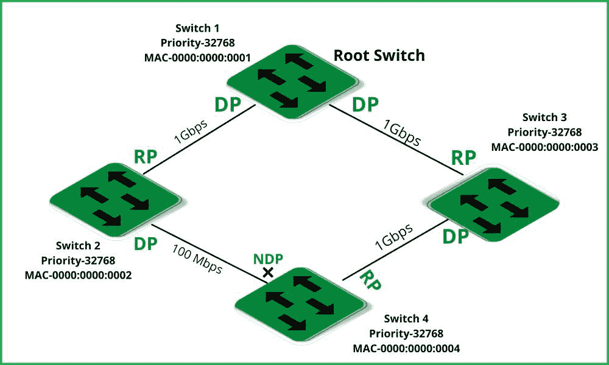

# 什么是指定港口？

> 原文:[https://www.geeksforgeeks.org/what-is-a-designated-port/](https://www.geeksforgeeks.org/what-is-a-designated-port/)

具有到根交换机的最佳路径的交换机被设置为转发。该交换机称为指定交换机，其端口称为指定端口。指定端口是局域网网段中路径开销最低的端口。每个网段都有一个称为单端口的端口，用于到达根交换机或根桥。

桥接设备配备有两个(或更多)端口。STP 根所在一侧连接的端口称为“根端口”“指定端口”是指不面向根，但以尽可能低的成本从另一个网段转发流量的端口。

**工作:**

*   根桥是交换机 1。
*   根端口是连接到根桥的端口，因此根桥上没有根端口。根桥上的每个端口都会转发，它们都是指定端口。
*   当交换机通电时，它们交换 BPDUs 并选择根桥作为它们要做的第一件事。在这种情况下，选择开关 1。
*   接下来，每台交换机必须确定到根桥的最短路径。我没有为这个图表中的每个环节添加费用，但是，根据上面的信息，
*   交换机 3 认为其与交换机 1 的直接连接成本最低，因此该链路上的端口成为 RP。
*   交换机 2 认为它与交换机 1 的直接连接是最便宜的，因此该链路上的端口成为 RP。
*   在交换机就根桥和各自的 RPs 达成一致后，它们现在必须找到其分配的端口。选定的端口负责将流量转发到网段。请考虑以下事项:
    *   RPs 通向根桥。
    *   DPs 是从根桥引出的路径。
    *   因为根桥没有任何阻塞端口，所以它的所有端口都是 DPs。

因此，图中唯一没有包括的其他部分是交换机 2 ->交换机 3。连接该网段的端口之一必须将流量转发到该网段；否则，该网段将永远收不到流量。但是它们不能同时转发，因为这会产生一个环路，即从交换机 1 发送的数据包会传送到交换机 3 ->交换机 2，然后返回到交换机 1，依此类推。

因此，交换机 2 和交换机 3 比较它们之间交付的业务流程图中该部分的价格，在本例中，其中一个交换机 3 的成本较低。它转发它的端口，将其转换为 DP。交换机 2 现在必须将其端口置于阻塞模式以中断环路。

**一些主要关键点:**

*   根成本最低的交换机被选为链路的指定交换机。
*   一台交换机可以有多个指定端口。
*   根桥(根交换机)上的所有端口都是指定端口。
*   如果局域网网段的一端是指定端口，而另一端不是根端口，则称为非指定端口(标记为 NDP)。
*   根端口永远不能是指定端口。
*   一个网桥只能有一个根端口(交换机)。一个网桥可能有许多指定端口(交换机)。