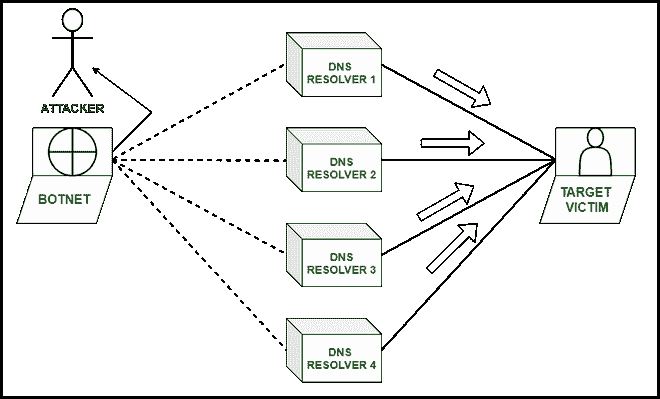

# 什么是 DNS 放大攻击？

> 原文:[https://www . geesforgeks . org/什么是-a-DNS-扩增-攻击/](https://www.geeksforgeeks.org/what-is-a-dns-amplification-attack/)

**DNS 放大攻击:**
在本文中，我们将了解 DNS 放大攻击以及如何预防。

域名系统放大攻击基本上是一种拒绝服务攻击。它使用不同的技术来攻击网络，方法是禁用网络，不允许合法用户使用网络。

为了发起 DNS 放大攻击，攻击者复制域并向服务器发送大量 DNS 查询，这导致服务器将查询响应的所有记录发送给攻击者，然后攻击者通过网络获得访问权限。例如，如果攻击者生成 10 MB 的 DNS 查询，那么服务器会发回 1 TB 的查询响应。

此后，服务器忙于处理查询和流量，无法向合法用户请求任何其他服务，攻击者最终以拒绝服务的方式完成任务。

域名系统放大攻击

**DNS 扩增:**

*   攻击者可以访问所有网络服务器，向服务器发送大量流量和查询，以阻止合法用户使用该站点。
*   攻击者在此攻击中使用的主要 ninja 技术是发送一个 DNS 查找请求，以打开源地址与目标地址欺骗的服务器。
*   当服务器发送对攻击者查询的响应时，它会直接发送到目标站点。攻击者然后向该站点的服务器发送更多请求，这产生了更多请求的倍增，称为**放大效应。**
*   攻击者能够通过大幅增加响应的大小而不是请求来增加目标站点的流量。
*   攻击者利用僵尸网络产生大量带有假冒身份证查询的域名系统地址，这有助于他们不费吹灰之力创建大量流量。
*   有时，很难避免这种放大攻击，因为服务器正在向攻击者发送合法信息。

**域名系统攻击的步骤:**

*   攻击者使用目标站点发送 UDP(用户数据报协议)来发送与受害者(目标)的真实 IP 地址相关的 IP 地址欺骗数据包。
*   UDP 数据包发送参数类型为“任意”的请求，以接收大量流量响应，从而使服务器保持繁忙。
*   服务器的域名解析器发送攻击者查询的响应，而这些响应又是对欺骗地址的大量响应。
*   被欺骗的 IP 地址接收那些具有大量流量的响应，从而导致拒绝服务。

**缓解域名系统攻击:**

*   使用第三方缓解服务有助于防止和解决域名系统攻击。
*   使用域名系统主动防火墙和恶意软件检测服务有助于提前检测这些攻击，并在防范攻击中发挥重要作用。
*   将网络服务器配置为仅处理来自特定允许人群的 DNS 请求。
*   减少域名解析器的数量将有助于仅回答来自组织内部和可信来源的域名查询，从而降低任何放大攻击的风险。
*   假冒 IP 地址的源 IP 验证有助于拒绝未知的 bot 流量，这些流量可能会危及整个 DNS 服务器。它有助于消除所有漏洞，因为它不允许未知的 IP 地址参与以后产生任何 DDoS 攻击。