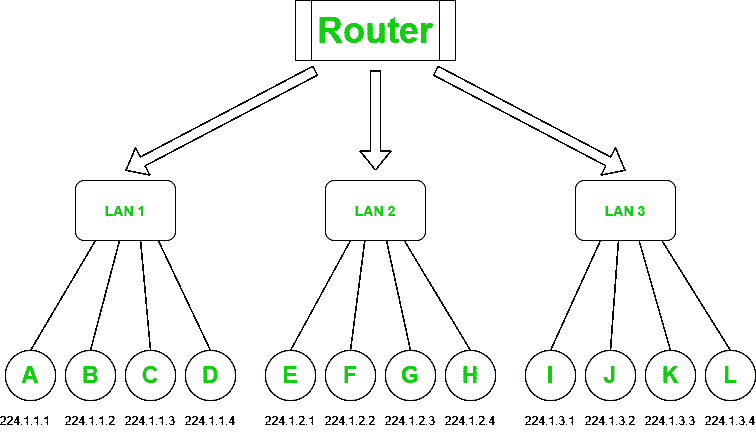
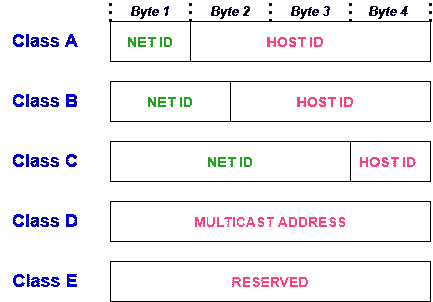

# 什么是网络地址？

> 原文:[https://www.geeksforgeeks.org/what-is-a-network-address/](https://www.geeksforgeeks.org/what-is-a-network-address/)

一个 [**计算机网络**](https://www.geeksforgeeks.org/computer-network-tutorials/) 是一组相互连接的计算机，它们共享网络节点上或由网络节点提供的相同或不同的资源。机器之间的这些共享或通信由一些规则或[网络协议](https://www.geeksforgeeks.org/network-protocols/)控制。这些计算机或机器由网络地址标识，并且可能有主机名。

网络地址是唯一标识电信网络中的主机或机器的逻辑或物理地址。网络也可能不是唯一的，可能包含网络中节点的一些结构和层次信息。互联网协议(IP)地址、媒体访问控制(MAC)地址和电话号码是网络地址的一些基本示例。在某些情况下，它可以是数字类型或符号类型，或者两者都有。

**网络寻址:**

网络层的主要职责是为网络中的不同节点分配唯一的地址。如前所述，它们可以是物理的或逻辑的，但主要是逻辑地址，即基于软件的地址。最广泛使用的网络地址是 IP 地址。它唯一标识 IP 网络中的一个节点。IP 地址是一个 32 位长的数字地址，以点-十进制符号的形式表示，其中每个字节都以十进制形式写入，用句点分隔。例如，196.32.216.9 是一个 IP 地址，其中 196 代表前 8 位，32 代表后 8 位，依此类推。IP 地址的前三个字节代表网络，最后一个字节指定网络中的主机。一个 IP 地址被进一步分成几个子类:

*   **A 类:**一个 IP 地址被分配给那些包含大量主机的网络。
*   **B 类:**一个 IP 地址被分配给从小规模到大规模的网络。
*   **C 类:**一个 IP 地址被分配给小规模的网络。
*   **D 类:** IP 地址为组播地址预留，不具备子网划分。
*   **E 类:**IP 地址用于将来的使用和研发目的，不具备任何子网划分。

一个 IP 地址分为两部分:

1.  **网络 ID :** 代表网络数量。
2.  **主机 ID :** 代表主机数量。

**分配网络标识的规范:**

1.  对于位于同一网络中的主机，共享相同的网络标识。
2.  它不能以 127 开头，因为 127 只被 a 类使用
3.  如果网络标识的所有位都设置为 0，则无法分配，因为它指定了本地网络上的特定主机。
4.  如果网络标识的所有位都设置为 1，则无法分配，因为它是为多播地址保留的。

**分配主机标识的规范:**

1.  它在任何网络中都必须是唯一的。
2.  如果主机标识的所有位都设置为 0，则无法分配，因为它用于表示 IP 地址的网络标识。
3.  所有位都设置为 1 的主机标识保留给多播地址。

**有类网络寻址:**

<figure class="table">

| **级** | **前导位** | **净标识位** | **主机标识位** | **网络数量** | **每个网络的地址** | **范围** |
| **A** | Zero | eight | Twenty-four | 2 7 | 2 24 | 0.0.0.0 至 127.255.255.255 |
| **B** | Ten | Sixteen | Sixteen | 2 14 | 2 16 | 128.0.0.0 至 191.255.255.255 |
| **C** | One hundred and ten | Twenty-four | eight | 2 21 | 2 8 | 192.0.0.0 至 223.255.255.255 |
| **D** | One thousand one hundred and ten | 未定义 | 未定义 | 未定义 | 未定义 | 224.0.0.0 至 239.255.255.255 |
| **E** | One thousand one hundred and eleven | 未定义 | 未定义 | 未定义 | 未定义 | 240.0.0.0 至 255.255.255.255 |

有关网络寻址和架构的更多信息，请参考本文。

</figure>