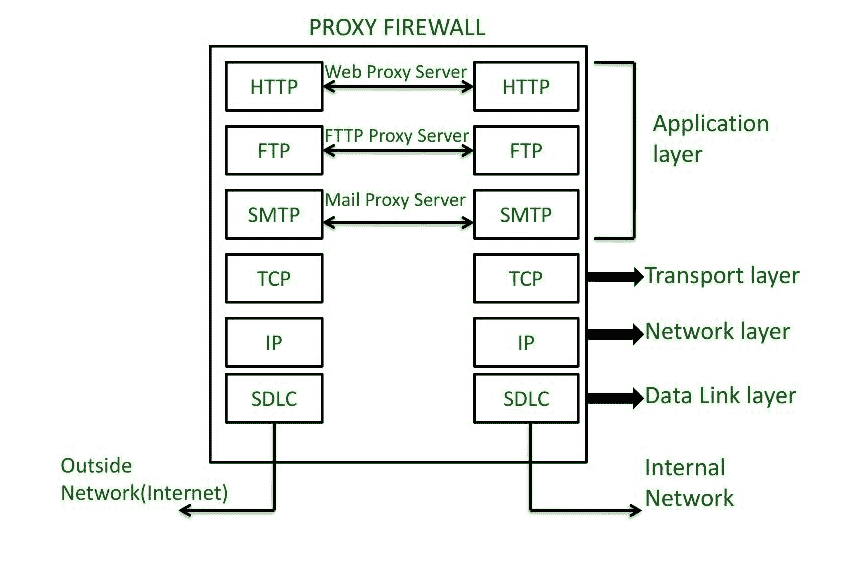

# 什么是代理防火墙？

> 原文:[https://www.geeksforgeeks.org/what-is-a-proxy-firewall/](https://www.geeksforgeeks.org/what-is-a-proxy-firewall/)

**先决条件:** [防火墙介绍](https://www.geeksforgeeks.org/introduction-of-firewall-in-computer-network/)

**简介:**
防火墙代理通过控制进出网络的信息来提供安全性。防火墙代理服务器过滤、缓存、记录和控制来自客户端的请求，以保持网络安全，防止入侵者和病毒。代理防火墙有自己的 IP(互联网协议)地址，因此内部网络永远不会与外部互联网直接连接。由于它在应用程序级别监控信息，因此也被称为应用程序防火墙。

**代理防火墙如何处理来自内部网络的请求:**

1.  代理防火墙充当可信内部网络和外部互联网之间的中介。
2.  如果内部网络中的计算机希望与外部互联网建立连接，它们首先与代理通信。
3.  然后，代理将数据从内部网络转发到互联网，并将从互联网接收的数据发送到内部网络。
4.  通过这种方式，代理防火墙保护内部网络免受外部互联网的入侵，并防止内部网络和互联网之间的直接连接。

**优势:**

1.  与面向数据包的防火墙相比，代理防火墙以更详细的方式分析支持的协议的数据流量。
2.  代理防火墙是最安全的防火墙类型，因为它们在应用程序级别工作。
3.  代理防火墙的主要优点是，在代理服务器防火墙的帮助下，它使用户能够以隐私的方式浏览互联网，允许他们将个人信息和浏览习惯保密。
4.  由于其良好的缓存结构，代理服务器经常被用来加速浏览和数据访问。

**缺点:**

1.  代理防火墙非常安全，但是它们通过限制您的网络可以处理的应用程序来牺牲功能。
2.  基于代理的防火墙并不兼容所有协议。
3.  代理防火墙的另一个主要缺点是延迟，在流量大的时候。延迟是用户试图从外部互联网访问信息时所经历的响应延迟。

**代理防火墙作为应用防火墙:**

1.  如前所述，代理防火墙在防火墙代理服务器的帮助下监控应用层的信息。代理防火墙服务器在防火墙上创建和运行进程，这些进程将服务镜像为在终端主机上运行。
2.  在应用层，有几种协议，如:HTTP(发送和接收网页的协议)、SMTP(互联网上电子邮件的协议)。代理服务器(如网络代理服务器)就像一个镜像 HTTP 服务工作的过程。类似地，文件传输协议代理服务器镜像文件传输协议服务的工作。
3.  为了避免内部网络和不受信任的外部网络之间的直接接触，代理服务器将双方会话转换为四方会话。然后，内部网络向服务器发出请求，请求由客户端的代理服务器转发到互联网服务器端的代理服务器，然后再转发到外部网络。这是代理防火墙提供的所有网络安全的基础。

**代理防火墙与传统防火墙的比较:**

1.  传统防火墙主要对进出网络的流量进行状态检测。代理防火墙比状态检测防火墙更进一步，不允许任何数据包在受保护的系统之间直接传输。
2.  在目的网络上，防火墙建立代理连接，然后通过它路由流量。在传统防火墙的情况下，不会创建这样的代理连接。
3.  代理防火墙主要工作在应用层，而传统防火墙工作在 TCP 模型的传输层和网络层。
4.  代理防火墙比传统防火墙贵得多，通常仅用于保护数据中心和高价值服务器。
5.  传统防火墙是旧的防火墙安全系统。代理防火墙是先进的防火墙安全系统。