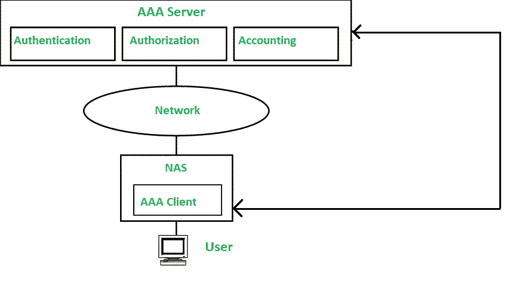

# 什么是 AAA(认证、授权和计费)？

> 原文:[https://www . geesforgeks . org/what-is-AAA-认证-授权-和-记账/](https://www.geeksforgeeks.org/what-is-aaa-authentication-authorization-and-accounting/)

**身份验证、授权和计费(AAA)** 是一个架构框架，用于访问计算机资源、实施策略、审核使用情况、提供服务计费所需的基本信息以及网络管理和安全所需的其他流程。这一过程主要用于使某些特定的合法用户能够访问网络和软件应用程序资源。AAA 概念被广泛用于参考网络协议 [RADIUS](https://www.geeksforgeeks.org/radius-protocol/) 。

**第一步:认证**
认证是识别用户的方法。在用户身份验证凭据的帮助下，它通过检查用户的凭据与网络数据库中存储的凭据是否匹配，来检查用户是否合法或者用户是否有权访问网络。认证通过后，用户可以访问网络的内部资源。

**授权**
用户要执行某些任务或向网络发出命令，必须获得**授权**。它决定了对网络的访问程度，以及通过身份验证的用户可以访问什么类型的服务和资源。授权是实施策略的方法。

**核算**
在这个阶段，衡量用户对系统资源的使用情况:登录时间、发送数据、接收数据、注销时间。记帐过程通过注销会话统计信息和使用信息来执行，用于授权控制、计费和资源利用。

**优势**

1.  AAA 框架增加了网络的可伸缩性:可伸缩性是系统通过向系统添加资源来处理越来越多的工作的属性。
2.  它提高了网络的灵活性和控制力。
3.  它有助于维护网络中的标准协议。
4.  RADIUS 允许每个用户拥有唯一的凭据。
5.  信息技术管理员将拥有用户和系统身份验证的中心点。

**缺点**

1.  在 RADIUS 服务器上，配置和初始设置可能既复杂又耗时。
2.  确定哪种 RADIUS 服务器软件和实施模式最适合您的组织是一个非常困难的选择。
3.  对于内部硬件来说，维护可能既困难又耗时。

**参考文献:**

1.  [https://en . Wikipedia . org/wiki/AAA _(computer _ security)](https://en.wikipedia.org/wiki/AAA_(computer_security))