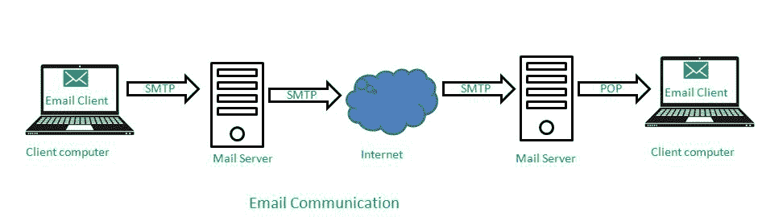

# 什么是电子邮件客户端？

> 原文:[https://www.geeksforgeeks.org/what-is-an-email-client/](https://www.geeksforgeeks.org/what-is-an-email-client/)

电子邮件(email)可以被定义为通过使用互联网通信系统来交换存储在计算机系统中的信息/消息的过程。电子邮件通常包含文本，但现在媒体和其他类型的文件也可以附加。当一封电子邮件被发送时，它会被送到一台远程计算机，比如电子邮件服务器，并被存储在那里，直到电子邮件的收件人上线并检查它。

发送和接收任何电子邮件都需要一个电子邮件地址，每个电子邮件地址由三部分组成:

1.  **用户名**:可以是任何东西，但不能遵循电子邮件提供商决定的指导方针。
2.  **域名/主机**:是邮件将存放的邮件服务器。可以是@gmail、@outlook 等。
3.  **域类型**:它告诉给定的电子邮件地址是否像商业一样。或教育类。edu 和其他一些定制类型。

*比如***是邮箱地址，它有三部分， **joy** 是用户名， **@gmail** 显示域名，**。com** 显示一个域类型。**

## **电子邮件系统**

**一个完整的电子邮件系统由三部分组成:**

1.  **电子邮件客户端**
2.  **邮件传输代理**
3.  **邮件递送代理**

### ****电子邮件客户端****

**电子邮件客户端也称为邮件用户代理。它实际上是一个人在他/她的计算机上发送和接收电子邮件的程序或应用程序。电子邮件客户端用于撰写、发送和阅读电子邮件。它基本上用于电子邮件管理，如创建、发送、接收和删除电子邮件。**

#### ****邮件客户端功能:****

1.  **通过提供用户友好的界面，它隐藏了发送和接收电子邮件的复杂性。通过使用这个界面，任何新手用户都可以轻松发送和接收电子邮件。**
2.  **大多数电子邮件客户端服务器都提供某种备份，因此人们不必担心任何邮件被删除，因为它会移动到垃圾箱，人们可以从那里恢复它。**
3.  **每个电子邮件客户端在互联网上发送邮件到服务器时，都会对邮件进行高度加密，因此会考虑隐私或保密性。**
4.  **最重要的功能之一是可访问性，即通过互联网连接从世界任何地方的任何计算机或移动设备读取消息的能力。**
5.  **没有内存或空间问题，因为电子邮件客户端在电子邮件服务器上提供了足够的内存空间。**
6.  **电子邮件客户端还可以用作设置重要提醒的待办事项列表。**

****

#### ****示例****

**一些著名的电子邮件客户端如下**

****微软 Outlook** :它是最好的电子邮件客户端之一，因为它有很多个人可以用来管理个人信息的功能。它是 Office 365 套件的一部分。它既可以用作独立软件，也可以用作多用户软件。**

**微软 Outlook 的一些功能包括:**

1.  **任务管理**
2.  **联系人管理**
3.  **设置提醒**
4.  **做笔记**
5.  **日历管理**

****Mailbird** :这款邮件客户端在单个位置管理多封邮件非常有用，拥有无数功能和定制选项。它提供了一个现代界面，即使对于新用户来说也非常容易使用。这里可以集成其他应用程序，如 LinkedIn、Whatsapp、Meet 等。**

**Mailbird 的一些功能包括:**

1.  **电子邮件跟踪**
2.  **日历同步和集成选项**
3.  **速读仪的功能**
4.  **定制主题的功能**
5.  **事件管理**

****雷鸟**:这个邮件客户端是 Mozilla 做的，其实一开始他们主要是针对 Linux 做的，但是考虑到 windows 用户，他们同时针对 windows 和 mac 做了设计。这个电子邮件客户端最好的一点是它是免费的。出于安全考虑，这是一个不错的选择。**

**雷鸟的一些特点是:**

1.  **多应用集成**
2.  **最佳隐私功能**
3.  **多收件箱管理**
4.  **消息过滤**
5.  **选项卡式电子邮件选项**

#### ****应用程序****

**电子邮件客户端的一些应用包括:**

1.  ****通过互联网与他人通信**:电子邮件客户端通过发送和接收消息，帮助通过互联网进行安全的通信。**
2.  ****对于业务增长和发展**:在当今的数字时代，出于这样或那样的目的，几乎不可能避免通过电子邮件客户端进行交互。它有助于业务增长，因为它提供了一个数字平台，使用该平台可以轻松完成品牌或广告。**
3.  ****对于共享不同类型的文件**:使用电子邮件客户端，与远程客户端共享文件变得非常容易，使用电子邮件客户端可以轻松共享不同类型的文件和媒体。**
4.  ****对于** **有用数据的备份目的**:有用文件的数据备份一直是大家的大问题，但是现在把有用数据邮寄给自己就很容易保存了，这样的话就在服务器上，随时随地都可以访问。**
5.  ****记录保存**:也用于保存客户之间交易的书面记录，使得沟通透明，任何人都不能否认自己的陈述。**

### ****邮件传输代理****

**邮件传输代理用于通过使用简单邮件传输协议(SMTP)在不同的计算机之间发送电子邮件，例如从一台计算机发送到另一台计算机。**

**用户不知道邮件传输代理，认为电子邮件传输过程很简单，而向预期的收件人发送电子邮件需要很长时间。**

### ****邮件投递代理****

**邮件传递代理由邮件传输代理用来将电子邮件发送到特定用户的收件箱。更具体地说，可以将邮件传递代理看作是处理邮件以传递到邮件传输代理可以阅读的地方的任何程序。**