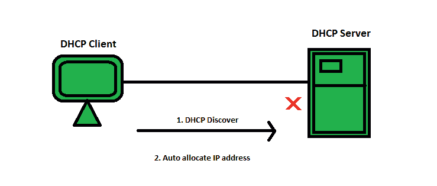
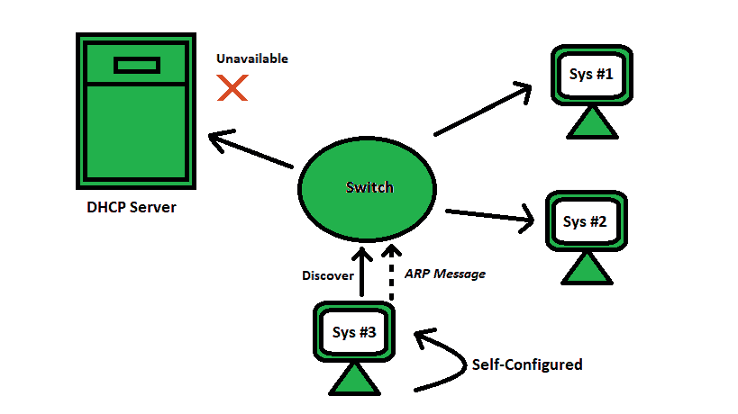

# 什么是 APIPA(自动私有 IP 寻址)？

> 原文:[https://www . geesforgeks . org/what-is-apipa-automatic-private-IP-addressing/](https://www.geeksforgeeks.org/what-is-apipa-automatic-private-ip-addressing/)

**APIPA** 代表**自动私有 IP 寻址(APIPA)。**它是操作系统(如 Windows)中的一项功能或特性，当其 [**DHCP(动态主机配置协议)**](https://www.geeksforgeeks.org/dynamic-host-configuration-protocol-dhcp/) 服务器不可达时，计算机可以自动自行配置 IP 地址和子网掩码。APIPA 的 IP 地址范围为 **(169.254.0.1 至 169.254.255.254)** 有 **65，534** 个可用 IP 地址，子网掩码为 **255.255.0.0** 。


#### 历史

最初，**互联网工程任务组(IETF)** 保留了 **IPv4 地址块 169 . 254 . 0 . 0/16(169 . 254 . 0 . 0–169 . 254 . 255 . 255)**用于链路本地寻址。由于同时使用不同范围的 IPv4 地址，流量过载变高。链路本地地址被分配给接口，即本质上是无状态的，这样当没有从 DHCP 服务器得到响应时，通信将被建立。此后，微软将这种地址自动配置方法称为“自动私有 IP 寻址(APIPA)”。



#### 自动配置和服务检查

它从用户(客户端)找不到数据/信息开始，然后使用 APIPA 自动为系统配置一个 IP 地址( *ipconfig* )。APIPA 提供了检查 DHCP 服务器是否存在的配置(按照微软的说法，每五分钟一次)。如果 APIPA 在网络配置区域检测到一台 DHCP 服务器，它会停止运行，让运行用动态分配的地址替换 APIPA 的 DHCP 服务器。

> **注意:**要知道给定的 IP 地址是由哪个寻址提供的，只需运行以下命令:
> 
> ```
> ipconfig/all
> ```



#### 特征

*   如果没有收到 DHCP 服务器的响应，通信可以正常建立。
*   APIPA 对这项服务进行管理，通过这项服务，它总是在特定的时间段内检查主 DHCP 服务器的响应和状态。

#### 优势

*   它可以用作 DHCP 的备份，因为当 DHCP 停止工作时，APIPA 就能够为网络主机分配 IP。
*   它会停止不需要的广播。
*   它使用 ARP(地址解析协议)来确认该地址当前未被使用。

#### 不足之处

*   APIPA ip 地址会减慢你的网络速度。
*   APIPA 不像 DHCP 那样提供网络网关。

#### 限制

*   APIPA 地址被限制在局域网中使用。
*   APIPA 配置的设备遵循对等通信规则。