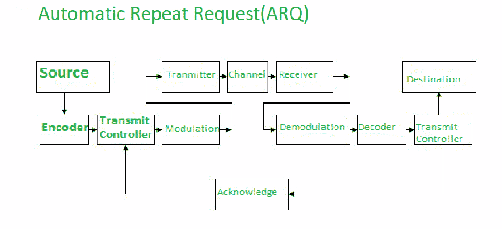

# 什么是 ARQ(自动重复请求)？

> 原文:[https://www . geesforgeks . org/what-is-ARQ-automatic-repeat-request/](https://www.geeksforgeeks.org/what-is-arq-automatic-repeat-request/)

**ARQ** 代表**自动重复请求**也称**自动重复查询**。ARQ 是双向通信系统中使用的一种差错控制策略。它是一组错误控制协议，用于通过不可靠的源或服务实现可靠的数据传输。这些协议位于 [OSI(开放系统互连)模型](https://www.geeksforgeeks.org/layers-of-osi-model/)的传输层和数据链路层。这些协议负责自动重传在传输过程中被发现损坏或丢失的数据包。

#### ARQ 的工作原理

这些协议的主要功能是，发送方从接收方接收确认，这意味着在超时发生之前帧或分组被正确接收，超时是接收方必须向发送方发送确认的特定时间段。如果发生超时:发送方在指定时间之前没有收到确认，这意味着帧或数据包在传输过程中已经损坏或丢失。因此，发送方重新发送数据包，这些协议确保重复该过程，直到发送正确的数据包。

#### 应用程序

ARQ 协议有广泛的应用，因为它们通过不可靠的上层信源提供可靠的传输。这些协议主要在**短波电台**上起作用，以确保信号的可靠传递。
对于 ARQ 的同一个功能，有多种应用:

1.  传输控制协议
2.  特定服务定向协议:自动柜员机网络中消息信号的纠错。
3.  高级数据链路协议。
4.  IBM 二进制同步通信协议。
5.  调制解调器文件传输协议。

#### 类型

这些协议在数据链路层中有几种工作方式:

*   [**【停止并等待】ARQ**](https://www.geeksforgeeks.org/stop-and-wait-arq/) **:**
    停止并等待 ARQ 也称为交替协议，是双向通信系统中使用的一种方法，用于在两个连接的设备(发送方和接收方)之间发送信息。它被称为停止并等待 ARQ，因为该协议的功能是每次发送**一帧**。发送帧或数据包后，发送方在收到接收方的确认之前不会再发送任何数据包。此外，发送方保留发送数据包的副本。在接收到期望的帧后，接收器发送确认。如果在指定时间(即超时时间)之前确认没有到达发送方，发送方将再次发送相同的数据包。每次帧传输后，超时时间都会重置。上面的场景描述了停止和等待的情况，因此这种控制机制被称为停止和等待 ARQ。

*   **回退-N ARQ:**
    回退-N ARQ 是 ARQ 协议的一种，其中发送过程继续**发送几个帧或数据包，即使没有从接收方**收到确认数据包。接收方进程跟踪它期望接收的下一个数据包的序列号，并将该序列号连同每个确认一起发送给发送方。接收器将删除任何不具有期望序列号的数据包，并重新发送对最后一个正确帧的确认。帧与序列号不匹配的可能性只有两种:要么是现有帧的重复帧，要么是需要稍后发送的无序帧，接收器会识别这种情况并相应地发送确认信号。一旦发送方发送了其窗口中的所有帧，它将识别自第一个丢失帧以来的所有帧，并将**返回到它从接收方 pr 接收的最后一个确认信号的序列号**，并再次继续该过程。这种系统的唯一缺点是，它会导致多次发送数据包:如果任何帧丢失或被发现损坏，那么该帧和发送窗口中的所有后续帧都将被重新传输。
    该协议比停止并等待 ARQ 更有效，因为没有等待时间。
*   **选择性重复 ARQ/选择性拒绝 ARQ:**
    选择性重复 ARQ/选择性拒绝 ARQ 协议机制类似于 Go-Back-N 协议机制，但在选择性重复 ARQ 中，即使发现帧损坏或丢失，发送过程仍会继续。这是通过以下方式实现的:接收器进程跟踪其尚未接收到的最早帧的序列号，并发送带有确认信号的相应序列号。如果在接收端没有接收到帧，发送方继续发送后续帧，直到清空窗口。一旦这个纠错过程完成，这个过程就从停止的地方继续。与回退协议不同，该协议不会多次发送数据包。

#### ARQ 的优势

*   与其他技术相比，错误检测和纠正机制非常简单。
*   与其他技术相比，可以使用简单得多的解码设备。

#### ARQ 的缺点

*   具有高错误率的介质或信道可能会导致过多的信息帧或信息包传输。
*   信道中的高错误率也可能导致信息丢失，从而降低系统的效率或生产率。