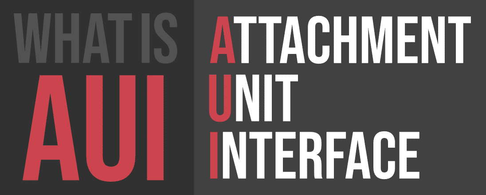

# 什么是 AUI(附件单元接口)？

> 原文:[https://www . geesforgeks . org/what-is-auiattachment-unit-interface/](https://www.geeksforgeeks.org/what-is-auiattachment-unit-interface/)

**AUI** 代表**附件单元接口**。AUI 是以太网标准的一部分，它规定了电缆如何连接到以太网卡。AUI 是一个物理和逻辑接口。IEEE 802.3 标准为 10BASE5 以太网定义了 AUI。AUI 连接器是一个 15 端口连接器，在以太网节点的物理信令和媒体附加单元(MAU)之间提供路径。

| 没有。 | 信号 | 描述 |
| --- | --- | --- |
| one | 竞争情报系统 | 控制电路屏蔽 |
| Two | 竞争情报署 | 电路甲中的控制 |
| three | DO-A | 数据输出电路 |
| four | 直接投资 | 电路屏蔽中的数据 | five | 人工智能 | 电路甲中的数据 |
| six | 副主席 | 公共电压(0 V) |
| seven | 辅酶 a | 控制输出电路 A(未使用) |
| eight | 一氧化碳 | 控制输出电路屏蔽(未使用) |
| nine | CI-B | 电路 B 中的控制 |
| Ten | DO-B | 数据输出电路 B |
| Eleven | DO-S | 数据输出电路屏蔽(未使用) |
| Twelve | 直接投资 | 电路 B 中的数据 | Thirteen | 副总统 | 电压加(+12 V) |
| Fourteen | 对 | 电压屏蔽(未使用) |
| Fifteen | 什么事 | 控制输出电路 B(未使用) |
| 壳 | 宜在家长指导下观看的 | 保护地 |