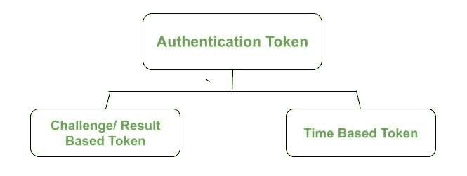

# 什么是网络安全中的认证令牌？

> 原文:[https://www . geesforgeks . org/什么是身份验证-令牌-网络安全/](https://www.geeksforgeeks.org/what-is-authentication-tokens-in-network-security/)

密码是最常见的身份验证方式。然而，他们并不像我们想象的那么便宜和简单，尤其是从组织的角度来看，因为他们必须为他们使用的每个资源提供一个 id 和密码，以及他们必须管理这么多人使用他们的门户的密码。此外，用户记住他们登录的每个网站的密码变得很麻烦。因此，我们有一个密码的替代方案，那就是身份验证令牌。

身份验证令牌是非常有用的密码替代品。它是一个小设备，每次使用时都会生成一个新的随机值。该随机值用于验证用户。

### **认证令牌的组件**

*   处理器
*   用于显示输出的液晶显示器(液晶显示器)
*   电池
*   用于输入信息的小键盘
*   实时时钟

每个这样的设备(认证令牌)都预编程有一个唯一的数字，称为**随机种子或种子。**此种子确保身份验证令牌(设备)生成的输出是唯一的。身份验证令牌是双因素身份验证的一个示例，因为令牌本身受到某些个人识别码的保护。

### **认证令牌的工作**

**1。令牌的创建**

创建身份验证令牌时，身份验证服务器会为令牌生成相应的随机种子。身份验证令牌会自动使用该种子，因此用户不知道该种子的值。这个种子是在令牌中预先编程的，它的条目是根据用户数据库中该用户的记录生成的。

**2。令牌的使用**

身份验证令牌会自动生成伪随机数，称为一次性密码或一次性通行码(这些代码/密码只能使用一次)。一旦使用，就不能再使用。这个一次性密码基本上是一个 4 位数的 PIN。以下是使用一次性密码的一些要点。

1.  被认证的用户将输入他/她的 id 和一次性密码，该密码将被发送到服务器。
2.  服务器使用*种子检索程序*从用户数据库接收对应于用户 id 的种子。
3.  服务器将种子和一次性密码提供给*密码验证程序。*
4.  该程序检查一次性密码和种子是否相互关联。

**3。服务器响应**

服务器最终会根据上一步的输出(成功/失败)返回一条合适的消息。

### 身份验证令牌的类型:

### **响应/挑战令牌**

1.用户仅通过提供其用户 id 而不是一次性密码来发送登录请求。

2.服务器检查用户 id 是否有效。如果无效，它会以错误消息进行响应；否则，如果有效，服务器会创建一个随机质询。然后向用户发送随机挑战。

3.用户收到随机挑战。使用小键盘，使用随机质询中的个人识别码和密钥打开身份验证令牌。

4.令牌的种子对随机质询进行加密，然后由用户在登录请求的密码部分输入。

5.服务器验证用户收到的加密随机质询，这可以通过两种方式完成-

*   服务器可以用用户的种子值解密从用户接收的加密随机挑战，服务器可以通过用户数据库获得该种子值。如果解密与服务器上可用的原始随机质询匹配，则身份验证成功。
*   服务器可以用用户的种子加密它自己版本的随机质询，该质询之前已发送给用户。如果此加密与从用户处收到的加密随机质询相匹配，则身份验证成功。

### 基于时间的令牌

在基于时间的令牌中，服务器不需要向用户发送任何随机挑战。令牌不需要键盘来输入。事实上，它用时间代替了随机挑战。令牌每 60 秒自动生成一个密码，并在液晶显示器上为用户显示最新的密码。

为了生成密码，基于时间的令牌使用种子和当前系统时间。

*   当用户想要登录时，他/她输入令牌液晶屏上显示的密码，并使用该密码和他们的用户 id 一起登录。
*   服务器接收密码，并对用户的种子值和当前系统时间执行独立的加密功能，以生成其版本的密码。如果这两个值匹配，它会将用户视为有效用户。
*   最后，服务器根据上一步的结果向用户发回适当的消息。

由于其自动化的特性(与挑战/响应令牌相比)，基于时间的令牌在现实生活中使用得更频繁。