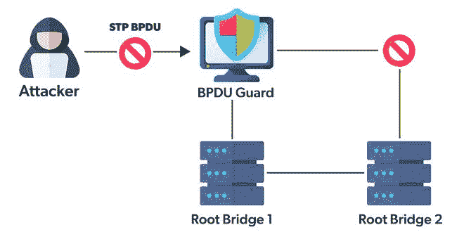

# 什么是网桥协议数据单元(BPDU)帧？

> 原文:[https://www . geesforgeks . org/what-is-bridge-protocol-data-unit-bpdu-frame/](https://www.geeksforgeeks.org/what-is-bridge-protocol-data-unit-bpdu-frame/)

网桥协议数据单元基本上是一个遍历树的约定，它用组织上的各种特征描述组织的每条消息，如利用组织上存在的独特交换机端口的媒体访问控制地址或 IP 地址。

[生成树协议](https://www.geeksforgeeks.org/types-of-spanning-tree-protocol-stp/) (STP)可以授权和削弱特定区域网络(如局域网(邻居)或个人区域网络)中的每台交换机，因此数据交易过程保持完美，交叉树计算可能适合系统管理。

### 前列腺增生的类型

基本上有两种类型的业务流程图:

*   **配置 bpdu:**配置 bpdu 主要用于存在网络根桥的情况下，它们负责控制和验证数据的向外流动，并充当从外部保护的防火墙。

*   **拓扑变化通知(TCN)bpdu:**拓扑变化通知(TCN)bpdu 保持向上数据流，其中它连续调节当前正在使用的网络拓扑，并在拓扑变化时发出提醒通知。

### 工作

BPDU 的工作

BPDU 以自己的方式向整个社区发送特定的信息，用于区分框架中不同组织地理位置的异常情况。它包含一个交换机艺术家，其中有它需要的端口，多个不同端口的数据和媒体访问控制地址。

BPDU 可以在组织信号中安排和更改树的交叉地理位置中的不同设置。BDPU 的这些数据有助于组织标志中使用的不同交换机提供明确无误的传递数据，以确定每个波通过它们的传输速度。

桥接协议信息单元背后的主要组件是，当它们与环境因素中的不同交换机和端口相关联时，它们通常会忽略信息包的传输。以另一种方式，他们利用另一种策略来设置准备处理的信息，直到网桥协议信息单元(BPDU)准备选择可用于信息传输的正确的交叉树地理。

信息处理完成后，信息会被投射到组织的其他端口和交换机，然后被转移到组织的主基地。当 BPDU 中的根信号收到来自发送方的消息时，它会通过借助其 MAC 地址识别原始接收方来将该消息转发给原始接收方。

此后，网桥协议信息单元(BPDU)将信号传输到交换机端口，使消息接收方能够通过在其解密密钥的帮助下解密该消息来接收该消息。

### BPDU 的意义

网桥协议信息单元(BPDU)存储有关个人电脑的所有重要信息，如其交换机端口标识和连接到该网络的所有计算机的媒体访问控制地址。此外，原始交换机端口和相邻端口的地址用于标识该网络上组织的每个用户的凭据。

网桥数据单元协议(BPDU)主要用于通过使用其媒体访问控制地址来验证跨任何组织发送和接收的消息。BPDU 中的交换机端口有助于应用生成树协议(STP)，以便管理整个组织的通信层。它为最有效的消息传输方式制定了一个有效的计划，因为它使用生成树来查找最近的交换机端口，以将其从流量中转移出去。在整个服务器受到攻击时会发生广播风暴的情况下，它非常有用。