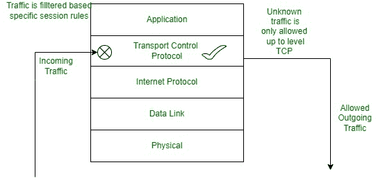
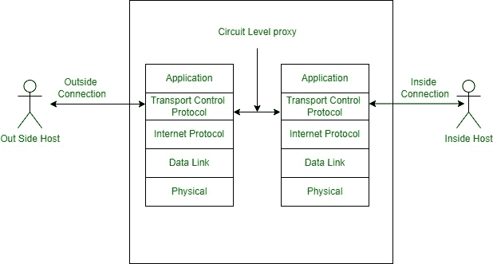

# 什么是电路级网关？

> 原文:[https://www . geesforgeks . org/什么是电路级网关/](https://www.geeksforgeeks.org/what-is-circuit-level-gateway/)

防火墙是一种设备，它通过根据安全规则允许或阻止可能进入或流出的流量来保护我们的网络。它也被称为网络安全的第一防御设备。

[防火墙](https://www.geeksforgeeks.org/introduction-of-firewall-in-computer-network/)的主要目的是过滤它接收或发送的数据包。当数据包通过网络在计算机之间传输时，它以小数据包的形式传输，防火墙会跟踪它。通常，我们使用防火墙来阻止通过指定流量的未授权请求。

**电路级网关**防火墙有助于提供 [UDP](https://www.geeksforgeeks.org/user-datagram-protocol-udp/) 和使用该连接的 TCP 之间的安全性。它还充当可信客户端或服务器与不可信主机之间的握手设备，反之亦然。

电路级网关

通常，这些电路级网关在现场视察模型的会话层工作。电路级网关通过数据包之间的握手来确定会话请求是否被确认。

在电路级网关的帮助下传递到远程计算机的信息在从网关发起时出现。这一切都是因为信息隐藏在受保护的网络中。电路级网关不贵。

为了在电路级网关中定义有效的会话，所使用的组件是:-

1.  目标地址、源地址和端口。
2.  延迟的时间。
3.  该协议正在使用中。
4.  用户和密码。

### **工作**

这个电路级网关设置可以借助两个 [TCP 连接](https://www.geeksforgeeks.org/tcp-connection-establishment/)来完成，建立网关与内部主机 TCP 和 TCP 用户的外部主机之间的连接。

内外主机建立连接后，网关将 TCP 段从一个主机传输到另一个主机，而无需担心内容。

每当网络包信息与虚电路表中的条目匹配时，电路级网关维护一个表，该表有助于验证连接并检查哪些网络包包含要传递的数据。当防火墙终止连接时，它会尝试删除表中的条目，两个节点之间的虚电路连接就会关闭。

在电路级网关中，一旦会话被允许，就不再执行单个数据包级别的进一步检查。

### **功能**

1.  它由确定哪些连接必须被允许的安全功能组成。
2.  它在 [OSI 模型](https://www.geeksforgeeks.org/layers-of-osi-model/)的会话层工作，或者在 TCP/IP 的应用层和传输层之间工作。
3.  它隐藏了他们保护的私有网络的信息。
4.  这是一个独立的系统。
5.  电路级网关的一个例子是 SOCKS 包

### **电路级代理防火墙**

电路级代理防火墙

### **优势**

1.  电路级网关充当代理，对服务主机隐藏内部主机。
2.  它避免了对单个数据包的过滤。
3.  这些网关价格低廉。
4.  地址方案很容易开发。
5.  实现简单。
6.  每个应用程序都不需要单独的代理服务器。

### **劣势**

1.  电路级网关不过滤单个数据包
2.  需要经常更新
3.  在防火墙内，它不能防止设备泄露数据。
4.  对于使用电路级网关，TCP/IP 堆栈必须由供应商修改。