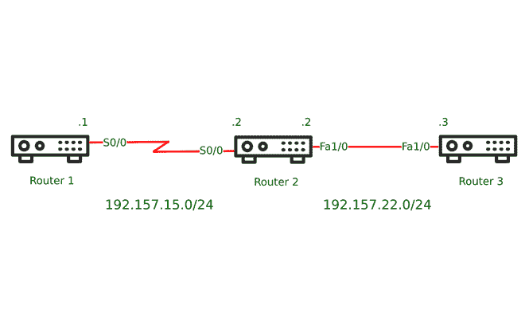

# 什么是思科发现协议(CDP)？

> 原文:[https://www . geesforgeks . org/what-is-Cisco-discovery-protocol-CDP/](https://www.geeksforgeeks.org/what-is-cisco-discovery-protocol-cdp/)

通常，大多数网络都有几个路由器或交换机，为了便于管理网络，使用网络图或网络图来告诉我们网络中存在什么类型的设备，所有设备如何相互连接，它们使用的 IP 地址以及它们属于哪个 VLAN 的信息。CDP 是专有的第 2 层思科网络协议。它是一个网络发现工具，默认情况下是启用的；它运行在思科设备上，有助于发现连接到网络的思科设备。CDP 有助于在不实际检查设备的情况下高效地检查设备。CDP 允许用户使用一些 show 命令来查看连接设备的信息，例如关于本地端口、远程端口、主机名、设备平台等的信息。

默认情况下，从相邻思科设备接收的 CDP 消息不会重定向到任何其他设备，即 CDP 只是转发到直接连接的思科设备。支持 CDP 的所有设备都以表格格式存储从其相邻设备接收的所有消息，可以使用 show cdp neighbors 命令查看这些消息。

这些 CDP 消息每 60 秒在所有 SNAP(子网访问协议)头兼容接口上传输一次。由于并非所有数据链路层媒体类型都支持 SNAP，因此支持的媒体类型有令牌环、以太网、PPP(点对点协议)、FDDI(光纤分布式数据接口)、帧中继、ATM(异步传输模式)、HDLC(高级数据链路控制)。思科设备还将这些 CDP 消息发送到多播目的地址(01:00:0C:CC:CC:CC)。



网络图

**显示 cdp 邻居示例:**

在上面的网络图中，我们有三台路由器。所以，让我们看看如何使用 CDP 来构建一个网络地图，就像图中所示的那样。

*   显示路由器 1 的 cdp 邻居命令。

```
Router1# show cdp neighbors
Capability Codes: R - Router, T - Trans Bridge, B - Source Route Bridge
                  S - Switch, H - Host, I - IGMP, r - Repeater, P - Phone,
                  D - Remote, C - CVTA, M - Two-port Mac Relay

Device ID             Local Intrfce      Holdtme            Capability           Platform             Port ID  
Router 2              Ser0/0             172                  R S I                 2500                  Ser0/0
```

*   显示路由器 2 的 cdp 邻居命令。

```
Router2# show cdp neighbors
Capability Codes: R - Router, T - Trans Bridge, B - Source Route Bridge
                  S - Switch, H - Host, I - IGMP, r - Repeater, P - Phone,
                  D - Remote, C - CVTA, M - Two-port Mac Relay

Device ID             Local Intrfce      Holdtme            Capability           Platform             Port ID  
Router 1              Ser0/0             143                R S I                2500                 Ser0/0
Router 3              Fa1/0              158                R S I                2500                 Fa1/0
```

*   显示路由器 3 的 cdp 邻居命令。

```
Router3# show cdp neighbors
Capability Codes: R - Router, T - Trans Bridge, B - Source Route Bridge
                  S - Switch, H - Host, I - IGMP, r - Repeater, P - Phone,
                  D - Remote, C - CVTA, M - Two-port Mac Relay

Device ID             Local Intrfce      Holdtme            Capability           Platform             Port ID  
Router 2              Fa1/0              141                R S I                2500                 Fa1/0
```

**CDP 消息中的信息:**

*   它包含 IOS 软件的版本。
*   它包含有关设备 IP 地址的信息。
*   设备的名称。
*   关于硬件平台的信息。
*   它包含硬件功能。，和
*   生成 CDP 消息的接口的相关信息。

**CDP 的好处:**

*   它允许使用实时传输协议(RTP)和不同的网络层协议来定位设备并告知它们是如何配置的。
*   它有助于排除 TLV(类型长度值)字段的故障。
*   它可以用作诊断工具，帮助排除设备和网络相关问题。
*   它可以检测广域网链路另一端配置错误的交换机/路由器的 IP 地址。