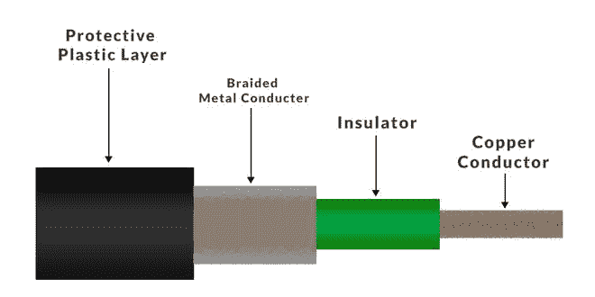

# 什么是同轴电缆？

> 原文:[https://www.geeksforgeeks.org/what-is-coaxial-cable/](https://www.geeksforgeeks.org/what-is-coaxial-cable/)

同轴电缆是一种电缆，它有一个铜导体和一个围绕它的绝缘体屏蔽，以及一个防止信号干扰和串扰的编织金属网。同轴电缆也称为**同轴。**

芯铜导体用于传输信号，绝缘体用于为铜导体提供绝缘，绝缘体被编织金属导体包围，这有助于防止电信号的干扰和串扰。整个装置再次覆盖一层塑料保护层，为电缆提供额外的安全性。

### **同轴电缆的结构**

同轴电缆

**铜导体:**由铜构成的中心导体。导线是数据传输的点。

**绝缘体:**铜导体周围的介电塑料绝缘。它用于保持中心导体和屏蔽之间的间距。

**编织网:**铜编织网有助于屏蔽电磁干扰，编织网为电磁干扰进出同轴电缆提供了屏障。

**保护塑料层:**外部聚合物层，具有塑料涂层。它用于保护内层免受损坏。

### 同轴电缆的类型

1.  **硬线同轴电缆:**硬线同轴电缆的中心导体由铜、银制成，与其他同轴电缆相比，直径更大。
2.  **柔性同轴电缆:**柔性同轴电缆非常柔软，内部导体被柔性聚合物包围。
3.  **半刚性同轴电缆:**半刚性同轴电缆使用实心铜外护套，绝缘材料为聚四氟乙烯。
4.  **可成型同轴电缆:**它是半刚性电缆的替代产品，使用柔性金属护套代替刚性铜外护套。
5.  **双轴电缆:**它在芯中有两个中心导体，单个外芯和电介质。这些电缆最适合低频数字和视频传输。
6.  **三轴电缆:**又称 Triax。它非常类似于同轴电缆，但增加了一个额外的铜编织层，编织层起到屏蔽作用，防止噪音。三轴电缆提供更大的带宽。
7.  **刚性同轴电缆:**刚性同轴电缆由两根铜管组成，铜管支撑在电缆末端，并使用聚四氟乙烯支架或圆盘绝缘体在电缆长度上固定间隔。刚性同轴电缆不能弯曲。它主要用于电视和调频广播系统。

### 同轴电缆的应用

同轴电缆用于以太局域网，也用于城域网

1.  **电视:**用于电视的同轴电缆应为 75 欧姆和 RG-6 同轴电缆。
2.  **互联网:**同轴电缆也用于承载互联网信号，RG-6 电缆用于此。
3.  **闭路电视:**闭路电视系统也使用同轴电缆，RG-59 和 RG-6 电缆都可以使用。
4.  **视频:**同轴电缆也用于视频传输 RG-6 用于更好的数字信号，RG-59 用于视频信号的无损传输。
5.  **高清电视**:高清电视使用 RG-11，因为它为信号传输提供了更多的空间。

### **优势**

1.  同轴电缆支持高带宽。
2.  安装同轴电缆很容易。
3.  同轴电缆具有更好的耐切割性，因此更加可靠耐用。
4.  受噪音、串扰或电磁干扰的影响较小。
5.  同轴电缆支持多通道

### **缺点**

1.  同轴电缆很贵。
2.  同轴电缆必须接地，以防止任何串扰。
3.  因为同轴电缆有多层，所以体积很大。
4.  黑客有可能会破坏同轴电缆并连接“t 形接头”，这损害了数据的安全性。