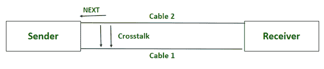

# 什么是相声？

> 原文:[https://www.geeksforgeeks.org/what-is-crosstalk/](https://www.geeksforgeeks.org/what-is-crosstalk/)

通信系统使用模拟信号进行通信，由于衰减、失真和噪声，这些信号在传输介质中传播时往往会恶化。这导致发送方和接收方的信号受损。
串扰是一种噪声信号，在通过通信介质传输时会破坏实际信号。当在一根电缆上传输的信号干扰并破坏了在紧邻的另一根电缆上传输的信号时，就会发生串扰。

主要发生在涉及传输用铜线的通信系统中，如 UTP ( [非屏蔽双绞线](https://www.geeksforgeeks.org/what-is-utpunshielded-twisted-pair/))或[同轴电缆](https://www.geeksforgeeks.org/what-is-coaxial-cable/)。这是通信系统、音频电子和集成电路设计中的主要问题之一。

***串扰主要是由使用平行相邻电缆传输的不同信号之间的耦合引起的*** 。它是由静电或电磁感应引起的。每个模拟信号都有一个相关联的磁场或电场，该磁场或电场与平行移动的其他信号的磁场重叠，从而通过在其他信号中诱发干扰信号而在其他信号中产生干扰。

### 串扰中的耦合类型:

1.  **静电耦合:**当电流在与另一根平行导线非常接近的导线中流动时产生的静电场由于在两根导线之间建立的虚拟电容而在该平行导线中产生干扰信号时，就会发生静电耦合。又称为 ***容性耦合*** ，这种现象产生的干扰信号称为 ***容性串扰*** 。

2.  **电磁耦合:**当在与另一根平行导线非常接近的导线中流动的交流电产生动态变化的磁场时，由于两根导线之间的互感，该磁场在该平行导线中产生干扰信号。又称为***感应耦合*** **g** ，这种现象产生的干扰信号称为 ***感应交叉表*** **k** 。

## **相声分类**

### **串扰类型的基础** **传播方向**

1.  **前向串扰:**前向串扰与引起串扰或在实际或受害信号中产生干扰的信号方向相同。
2.  **后向串扰:**后向串扰在信号的相反方向传播，导致串扰或在实际或受害信号中产生干扰。

### **基于测量位置的串扰类型**

**1。近端串扰(NEXT):** 近端串扰是指由于传输介质近端(即数据传输源附近)的另一对双绞线电缆中的信号，导致其中一根双绞线电缆中的模拟信号受到干扰。当输出数据信号泄漏并损坏输入数据信号时，就会出现这种情况。结果，输入信号在发射站的近端与输出信号混合。

然后

**2。远端串扰(FEXT):** 远端串扰是指在传输介质的远端，即数据传输的目的地附近，由于另一根双绞线电缆中的信号，导致一根双绞线电缆中的模拟信号受到干扰。当接收端的输入数据信号泄漏并破坏输出数据信号时，就会出现这种情况。结果，输出信号在发射站的远端与输入信号混合。

FEXT

### **相声类型**基于**如何量化**

1.  **功率和 NEXT (PS NEXT):** 功率和 NEXT 是指在发射站近端以绝对或相对功率测量的串扰。
2.  **功率和 FEXT (PSFEXT):** 功率和 FEXT 是指在发射站远端以绝对或相对功率测量的串扰。
3.  **功率和等电平串扰(PS-ELFEXT):** 功率和 ELFEXT 指 PSNEXT 和 PSFEXT 之和。

### **外星人相声:**

外来串扰是指相邻电缆链路之间的信号干扰。通常，当一根电缆(称为受害者电缆)被许多其他被称为干扰者的电缆包围时，就会发生这种情况，这些干扰者会破坏受害者电缆的信号。当为了更快的应用而增加电缆带宽时，这一点变得非常重要。屏蔽电缆也不能防止这种串扰。

### 效果:

1.  信号完整性问题
2.  延迟噪声效应
3.  逻辑故障
4.  电压过冲
5.  时序噪声

### **预防:**

1.  减少传输信号的平行电线的长度。
2.  使用大小相等但极性相反的电压线来产生信号。
3.  使用每单位距离匝数更多的双绞线电缆。
4.  将 UTP 电缆(非屏蔽双绞线电缆)更换为 STP 电缆(屏蔽双绞线电缆)。
5.  在通过介质传输之前，将模拟信号转换为数字信号。
6.  增加双绞线电缆的绞合频率。
7.  增加传输模拟信号的相邻平行电缆之间的距离。

### 挑战和解决方案:

1.  **通信系统:**串扰导致通信效率低下，可能导致信息从一条线路泄漏到另一条线路。通过铜线以电流形式传输的信号会在附近的电线中产生电磁干扰信号，电线会从传输信息的电线中拾取信号。
    ***解决方案:*** 增加导线的绞合频率可以显著降低通信系统中的串扰。传输信号的电缆中的扭转操作在防止电线之间的电磁干扰方面起着至关重要的作用。
2.  **组网:**网络内的串扰导致数据传输效率低下，可能导致信息丢失。铜缆上传输的信号会干扰另一条电缆上传输的信号，导致网络的信噪比很低。
    ***解决方案:*** [应使用屏蔽双绞线电缆](https://www.geeksforgeeks.org/what-is-stpshielded-twisted-pair/) (STP)代替非屏蔽双绞线电缆(UTP)，以减少网络内部的串扰。
3.  **印刷电路板:**印刷电路板(PCB)上的串扰导致电路板走线之间的电磁耦合。由于两者之间的耦合，一条走线中的过高电压或电流会对电路板上的另一条走线产生干扰。
    ***解决方案:*** 可以通过增加板上走线之间的距离、使用差分信号或避免板上平行走线来降低 PCB 上的串扰。

串扰是通信系统中使用铜缆作为传输介质的主要缺点之一。有效管理串扰可提高传输的可靠性，并使铜缆成为长距离通信中传输介质的有力候选者。