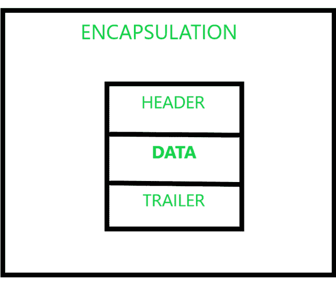

# 什么是网络中的数据封装和解封装？

> 原文:[https://www . geeksforgeeks . org/什么是数据封装和网络中的解封装/](https://www.geeksforgeeks.org/what-is-data-encapsulation-and-de-encapsulation-in-networking/)

这篇文章是关于网络中**数据封装和解封装的。封装和解封装过程同时在网络上运行，以使有效的通信成为可能。封装是在发送方执行的过程，而解封装发生在接收方。**

现在，我们来看看**封装和解封装**的分步过程。

**封装过程:**

**步骤-1 :**
流程从 [OSI 模式](https://www.geeksforgeeks.org/tcp-ip-model/) l 或 TCP/IP 模型中的应用层的应用、呈现和会话层开始，从用户处获取数据输入，并添加报头部分(可选)，然后将其转发到传输层。

**第 2 步:**
在此之后，进一步的传输层再次添加额外的新信息，称为*“段头”。*整个数据包被称为“段”，在解封装的最后，需要这个信息。现在，这些数据被传递到模型的下一层，网络层。

**步骤-3 :**
类似地，网络层在从传输层接收的“数据段”中添加报头和尾部，并形成称为*数据报*的新实体。这些数据被进一步传递到数据链路层。

**步骤-4 :**
同样，数据链路层在从网络层接收的输入上添加另一个数据字段。这个全新的数据片段被传递到下一层，即物理层。

**步骤-5 :**
最后一层物理层在接收到的上一层输入中加入最终数据。封装过程结束。

整个[封装](https://www.geeksforgeeks.org/tcp-ip-in-computer-networking/)过程可以总结在这张图中。

**解封过程:**

**步骤-1 :**
该过程从 OSI 模型或 TCP/IP 模型中的物理层开始，获取封装的数据输入信号，并将整个数据解封装为数据报，并将其转发到数据链路层。

**步骤-2 :**
此后，进一步的数据链路层再次切断额外的新信息。如果发现一切正确，整个数据报将被解封、分析，并检查报头和尾部。现在，这个部分解封装的数据被传递到模型的下一层，网络层。

**步骤-3 :**
类似地，网络层对从数据链路层接收的数据段中的报头和尾部进行解封装，并进一步传递到传输层。

**步骤-4 :**
同样，传输层根据从网络层接收的输入对另一个数据字段进行解封装。此外，这个数据片段被传递到下一层，应用层。

**步骤-5 :**
最后，最后一个应用层完全解封装从上一层接收的数据片段输入。解封过程终止。

整个解封过程可以用这张图来概括。

