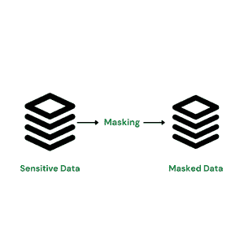
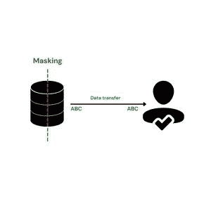
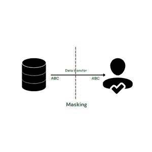
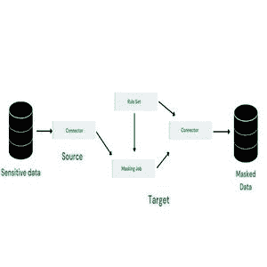
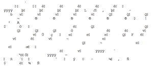

# 什么是数据屏蔽？

> 原文:[https://www.geeksforgeeks.org/what-is-data-masking/](https://www.geeksforgeeks.org/what-is-data-masking/)

数据屏蔽是一个非常重要的概念，可以保护数据免受任何破坏。尤其是对于包含大量敏感数据的大型组织来说，这些数据很容易被泄露。信用卡信息、电话号码、家庭住址等细节是非常脆弱的信息，必须加以保护。为了更好地理解数据屏蔽，我们首先需要知道什么是计算机网络。

## 什么是计算机网络？

计算机网络是共享资源的计算机的协调系统。这些资源由称为网络节点的重新分发点或端点提供。计算机通过数字互连使用通用通信协议来相互通信。计算机网络是电信系统不可分割的一部分。连接可以包括基于物理有线、光学和无线射频方法的电信网络技术。

### 计算机网络与网络安全

网络安全由许多层组成，攻击可能发生在这些层中的任何一层。这些网络通常由三个控件组成

*   **物理网络安全**
*   **技术网络安全**
*   **管理网络安全**

**物理网络安全:**这旨在保护系统网络安全，防止未经授权的人员闯入包括 OUI、光缆等在内的网络组件。,

**技术网络安全:**这保护存储在网络中或通过网络传输的数据。它确保除了用户自己，没有人能逃脱任何未经授权的活动。

**管理网络安全:**这包括授权用户对其他人员需要遵守的所有政策和程序。

## 数据屏蔽:

数据屏蔽意味着创建预先存在的数据的精确副本，以保护原始数据的安全，防止任何安全漏洞。正在创建各种数据屏蔽软件，以便组织可以使用它们来保护数据安全。这就是强调数据屏蔽的重要性。

### 数据屏蔽的类型

有各种类型的数据屏蔽。其中一些在下面给出

*   **静态数据屏蔽(SDM):** 静态数据屏蔽通过改变数据在静止状态下工作，从而永久替换敏感数据。它帮助一个组织创建一个干净的、几乎没有漏洞的数据库副本。SDM 通常用于开发和数据测试。

静态数据屏蔽发生在静止状态

*   **动态数据屏蔽(DDM):** 顾名思义，动态数据屏蔽在数据传输的同时或同时改变数据。使用 DDM，您可以进行完全掩蔽和部分掩蔽。数字数据也有随机掩码选项。

动态数据屏蔽发生在数据交换时

*   **确定性数据掩码:**确定性数据掩码的工作原理是，它用同一行中的相似值替换给定表的列中的值。例如，这可以以各种格式完成。，替换格式。
*   **动态数据屏蔽:**在这种类型的数据屏蔽中，数据在通勤时从一个地方传输到另一个地方，而与磁盘无关。它类似于动态数据屏蔽，只是每次使用一个值。

动态数据屏蔽一次屏蔽一条记录的数据

## 技术:

可以使用以下技术进行数据屏蔽

*   **替代:**替代法被认为是最高效、最可靠的技术之一，以达到预期的效果。在该方法中，任何需要保护的敏感信息都应该用一个虚假但看起来真实的值来代替。只有有权访问系统的人才能查看屏蔽值。
    *   **优点:**使数据看起来尽可能真实
    *   **缺点:**在处理大量不相关的数据时不适用
*   **换人前:**

<figure class="table">

| **参与者姓名** | **问题类型** | **得分** |
| 阿莱娜 | 困难的 | Forty-five point three three |
| 罗里（m.） | 困难的 | Thirty-three point two one |
| 米格尔 | 容易的 | Twenty |
| 翅果 | 中等 | Thirty-seven point two |

</figure>

*   **替换后**:

<figure class="table">

| **参与者姓名** | **问题类型** | **得分** |
| 阿莱娜 | 困难的 | Thirty point two two |
| 罗里（m.） | 困难的 | Forty point nine |
| 米格尔 | 容易的 | Fifty |
| 翅果 | 中等 | Forty-six point two four |

</figure>

*   **求平均值:**这种方法可以用于数值数据的情况。您可以用列中所有值的集合平均值替换所有单元格中的值，而不是显示单个数值数据。例如，如果您有学生的详细信息，并且您不想让其他学生看到其他学生的总分数，那么您可以通过对所有学生的分数取平均值并用列中的平均值替换来更改数据。

<figure class="table">

| **参与者姓名** | **问题类型** | **得分** |
| 阿莱娜 | 困难的 | Forty-one point eight four |
| 罗里（m.） | 困难的 | Forty-one point eight four |
| 米格尔 | 容易的 | Forty-one point eight four |
| 翅果 | 中等 | Forty-one point eight four |

</figure>

*   **洗牌法:**洗牌法和平均法可以说是类似的技术，但是有一个区别将它们区分开来。不需要替换列中的所有值，只需将这些值打乱即可。这样，没有人能知道哪个值属于哪个数据集，因为它们将位于不同的位置。
    *   **优点:**高效处理大量数据，同时尽可能保持数据真实。
    *   **缺点:**如果数据集相对较小，可以轻松撤销。
*   **洗牌前:**

<figure class="table">

| **参与者姓名** | **问题类型** | **得分** |
| 阿莱娜 | 困难的 | Forty-five point three three |
| 罗里（m.） | 困难的 | Thirty-three point two one |
| 米格尔 | 容易的 | Twenty |
| 翅果 | 中等 | Thirty-seven point two |

</figure>

*   **洗牌后:**

<figure class="table">

| **参与者姓名** | **问题类型** | **得分** |
| 阿莱娜 | 困难的 | Fifty |
| 罗里（m.） | 困难的 | Forty-six point two four |
| 米格尔 | 容易的 | Thirty point two two |
| 翅果 | 中等 | Forty point nine |

</figure>

*   **加密:**加密是网络安全和密码学中非常常见的概念。这是通过以不可读的形式完全更改敏感数据集来实现的。这样做是为了确保没有人知道什么类型的数据，甚至什么数据被表示出来。只有能够访问加密密钥的人员才能看到数据。
    *   **优点:**有效屏蔽数据
    *   **缺点:**任何拥有加密密钥的人都可以轻松访问数据。此外，任何懂得密码学并努力解密数据的人。

*   **取消或删除:**取消正是顾名思义，通过用空值替换来删除列中的值。这是消除在测试环境中显示任何敏感信息的非常有效的方法。
    *   **优点:**在数据不重要的情况下非常有用
    *   **缺点:**不适用于测试环境。

<figure class="table">

| **参与者姓名** | **问题类型** | **得分** |
| 阿莱娜 | 困难的 | 空 |
| 罗里（m.） | 困难的 | 空 |
| 米格尔 | 容易的 | 空 |
| 翅果 | 中等 | 空 |

</figure>

*   **密文方法:**在此方法中，您可以用相同的唯一代码或整个列的通用值替换敏感信息。
    *   **优点:**很难分辨出数据可以是什么，因此使数据更加安全。
    *   **缺点:**只有当值没有用于开发或质量保证目的时，才应使用该方法。

<figure class="table">

| **参与者姓名** | **问题类型** | **得分** |
| 阿莱娜 | 困难的 | XXXXXXXXXX |
| 罗里（m.） | 困难的 | XXXXXXXXXX |
| 米格尔 | 容易的 | XXXXXXXXXX |
| 翅果 | 中等 | XXXXXXXXXX |

</figure>

*   **日期老化:**如果您的数据集中有不想透露的日期，那么您可以将日期设置得比实际给出的日期稍微前后一些。例如，如果您将日期设置为 20-8-21，则可以将日期设置为 300 天前的 01-02-21。这也可以用任何类型的数字数据来完成。确保列或行中的数据老化到一个确定的数字或类似的算法
    *   **优点:**算法简单易记，信息屏蔽有效
    *   **缺点:**仅适用于数字数据。
*   **原始数据集:**

<figure class="table">

| **参与者姓名** | **问题类型** | **得分** |
| 阿莱娜 | 困难的 | Thirty point two two |
| 罗里（m.） | 困难的 | Forty point nine |
| 米格尔 | 容易的 | Fifty |
| 翅果 | 中等 | Forty-six point two four |

</figure>

*   **通过向该行的所有元素添加 45 来屏蔽数据集:**

<figure class="table">

| **参与者姓名** | **问题类型** | **得分** |
| 阿莱娜 | 困难的 | Thirty point two two |
| 罗里（m.） | 困难的 | Forty point nine |
| 米格尔 | 容易的 | Fifty |
| 翅果 | 中等 | Forty-six point two four |

</figure>

## 数据屏蔽的应用:

数据屏蔽有无数的应用，尤其是在信息安全方面。其中一些是:

*   **审核:**在审核中，您需要跟踪并保持组织或其他来源给出的所有数据的准确性。当然，保持数据的安全是很重要的，这可以通过数据屏蔽来实现。
*   **访问控制:**确保只有授权人员才能访问和修改任何敏感数据被称为访问控制。数据屏蔽在访问控制中起着至关重要的作用，因为它可以掩盖任何可能无限期发生的灾难，并防止重大损害。
*   **密码学:**正如前面在技术部分所讨论的，有一种技术叫做加密。加密是密码学中用来隐藏敏感数据的一种方法。因此，为了追求密码学，数据屏蔽是一个需要了解的重要概念。

## 可以屏蔽的数据类型:

任何类型的数据都可以被屏蔽。以下是一些例子:

*   **个人信息:**个人信息是最敏感的信息。无论是在专业环境中还是在个人环境中，个人信息被屏蔽都很重要。易受攻击的个人信息总是对安全构成威胁。
*   **财务数据:**对于一个组织来说，保持财务数据的安全是很重要的。重要而敏感的信息，如交易、损益表和其他信息，在测试环境中披露是非常危险的。

## 数据屏蔽的好处:

数据屏蔽为无数网络安全问题提供了解决方案。因此，数据屏蔽有很多好处。其中一些是:

*   数据屏蔽在保护数据泄露方面非常有效。
*   它不允许劫机者轻易侵入你的系统。
*   如果数据被屏蔽，内部人士就不能以刻薄的方式使用数据。
*   保护任何易受攻击的接口。
*   与其他信息安全方法不同，它非常经济高效。
*   数据可以与授权人员共享，而不会对您的安全造成任何威胁。

## 数据屏蔽的挑战:

尝试数据屏蔽时可能会遇到某些挑战。其中一个挑战是，您需要以一种不会让授权人员丢失其原始身份的方式屏蔽数据，同时又能屏蔽到足以使网络犯罪分子无法破坏原始数据的程度。这在理论上看起来相当简单，但实际实现起来相当棘手。

数据屏蔽还应该能够屏蔽数据，而无需实际修改数据或应用程序本身。屏蔽时也应保持数据的完整性。屏蔽系统应该能够遵循数据库设置的参数，而不是覆盖那些设置的参数

数据屏蔽是一个非常重要的概念，需要在每个组织中实施。很快，数据屏蔽不仅将成为机构的一个概念，也将为普通公众所用，以确保他们在网络空间的信息安全。这强调了学习数据屏蔽技术的重要性，以便在日常数据中使用它们。安全从家开始。