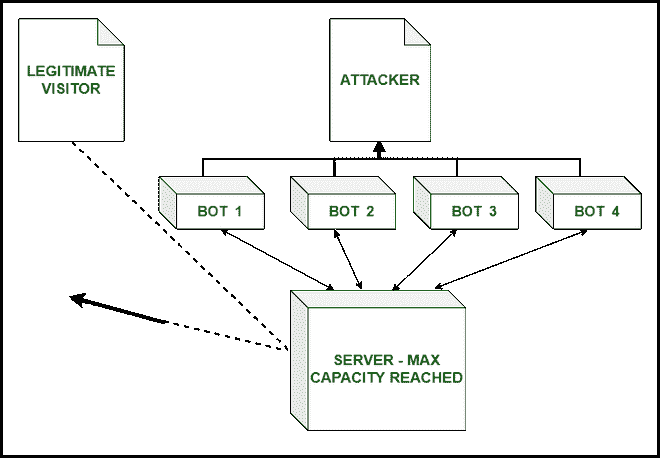

# 什么是 DDoS 缓解？

> 原文:[https://www.geeksforgeeks.org/what-is-ddos-mitigation/](https://www.geeksforgeeks.org/what-is-ddos-mitigation/)

在本文中，我们将了解 DDoS 缓解措施及其攻击方式。

DDoS 缓解是指当服务器受到 DDoS 攻击时，保护其安全的过程。分布式拒绝服务代表分布式拒绝服务。DDoS 是攻击者/黑客通过中断连接到该网络的用户的所有网络服务来攻击服务器的过程。

**DDoS 攻击:**

*   DDoS 攻击被攻击者用来关闭不同企业和组织的网站。
*   在这次攻击中，攻击者使用不需要的 bot 流量来淹没网站，使得普通用户无法到达他们的目的地网站。
*   攻击者使用大量 IOT 设备以及网络服务器和设备来淹没网站的网络，并且不允许合法用户使用它。
*   攻击者使用有害的恶意软件和病毒技术来感染设备，这样他们也可以参与 DDoS 攻击。
*   DDoS 缓解包括通过使用不同的 IP 地址、HTTP 头和 JavaScript 足迹，将人工流量与机器人流量分开，从而保护网络免受 DDoS 攻击。

DDoS 缓解

**DDoS 缓解流程:**
缓解流程分 4 步进行–

1.  **检测–**
    我们必须尽可能的识别交通流量，这样我们就可以停止攻击并做好准备。我们必须持续监控流量特征，并了解网站上有多少机器人。
2.  **分流–**
    在流量较大的情况下，我们必须通过 DNS(域网络系统)或 BGP(边界网关协议)路由过程分流流量。DNS 路由总是按需提供，它有助于在发生网络层或应用层攻击时转移流量。
3.  **过滤器–**
    网络应该能够借助 IP 地址、HTTP 等来分离合法和不需要的机器人流量。
4.  **分析–**
    现在，为了将来的目的，网络必须获得关于攻击者的所有信息，以便将来他们可能已经在这些信息的帮助下阻止了攻击。应使用系统日志和高级安全分析来记录其信息。

**DDoS 缓解技术:**

*   **分离流量–**
    这是缓解过程中最重要的部分，在这个过程中，我们应该高效区分合法和不受欢迎的机器人用户。
*   **减少攻击面–**
    即使网站受到攻击，我们也要减少网站的攻击面，这样对网络造成的伤害最小。
*   **CDN–**
    CDN(内容交付网络)有助于分发网站内容，并使用户和网站资源之间的路径长度最小化。
*   **黑洞路由–**
    黑洞路由涉及借助计算机网络将不想要的机器人用户与合法用户分离，然后将这些机器人重新路由到黑洞。
*   **WAF–**
    WAF(web 应用防火墙)是一种通过立即减轻 DDoS 攻击来快速响应 DDoS 攻击的应用程序，以便在流量到达服务器之前将其丢弃。

**选择 DDoS 缓解服务的步骤:**
使用 DDoS 缓解服务时，我们应牢记以下数据点–

*   **灵活–**
    我们应该能够随时创建和修改策略，以随时适应新的威胁，这是需要牢记的一件重要事情。
*   **可靠–**
    DDoS 缓解服务应该高度可靠，以便在网络有可能受到攻击时可以使用。
*   **可扩展–**
    缓解服务应根据所用网络的大小高度可扩展。无论何时发生较大的攻击，它都应该能够处理。
*   **网络规模–**
    拥有更大的网络有助于 DDoS 服务提供更快、更高效的数据传输能力。