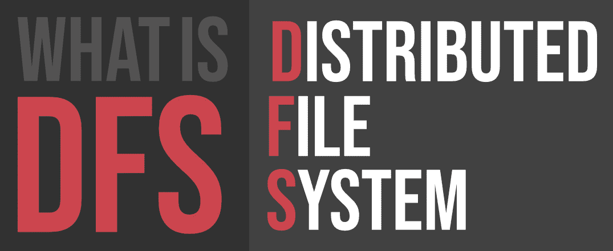

# 什么是 DFS(分布式文件系统)？

> 原文:[https://www . geesforgeks . org/what-is-DFS distributed-file-system/](https://www.geeksforgeeks.org/what-is-dfsdistributed-file-system/)

A **分布式文件系统(DFS)** 顾名思义，就是分布在多个文件服务器或多个位置的文件系统。它允许程序像访问本地文件一样访问或存储独立的文件，允许程序员从任何网络或计算机访问文件。

分布式文件系统(DFS)的主要目的是允许物理分布式系统的用户通过使用公共文件系统来共享他们的数据和资源。由局域网连接的工作站和大型机的集合是分布式文件系统上的一种配置。DFS 作为操作系统的一部分来执行。在 DFS 中，创建了一个命名空间，这个过程对客户端是透明的。

外勤部有两个组成部分:

*   **位置透明度–**
    位置透明度通过名称空间组件实现。
*   **冗余–**
    冗余是通过文件复制组件完成的。

在出现故障和负载过重的情况下，这些组件通过允许将不同位置的数据共享逻辑分组到一个文件夹下，从而提高了数据可用性，该文件夹被称为“DFS 根目录”。

不需要同时使用 DFS 的两个组件，可以在不使用文件复制组件的情况下使用名称空间组件，并且完全可以在服务器之间不使用名称空间组件的情况下使用文件复制组件。

#### DFS 的特点:

*   **透明度:**
    *   **结构透明–**
        客户端不需要知道文件服务器和存储设备的数量或位置。应该为性能、适应性和可靠性提供多个文件服务器。
    *   **访问透明性–**
        本地和远程文件应以相同的方式访问。文件系统应该自动定位在被访问的文件上，并将其发送到客户端。
    *   **命名透明度–**
        文件名中不应该有任何指向文件位置的提示。一旦给文件起了名字，在从一个节点转移到另一个节点的过程中就不应该改变它。
    *   **复制透明度–**
        如果一个文件在多个节点上复制，文件的副本及其位置都应该从一个节点隐藏到另一个节点。
*   **用户移动:**
    它会自动将用户的主目录带到用户登录的节点。
*   **性能:**
    性能基于说服客户请求所需的平均时间。此时间包括 CPU 时间+访问辅助存储所用的时间+网络访问时间。建议分布式文件系统的性能类似于集中式文件系统。
*   **简单易用:**
    文件系统的用户界面要简单，文件中的命令数量要少。
*   **高可用性:**
    分布式文件系统应该能够在任何部分故障(如链路故障、节点故障或存储驱动器崩溃)的情况下继续运行。
    一个高可信、适应性强的分布式文件系统，应该有不同的、独立的文件服务器来控制不同的、独立的存储设备。
*   **可扩展性:**
    由于通过增加新机器或者将两个网络连接在一起来增长网络是常规，分布式系统必然会随着时间的推移而增长。因此，应该构建一个良好的分布式文件系统，以便随着系统中节点和用户数量的增长而快速扩展。服务不应随着节点和用户数量的增长而大幅中断。
*   **高可靠性:**
    在合适的分布式文件系统中，数据丢失的可能性应该尽可能地降到最低。也就是说，由于系统的不可靠性，用户不应该感到被迫为他们的文件制作备份副本。相反，文件系统应该创建关键文件的备份副本，以便在原始文件丢失时使用。许多文件系统采用稳定存储作为高可靠性策略。
*   **数据完整性:**
    多个用户频繁共享一个文件系统。文件系统必须保证保存在共享文件中的数据的完整性。也就是说，必须使用并发控制方法来正确地同步来自竞争访问同一文件的许多用户的并发访问请求。原子事务是文件系统经常向用户提供的数据完整性的高级并发管理机制。
*   **安全性:**
    分布式文件系统应该是安全的，这样它的用户就可以相信他们的数据是保密的。为了保护文件系统中包含的信息免受不必要的&未经授权的访问，必须实施安全机制。
*   **异构性:**
    分布式系统中的异构性由于规模巨大而不可避免。异构分布式系统的用户可以选择为不同的目的使用多个计算机平台。

#### 历史:

分布式文件系统的服务器组件最初是作为附加功能引入的。它被添加到 Windows NT 4.0 服务器中，被称为“DFS 4.1”。后来，它被作为标准组件包含在所有版本的 Windows 2000 Server 中。客户端支持已经包含在 Windows NT 4.0 和更高版本的 Windows 中。

Linux 内核 2.6.14 及其后的版本附带了一个名为“cifs”的 VFS 中小型企业客户端，支持 DFS。Mac OS X 10.7 (lion)及更高版本支持 Mac OS X DFS。

#### 应用:

*   **NFS–**
    NFS 代表网络文件系统。它是一种客户端-服务器架构，允许计算机用户远程查看、存储和更新文件。NFS 协议是网络连接存储(NAS)的几种分布式文件系统标准之一。
*   **CIFS–**
    CIFS 代表通用互联网文件系统。CIFS 是中小企业的口音。也就是说，CIFS 是微软设计的 SIMB 协议的一个应用。
*   **SMB–**
    SMB 代表服务器消息块。这是一种共享文件的协议，由 IMB 发明。创建中小企业协议是为了允许计算机通过局域网对远程主机执行文件读写操作。远程主机中的目录可以通过中小型企业访问，称为“共享”。
*   **Hadoop–**
    Hadoop 是一组开源软件服务。利用 MapReduce 编程模型，给出了大数据分布式存储和操作的软件框架。Hadoop 的核心包含一个存储部分，称为 Hadoop 分布式文件系统(HDFS)，以及一个操作部分，即 MapReduce 编程模型。
*   **NetWare–**
    NetWare 是由 Novell，Inc .开发的一个废弃的计算机网络操作系统，它主要使用组合多任务在个人计算机上运行不同的服务，使用的是 IPX 网络协议。

#### 外勤部的工作:

有两种方法可以实现 DFS:

*   **独立的 DFS 命名空间–**
    它只允许那些存在于本地计算机上并且不使用活动目录的 DFS 根。独立 DFS 只能在创建它的计算机上获得。它不提供任何故障释放，也不能链接到任何其他 DFS。独立的 DFS 根很少被发现，因为它们的优势有限。
*   **基于域的 DFS 命名空间–**
    它将 DFS 的配置存储在 Active Directory 中，创建可在 **\\ <域名> \ < dfsroot >** 或**\ \<FQDN>\<DFS root>**访问的 DFS 命名空间根

#### 优点:

*   DFS 允许多个用户访问或存储数据。
*   它允许远程共享数据。
*   它提高了文件的可用性、访问时间和网络效率。
*   提高了更改数据大小的能力，也提高了交换数据的能力。
*   即使服务器或磁盘出现故障，分布式文件系统也能提供透明的数据。

#### 缺点:

*   在分布式文件系统中，节点和连接需要得到保护，因此我们可以说安全性处于危险之中。
*   从一个节点移动到另一个节点时，网络中的消息和数据可能会丢失。
*   分布式文件系统中的数据库连接是复杂的。
*   此外，与单用户系统相比，在分布式文件系统中处理数据库并不容易。
*   如果所有节点都试图同时发送数据，就有可能发生过载。