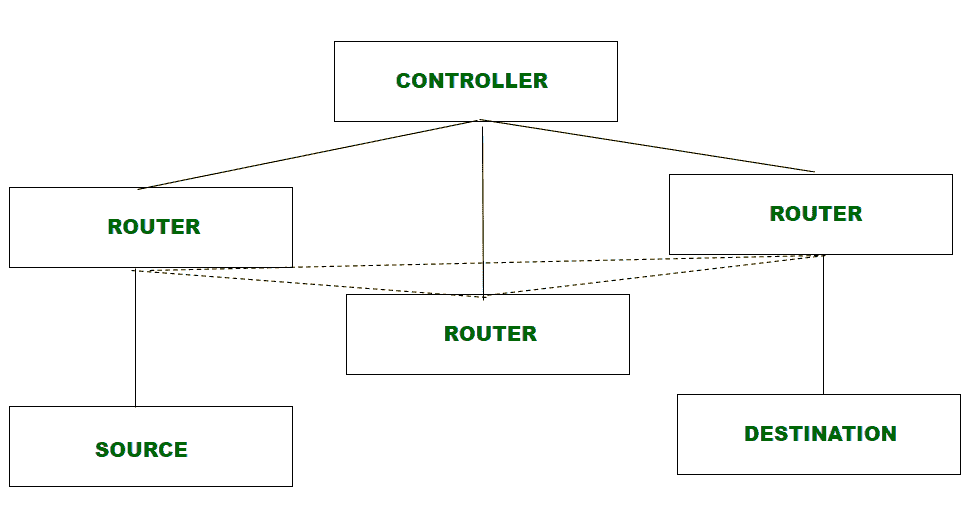

# 什么是数字网络？

> 原文:[https://www.geeksforgeeks.org/what-is-digital-networking/](https://www.geeksforgeeks.org/what-is-digital-networking/)

数字网络是指通过使用数字技术构建的社交网络。它支持数字交换以及语音、视频、数据和其他网络服务的数字传输。它拥有市场、数据网络和通信网络，这些网络提供了一个平台，使网络符合业务需求。

[像交换机、路由器和接入点这样的联网设备](https://www.geeksforgeeks.org/network-devices-hub-repeater-bridge-switch-router-gateways/)构成了数字网络的核心。这些设备将计算机、服务器等设备连接到组织网络并保护其安全，还用于将网络连接到其他网络并分析要通过网络发送的数据。

数字网络

**数字网络的特点:**

1.  **集中管理–**
    数字网络通过支持云的集中管理，为内部部署和云空间提供端到端网络服务。中央服务器监控、分析和管理网络的所有组件。

2.  **自动化–**
    数字网络自动化了整个网络中网络基础设施的管理和共享。此外，它还提供了一个自动化环境，智能机器可以在其中相互通信。

3.  **安全性–**
    数字网络可以通过收集流量数据并识别其中的任何安全漏洞来识别威胁，即使在加密数据流量中也是如此。

4.  **虚拟化–**
    数字网络在逻辑上将物理网络分组在一起，并使它们作为称为虚拟网络的单个或多个独立网络运行。它允许每个逻辑网络共享网络的所有资源。

**不断发展的数字网络:**

1.  [**【软件定义网络(SDN)**](https://www.geeksforgeeks.org/software-defined-networking/)**–**
    集中控制的基于软件的机制路由数据流量，带来高敏捷性。转发数据的决定基于由中央控制器分配的流表的条目。

2.  [**基于意图的网络–**](https://www.geeksforgeeks.org/intent-based-networking-ibn/)
    它自动化操作，提供高安全性，分析网络性能，并将网络与各种业务流程集成。它根据服务描述为设备生成配置，并在网络的预期状态和运行状态之间提供保证检查，使用闭环验证来持续验证配置的正确性。

3.  [**虚拟化网络–**](https://www.geeksforgeeks.org/network-virtualization-in-cloud-computing/)
    它在逻辑上将物理网络基础设施划分为不同的逻辑单元，这样每个逻辑网络都可以进行调整，以满足特定的安全性、服务质量(QoS)和其他要求。每个逻辑单元彼此独立，并且共享网络上的所有资源。

4.  **基于控制器的网络–**
    控制器通过将业务意图转化为设备配置来控制单个设备的网络功能，并不断监控设备以提高网络的性能和安全性。网络中的控制程度和控制类型差异很大。

5.  **多域集成网络–**
    网络分为不同的域，每个域有多个代理和一个域管理器。代理通过交换相关的操作参数与域管理器通信，域管理器进一步与更高级别的父管理器或域管理器通信。

**数字网络优势:**

1.  **可扩展–**
    数字网络更容易在更大的层面上扩展或扩展，以满足组织不断变化的需求。
2.  **经济高效–**
    数字网络对于流量大、不同用户群体有不同需求的组织来说更实惠。
3.  **安全–**
    数字网络比传统网络更安全，在加密数据流量的情况下，传统网络可能无法检测到安全漏洞。
4.  **敏捷–**
    数字网络表现出高度的敏捷性，以响应网络内所需的变化。
5.  **网络分析–**
    它通过收集网络信息不断分析网络性能。

**数字网络的劣势:**

1.  **中央依赖–**
    中央系统或控制器故障导致整个网络故障。
2.  **复杂设计–**
    它的设计很复杂，因为它是不同操作系统、环境和网络组件的组合。

**数字网络的重要性:**
在数字化转型的时代，网络需要高度敏捷地将跨网络的实时变化纳入其中，以跟上业务需求。数字网络通过集中管理实现这一点，所做的更改可以立即在整个网络中传播。此外，网络安全是数字转型最重要的特征之一，数字网络通过收集流量信息并指出安全漏洞来提供出色的安全性。