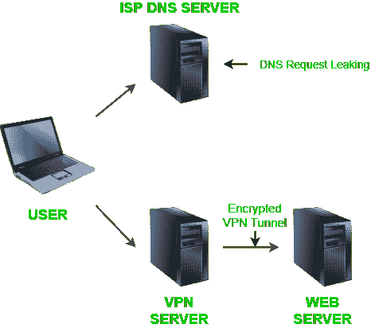

# 什么是 DNS 泄漏？

> 原文:[https://www.geeksforgeeks.org/what-is-dns-leak/](https://www.geeksforgeeks.org/what-is-dns-leak/)

设备移动性的提高，远程访问网络的概念，以及更多类似的机会，使得防止黑客访问您的私人数据的任务变得更加复杂。
在大多数致命攻击中，攻击者甚至不用访问您的系统，就可以关闭您的整个网站。攻击者可以利用互联网在您的网站访问者和其他传入数据到达您的网络之前将其转移。这里 DNS 系统是关键。它是第一道防线，在数据安全方面发挥着重要作用。

> 在本文中，我们将讨论–
> 
> *   **什么是 DNS？**
> *   **什么叫 DNS 泄露？**
> *   **检查域名系统泄漏的方法？**
> *   **有哪些主要的域名系统泄漏问题？**
> *   **如何防止 DNS 泄露？**

### 什么是 DNS？

**DNS-域名系统**是一个分级命名系统，用于连接到互联网的计算机、服务或任何其他资源或设备。或者我们可以说，用简单的语言，域名系统将更容易记住的域名翻译成数字的 IP 地址，这些地址是定位和识别具有底层网络协议的设备和服务所需要的。

域名系统服务器包含所有的域名及其对应的 IP 地址。每当你输入一个网址-

*   您的浏览器将发送 IP 请求(域名-例如 www.geeksforgeeks.com)到域名服务器。
*   域名系统服务器将匹配该网址的相应 IP 地址，并将您的浏览器指向该网站。

域名系统是必不可少的，因为浏览器无法理解字母网址，只能处理数字 IP 地址。

### 域名系统泄漏是什么意思？

如上所述，域名系统充当互联网和您的设备之间的通信者。但是，在默认域名系统设置的情况下，互联网服务提供商或任何合法或非法访问域名系统服务器的人都可以看到用户的在线活动。
为了根除这种情况，许多人倾向于使用**虚拟专用网络**，这有助于在互联网上创建安全的虚拟连接。添加虚拟专用网通过虚拟专用网隧道推送所有的域名系统请求和数据。

不幸的是，有利就有弊。虚拟专用网服务器不是 100%安全的，它们可能会泄露域名系统请求。这就是所谓的 **DNS 泄漏**。因此，我们可以说域名系统泄漏是一个安全漏洞，它将域名系统请求暴露给互联网服务提供商的域名系统服务器。

### 检查域名系统泄漏的方法–

检查域名系统泄漏是一项非常简单的任务。市面上有那么多一键测试工具可以测试 DNS 漏洞。这里有一些优秀和真实的网站来测试域名系统泄漏:

*   [dnslettest . com](https://www.dnsleaktest.com/)
*   [IPLEAK.NET](https://ipleak.net/)

***域名系统泄漏测试是如何工作的？***
如果你在虚拟专用网背后进行域名系统泄漏测试，答案很简单。

*   结果应该与您通过虚拟专用网络连接的 IP 相同。
*   如果你看到你的网络服务提供商在名单上，它指向一个域名系统泄漏。
*   不在您的虚拟专用网服务下的列表可能表示有泄漏。

尽量不要选择任何虚拟专用网服务提供的域名系统泄漏测试工具。这些天，虚拟专用网服务正在开发他们的工具，并将其用作诱饵来吓唬用户和销售他们的产品。

### 有哪些主要的域名系统泄漏问题？

在本节中，我们将讨论导致域名系统泄漏的主要问题。

1.  **不规则网络配置:**连接 VPN 时，先将设备连接到本地网络。请确保设置正确，因为当您连接到新网络时，DHCP 设置有时会自动分配一个 DNS 服务器，这可能是您的 ISP DNS 服务器。
2.  **IPv6 泄漏:**大多数 VPN 都支持 IPv4，它们无法处理进出 IPv6 设备的任何请求。这些虚拟专用网无法处理使用将 IPv4 转换为 IPv6 的双堆栈隧道从机器发送的请求。因此，域名系统请求最终到达域名系统服务器，域名系统泄漏导致真实的 IP 暴露。
3.  **透明 DNS 代理:**如果 ISP 检测到用户将其 DNS 服务器设置更改为第三方服务器，他们会强制实施自己的 DNS 服务器。该透明服务器将中断用户网络流量，并将其发送到互联网服务提供商域名系统服务器。这种类型的服务器可以通过域名系统泄漏测试来检测。
4.  **Teredo 技术:**微软引入 Teredo 技术，解决 IPv6 和 IPv4 的问题。然而，在虚拟专用网的情况下，它仍然会导致域名系统泄漏，因为它是一种隧道协议，也能够绕过虚拟专用网加密隧道。
5.  **Windows OS 8、8.1 和 10 版:** Windows 功能智能多宿主名称解析已在 Windows 8 和更高版本中推出。该功能倾向于将请求发送到所有可用的域名系统服务器。它确保来自非标准服务器的响应只有在收藏夹没有响应的情况下才是可接受的。最有可能的是，互联网服务提供商的域名系统响应被接受，最终导致域名系统泄漏。

### 如何防止域名系统泄露？

*   使用 HTTPS 域名系统或顶级域名系统加密域名系统请求。
*   使用通过虚拟专用网发送域名系统请求的虚拟专用网客户端。
*   使用防火墙在整个设备上禁用 DNS，或将 DNS 服务器设置为不存在的服务器，如 127.0.0.1 或 0.0.0.0
*   使用像 Tor Browser 这样的匿名浏览器，这使得用户匿名，并且不需要在操作系统上设置任何 DNS。
*   使用您自己的域名解析服务器。
*   使用 Cloudflare 域名系统服务器。
*   使用代理或虚拟专用网，在系统范围内，通过第三方应用程序助手，如代理或以网络浏览器扩展的形式。

**参考文献:**

*   [https://en.wikipedia.org/wiki/DNS_leak#Prevention](https://en.wikipedia.org/wiki/DNS_leak#Prevention)
*   [https://en.wikipedia.org/wiki/Domain_Name_System](https://en.wikipedia.org/wiki/Domain_Name_System)