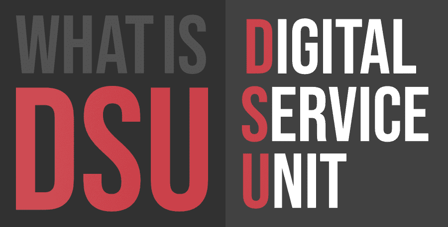

# 什么是 DSU(数字服务单位)？

> 原文:[https://www . geesforgeks . org/what-is-dsudigital-service-unit/](https://www.geeksforgeeks.org/what-is-dsudigital-service-unit/)

在我们了解什么是数字服务单元及其作用之前，我们必须先了解什么是电信。电信基本上是通过电缆、电报、电话或其他广播媒体与某人进行远距离通信。正如人们意识到的那样，整个通信过程是一个漫长的过程，由许多组件组成，其中包括人类用户，因此，最重要的组件之一是数字服务单元。数字服务单元很像电话，在向特定设备发送信号和从特定设备接收信号方面起着重要作用。

#### 工作和使用

使整个过程成为可能的组成部分之一是数字服务股。数字服务单元是一种硬件，其大小不超过外部调制解调器，负责将局域网中使用的通信技术的数字数据帧转换为适用于广域网的帧。它与渠道服务股合作，连接到局域网。这些数字接口设备将用户通信设备(尤其是与数据相关的设备)连接到数字接入线路。换句话说，数字服务单元将数字电路中编码的数据转换成同步串行数据。数字服务单元还执行将数字通信线路与网络设备电隔离的附加功能。从消费者的角度来看，数字服务单元的功能不可或缺的一点是，渠道服务单元和数字服务单元应该属于同一家公司或同一家制造商。如果不是这样，那么消费者就有可能因为遇到不兼容问题而意外遇到问题。数字服务单元创建的网络类型有多种，包括 DDS、ATM、E1/FE、E3、SMDS、T3 等。

#### 应用

*   因此，它们经常与渠道服务单元集成在一起，从而使消费者免除了单独安装它们的额外麻烦。
*   它们使客户的操作变得非常方便和容易。举个例子，一个人在家工作的例子(在这个世界上，受冠状病毒影响的人离现实不远)。为了有效地做到这一点，他或她需要一个有效的互联网或网络信号。为此，他或她可能拥有一条通往电话公司的数字线路，或者在互联网服务提供商的要求下拥有任何其他合适的网关，该网关在其终端有一个数字服务单元，并且其运行所通过的网关在其终端也有一个数字服务单元，这两者都被设置为相同的通信标准。
*   在这种情况下，信道服务单元承担了大部分“接收”——接收和中继来自广域网线路的信号。数字服务单元管理线路控制，并在 RS-232C、RS-449 或 V.xx 帧之间转换输入和输出。
*   它管理定时误差并发出再生信号。它提供了计算机或桌面(视情况而定)与 CSU 之间的通用交换介质。

有各种形式的数字服务单元可用，这些服务单元相当多样。它们有芯片、电路板和模块形式。有些表格甚至可以叠放在一起。然而，数字服务单元的选择必须考虑各种因素，如线路速率等。

#### 优势

使用数字服务单元有许多优点:

*   它像调制解调器一样小，使用时很容易拿取。
*   它管理线路控制、定时误差和信号再生任务——如果没有这个设备，所有这些都难以置信地难以掌握。事实上，它的工作如此出色，以至于我们对它的依赖大大增加——在当今世界，每个人都需要它在互联网上处理自己的事情，这种情况更是如此。因此，如果人们把这种设备归类为整个电信过程运作的一个非常重要的组成部分，那么这也是理所当然的，也是整个世界的一个重要组成部分。

#### 不足之处

*   它非常昂贵，因此使用起来不经济。
*   设置时间延迟。投入使用相当复杂，因此外行人自己做是不可行的。
*   如果 CSU 与 DSU 不兼容，可能会给消费者带来问题