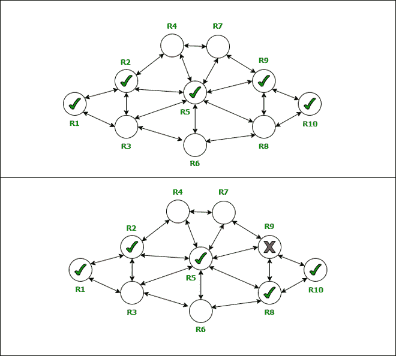
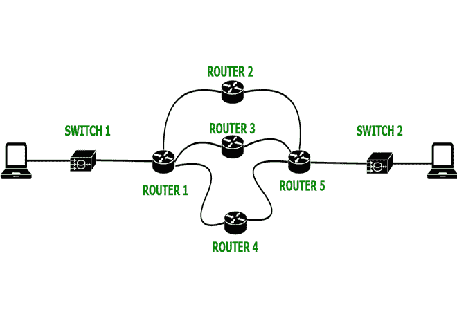

# 什么是计算机网络中的动态路由？

> 原文:[https://www . geesforgeks . org/什么是计算机网络中的动态路由/](https://www.geeksforgeeks.org/what-is-dynamic-routing-in-computer-network/)

**路由**是一个决策的过程，其中路由器(*是网络中用来在网络上以数据包的形式接收和发送数据的硬件设备*)选择最佳路径将数据从源传输到目的地。路由器存在于现场视察和传输控制协议模型的网络层。路由器的一些功能是:

1.  在网络上构建一条到达目的地的最佳路径(静态和动态路由都在其中进行)。
2.  制定路线。
3.  平衡负载。

### **路由类型:**

1.  **静态路由**
2.  **默认路由**
3.  **动态路由**

静态路由和[默认路由](https://www.geeksforgeeks.org/types-of-routing/)有一些缺点，因此引入了动态路由。

#### **静态路由的缺点:**

*   在大型网络中，手动将每条路由汇总或添加到路由图上是一项繁重的任务。
*   管理它的订购很费时间。
*   如果某条链路出现故障，它无法重新路由流量。

#### **默认路由的缺点是:**

*   如果网络很复杂，那么设置起来就比较困难。

为了克服静态路由和默认路由的缺点，早在 20 世纪 80 年代，有史以来第一次在计算机中使用动态路由，其中使用的协议是 RIP(路由信息协议)。

### 动态路由

**动态路由**是一种寻找数据在网络上传输的最佳路径的技术，在这个过程中，路由器可以通过各种不同的路由传输数据，并根据通信电路当时的条件到达目的地。

动态路由

动态路由器足够智能，可以根据网络当时的情况选择最佳的数据路径。如果网络中的一个部分无法转发数据，动态路由器将使用其算法(在该算法中，它们使用路由协议在它们之间收集和共享当前路径的信息)，并将通过另一个网络实时重新路由先前的网络。这种通过共享状态在网络上实时改变路径的惊人能力和功能是动态路由的关键功能。 [OSPF](https://www.geeksforgeeks.org/open-shortest-path-first-ospf-protocol-fundamentals/) (先开放最短路径)和 [RIP](https://www.geeksforgeeks.org/routing-information-protocol-rip/) 是一些用于动态路由的协议。

在上图中，上图描绘了路径*R1->R2->R5->R9->R10*将数据从 **R1** (源)带到 **R10** (目的地)，但是由于某种原因 **R9** 无法处理其工作，于是它动态构建了一条新路径，即*R1->R2->R5->R8->*

与静态路由器不同，在静态路由器中，管理员在路由器中重新配置更改，而在静态路由器中，管理员自己更改路由并找到最佳网络/路径。

### **动态布线工作**

**动态布线工作**

**首先，**一种路由协议(*一种规定信息将如何在路由器之间共享以及它们将如何相互通信以在网络上的节点之间共享/分发信息的协议*)必须安装在网络中的每台路由器中，以在彼此之间共享信息。
**其次，**手动启动，带着路由器信息转到路由器的第一张路由表，之后借助动态路由算法自动进行，动态形成网络中其余路由器的路由表。
**第三，**然后在路由器之间交换路由信息，因此如果网络中断或路由器无法工作并与其连接的路由器共享信息，那么每个路由器的路由表将被正确修改为当前状态，这样它就不会无法向目的地传送信息。
**第四，**主机出现检查或匹配默认网关地址和本地路由器的 IP 地址。

### 目的

动态协议被引入:

1.  探索每一条路，选择最好的路。
2.  与网络中的其他路由器共享网络信息。
3.  自行更新路径并重新路由最佳路径。

### 成分

动态路由中使用了三个主要组件:

1.  数据结构(构建信息)
2.  算法(构建或重新更新路径)
3.  路由协议(共享网络信息)

### **优势**

1.  有利于性能以及可扩展的网络，在节点上有高频率的数据。
2.  与其他路由协议相比，它的错误更少。
3.  管理员无需手动配置。
4.  互相共享网络信息，使他们更可靠地高效工作。

### **缺点**

1.  需要更重更可靠的强大硬件。
2.  与静态协议相比，维护更高