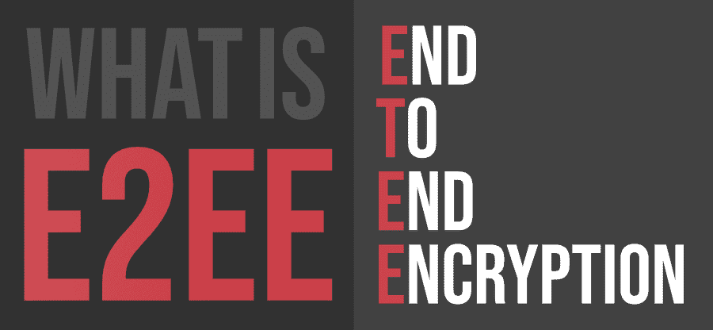
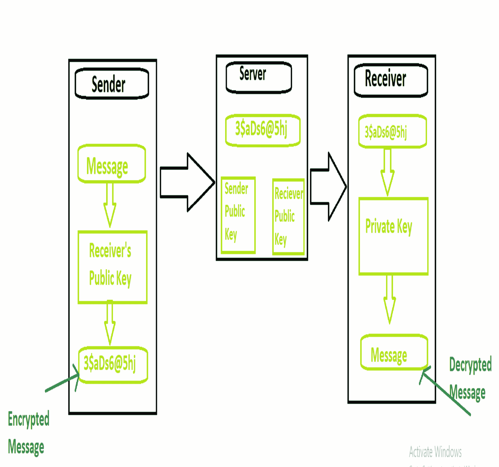

# 什么是 E2EE(端到端加密)？

> 原文:[https://www . geesforgeks . org/what-e2eeend 端到端加密/](https://www.geeksforgeeks.org/what-is-e2eeend-to-end-encryption/)

**E2EE** 或**端到端加密**是指在终端主机上对数据进行加密的过程。它是不对称加密的一种实现，因此确保了数据通信的安全方式。这是最安全的私下安全通信方式，因为数据可以由发送方和接收方只读。其他任何人都不能加密数据，包括政府，甚至不能由数据通过的服务器加密。

#### 加密的类型

根据使用的密钥类型，加密有两种类型:

*   **对称加密:**
    在对称加密中，发送方和接收方使用相同的密钥来加密和解密消息。因此，它可能需要将密钥从一方发送到另一方，从而使其暴露于危险之中。因此，与非对称加密相比，它的效率较低。
*   **非对称加密**
    在非对称加密中，使用两种类型的密钥，一种是公钥，一种是私钥。发送方和接收方都有公钥和私钥。公钥对两端都可用，发送方和接收方都可以在通信开始前共享公钥。发送方使用接收方的公钥加密要发送的消息，接收方使用其公钥和私钥解密消息。接收者的私钥只对接收者可用，对其他人无效。

#### 端到端加密的工作原理

*   它使用非对称加密技术进行发送方和接收方之间的数据通信
*   发送方从服务器上取下接收方的公钥
*   然后，发送方使用接收方的公钥对要发送的消息进行加密
*   然后，发送者将加密的消息发送到服务器
*   接收器然后从服务器接收加密的消息
*   接收者然后使用其私钥解密消息
*   接收者阅读信息

#### 应用程序

这种方法在隐私非常重要的领域非常重要，例如:

*   谈判和沟通非常重要，并且面临被黑客攻击的威胁
*   需要保护的军事信息，以及每个通信需要保护的地方
*   涉及健康、未成年人信息等敏感问题的领域

#### 优势

*   当数据从发送者传输到接收者时，通信方法是高度安全的
*   它为用户提供了更大的灵活性，因为它允许他们决定加密哪些数据。
*   它还允许用户决定谁有权阅读他的消息。
*   端到端加密过程消耗更少的资源和时间，并且文件大小通常很小。

#### 不足之处

*   储存钥匙需要一些特殊的装置。
*   它不会保护您在端点上的数据
*   不安全的加密算法