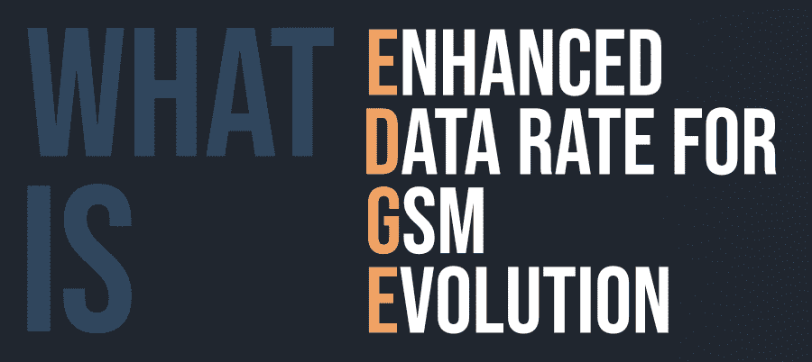
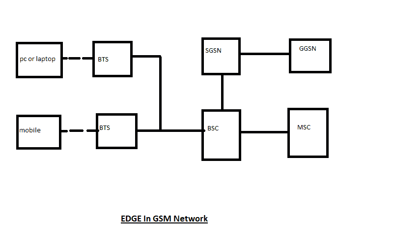

# 什么是 EDGE(GSM 演进的增强数据速率)？

> 原文:[https://www . geeksforgeeks . org/什么是 edge enhanced-data-rate for GSM-evolution/](https://www.geeksforgeeks.org/what-is-edgeenhanced-data-rate-for-gsm-evolution/)

**EDGE**(GSM 演进的增强数据速率)提供了比普通 GSM 更高的数据传输速率。它使用数字移动技术的 GSM 向后兼容扩展。EDGE 拥有前 3G 无线电技术，并使用国际电联 3G 定义的一部分。它可以在任何部署了 GPRS 的网络上工作(进行必要的升级)。

为了提高数据传输速度，美国的 Cingular 于 2003 年在 GSM 网络上部署了 EDGE。

#### 工作

它使用 8PSK 调制，以实现更高的数据传输速率。调制格式从 GMSK 更改为 8PSK。这提供了一个优点，因为它能够每符号传送 3 比特，并且增加了最大数据速率。但是，这次升级需要更换基站。

#### 特征

*   它提供了一条从 GPRS 到 UMTS 的进化迁移路径。
*   它由 3GPP 标准化。
*   EDGE 用于任何分组交换应用，如互联网连接。
*   EDGE 为每个无线电信道提供了更高的比特率，并提高了容量和性能。

#### 优势

*   它有更高的速度。
*   这是一种“永远在线”的连接
*   它更加可靠和高效
*   它具有成本效益

#### 不足之处

*   它消耗更多的电池。
*   硬件需要升级。