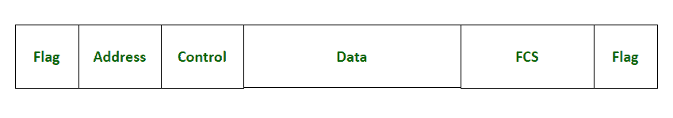

# 什么是帧校验序列？

> 原文:[https://www.geeksforgeeks.org/what-is-frame-check-sequence/](https://www.geeksforgeeks.org/what-is-frame-check-sequence/)

帧校验序列(FCS)是指添加到帧中用于错误检测的额外位。用于 [HDLC](https://www.geeksforgeeks.org/types-of-hdlc-frames/) 错误检测。它是 2 字节或 4 字节字段，用于检测通过网络传输的帧的地址字段、控制字段和信息字段中的错误。它用于确保数据帧在从发送方发送到接收方时不会被传输介质破坏。

HDLC 帧格式

**特征:**

*   这是 HDLC 帧中存在的错误检测码。
*   它的大小从 2 字节到 4 字节不等。
*   它用于通信协议中。
*   它只负责错误检测，不负责错误恢复。
*   要使用的 FCS 技术的类型取决于网络遵循的协议。

### 目的:

数据帧在通过通信介质传输时经常被破坏。在帧通过网络传输之前，会将 FCS 位添加到帧中。在目的地再次计算 FCS 码，并与帧的 FCS 位进行比较，如果 FCS 匹配，则认为传输成功，否则丢弃帧。因此，它用于错误检测。

FCS 仅用于错误检测，不指定任何有关错误恢复的细节。错误恢复技术完全基于传输协议。以下示例演示了不同的协议如何响应使用 FCS 检测到的错误:

1.  [以太网](https://www.geeksforgeeks.org/ethernet-frame-format/)，数据链路层协议规定数据帧在检测到错误时应丢弃，不采取任何错误恢复措施。如果发送方使用以太网协议向目的地发送一些消息，该消息被分成数据帧，每个帧附有 FCS 位，然后这些帧通过介质传输。如果任何帧在传输时被破坏，那么它的 FCS 位将被改变。在目的地，计算 FCS 并与每个帧的 FCS 位进行比较，并且损坏帧的 FCS 将与计算的 FCS 不匹配，因此该帧将被丢弃。由于以太网没有规定在错误检测的情况下采取任何行动，如重发损坏的帧，因此数据将丢失。

2.  [TCP](https://www.geeksforgeeks.org/tcp-ip-model/) ，传输层协议规定在检测到错误的情况下应该丢弃数据帧，并重新传输损坏的帧并启动错误恢复。如果发送方使用 TCP 协议向目的地发送一些消息，该消息被分成数据帧，每个帧附有 FCS 位，然后这些帧通过介质传输。如果任何帧在传输时被破坏，那么它的 FCS 位将被改变。在目的地，计算 FCS 并与每个帧的 FCS 位进行比较，并且损坏帧的 FCS 将与计算的 FCS 不匹配，因此该帧将被丢弃。然后，TCP 启动错误恢复并重新传输损坏的帧，因此在这种情况下数据不会丢失。

### **实施:**

接收器计算带有尾随 FCS 的整个帧的运行总和，然后将结果与该帧的 FCS 位进行比较，如果结果匹配，则认为传输成功，否则丢弃该帧。通常情况下，先发送 FCS 的最高有效位，但也可以将 FCS 反转为先发送最低有效位。

不同的技术被用于计算用于错误检测的 FCS 码。以下是用于检测传输帧中错误的一些技术:

1.  **简单奇偶校验:**在帧中添加一个奇偶校验位，用于错误检测。它有两种类型——奇数奇偶校验和偶数奇偶校验。在奇数奇偶校验中，如果数据包含奇数个 1，奇偶校验位设置为 0；如果数据包含偶数个 1，奇偶校验位设置为 1。而在偶校验中，如果数据包含奇数个 1，奇偶校验位设置为 1；如果数据包含偶数个 1，奇偶校验位设置为 0。这里，奇偶校验位作为 FCS 码形成帧的一部分。
2.  **二维奇偶校验:**为每行和每列计算奇偶校验位，并将其附加到数据帧中。单个行或列的奇偶校验位的计算类似于简单的奇偶校验。在这种技术中，所有行和列的奇偶校验位的组合形成了 FCS 代码。
3.  **校验和:**数据被分成多个段，所有的段用 1 补码算法相加，得到的和被补码得到校验和。校验和与其他数据段一起发送到目的地，在接收端，使用 1 的补码计算所有数据段的总和，然后对获得的总和进行补码。如果最终结果为零，则认为传输成功，否则丢弃该帧。有时，校验和被认为是循环冗余校验错误检测算法的 FCS 代码。
4.  **循环冗余校验(CRC):** 冗余比特序列被添加到数据单元的末尾，使得得到的数据可以被预定的二进制数整除。这些位称为循环冗余校验位。在接收端，数据除以该预定数，如果余数为 0，则该帧被接受，否则被丢弃。在该算法中，循环冗余位被视为 FCS 位。

### **工作:**

数据在传输时经常被破坏，因此在传输时帧校验序列被附加到帧的末尾。FCS 通过使用任何错误检测技术来计算，例如奇偶校验、校验和等。在目的地，通过遵循在发送方站点生成 FCS 时使用的相同技术，再次计算 FCS。然后将结果与数据帧中存在的 FCS 位进行比较，如果两者相同，则该帧被接受并且传输被认为是成功的，否则该帧被丢弃，假设在传输时发生了一些错误。

*例如，*假设网络中有两个设备，比如 A 和 B，并且遵循 TCP 协议。a 希望以这样一种方式向 B 发送一些数据，即 B 不接受损坏的帧，并且通信没有错误。因此，A 将每一帧的数据分成 m 个大小的部分，通过使用 1 的补码对所有部分求和并将其附加到每一帧的末尾来计算校验和，然后传输该帧。现在，B 将使用 1 的补码计算帧和 FCS 位的运行总和，如果总和为零，则该帧将被 B 接受，否则将被丢弃。由于网络遵循 TCP 协议，在检测到故障的情况下，甲可以重传损坏的帧。这样沟通会更有效率，因为没有错误会导致沟通不一致。