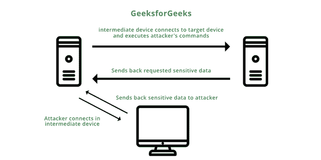

# 什么是 FTP 反弹攻击？

> 原文:[https://www.geeksforgeeks.org/what-is-ftp-bounce-attack/](https://www.geeksforgeeks.org/what-is-ftp-bounce-attack/)

**先决条件**–[文件传输协议](https://www.geeksforgeeks.org/file-transfer-protocol-ftp/)

FTP Bounce 攻击是一种旧类型的网络攻击，在 FTP 服务器上执行，将出站流量发送到设备，通常是网络中的另一台服务器。它利用了**被动模式 FTP，**客户端启动控制和数据连接。攻击者发出**端口**命令，欺骗 FTP 连接执行命令，并从另一台设备而不是目标服务器提取敏感信息。通过这种攻击，攻击者间接控制受害者的机器在网络中请求数据，并从 [FTP 服务器](https://www.geeksforgeeks.org/ftp-server-working-and-its-benefits/)向其发送流量。这使得攻击者能够与网络上的第三个设备通信，并从该设备获得对敏感信息的未授权访问。

*例如，*考虑一个设备 **A** 没有访问服务器的权限，但是另一个设备 **B** 有访问该服务器中数据的权限。攻击者通过授权设备 **B.** 执行 FTP Bounce 攻击以获得对服务器的访问权限

但是，今天的文件传输协议服务器具有默认阻止此类攻击发生的功能，但是如果您在现代文件传输协议服务器中错误配置了这些功能，则可能导致服务器容易受到文件传输协议反弹攻击。

### FTP 反弹攻击操作

FTP 反弹攻击是这样进行的:

1.  让我们假设有一个攻击者 **A.**
2.  网络中有两台服务器( **P 和 Q** )和一台客户端 **(C)** 。
3.  这里 **Q** 是网络上的第三个设备。

文件传输协议反弹攻击

**步骤 1:** 攻击者 **A** 在客户端 **C** 和服务器 **P** 之间建立 FTP 控制连接。

**第二步:**攻击者 **A** 发出数据连接的端口命令，但是攻击者在端口命令中指定的不是客户端 **C** 的 IP，而是服务器 **Q** 的 IP。

**第三步:**现在攻击者 **A** 发送要执行的命令列表到服务器 **P** 。该列表包括使用端口命令打开从服务器 **P** 到服务器 **Q** 的被动连接等命令，但攻击者给出的不是服务器 **P** 的 IP，而是攻击者 **A** 的 IP。因此，未经授权访问服务器上的文件**问**

**第四步:**服务器 **Q** 发送服务器 **P** 请求的数据。服务器 **P** 然后将该数据发送回攻击者 **A.**

### 损害会导致

**1。数据丢失到未经授权的系统** ***:*** 这是一个巨大的数据问题。此类数据的丢失会影响任何企业或个人。

**2。攻击者可能会修改敏感数据** ***:*** 攻击者可能会修改对您的需求至关重要的敏感信息。攻击者可能会声称只有在您满足他们的要求后才会释放原始数据。这将在数据和金钱方面给企业带来巨大损失。

### 预防措施

**1。**现代 FTP 服务器默认会处理此类攻击。今天的 FTP 服务器只接受从始发主机发起连接的 [**端口**](https://www.geeksforgeeks.org/port-security-in-computer-network/) 命令。它拒绝任何其他试图连接到不同设备 IP 的**端口**命令。个人可以在其系统中检查此默认功能。

**2。**此外，还可以配置防火墙来拒绝端口 20 上的请求。端口 20 是被动 FTP 的默认端口，被认为非常不安全。