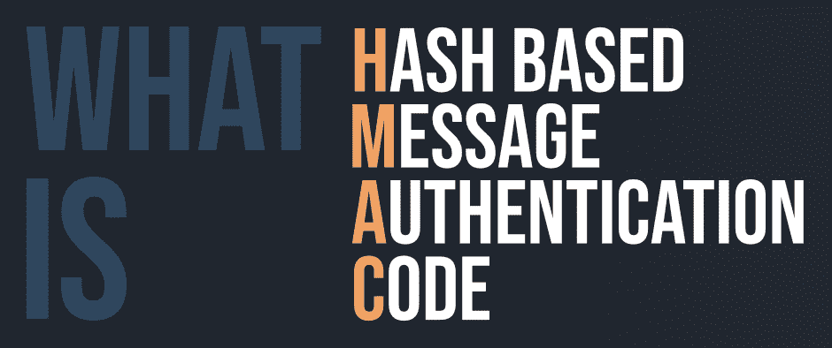
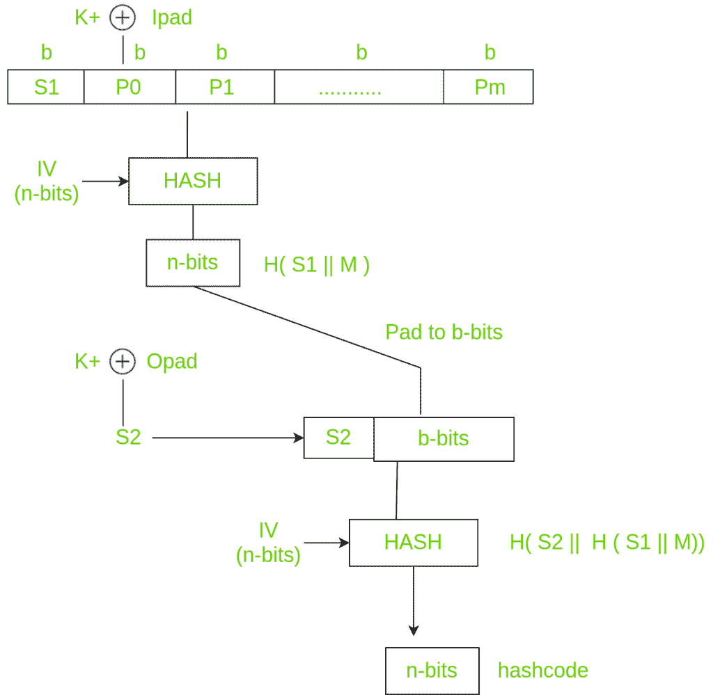

# 什么是 HMAC(基于哈希的消息认证码)？

> 原文:[https://www . geesforgeks . org/what-is-HMA chash-based-message-authentication-code/](https://www.geeksforgeeks.org/what-is-hmachash-based-message-authentication-code/)

**HMAC** (基于哈希的消息认证码)是一种消息认证码(MAC)，通过对要认证的数据(即)和秘密共享密钥执行加密哈希函数来获取。像任何媒体访问控制一样，它用于数据完整性和身份验证。检查数据完整性对于参与通信的各方来说是必要的。HTTPS、SFTP、FTPS 和其他传输协议使用 HMAC。密码散列函数可以是 MD-5、SHA-1 或 SHA-256。数字签名几乎与 HMACs 相似，即它们都使用散列函数和共享密钥。区别在于密钥，即 HMACs 使用对称密钥(相同的副本)，而签名使用非对称密钥(两个不同的密钥)。



#### 历史

与业务相关的流程和决策在很大程度上依赖于完整性。如果攻击者篡改这些数据，可能会影响流程和业务决策。因此，当通过互联网在线工作时，必须注意确保完整性，或者至少知道数据是否被更改。这就是 HMAC 开始使用的时候。

**应用程序**

*   在激活或创建帐户期间验证电子邮件地址。
*   对发送到客户端浏览器然后提交回来的表单数据进行身份验证。
*   HMACs 由于成本较低，可用于物联网(IoT)。
*   每当需要重置密码时，都会发送一个可以使用一次的链接，而无需添加服务器状态。
*   它可以接受任何长度的消息，并将其转换为固定长度的消息摘要。也就是说，即使你得到一个长消息，消息摘要也会很小，从而允许最大化带宽。

#### HMAC 的工作

HMACs 为客户端和服务器提供了一个只有它们自己知道的共享私钥。客户端为每个请求生成一个唯一的哈希(HMAC)。当客户端请求服务器时，它用私钥对请求的数据进行哈希处理，并将其作为请求的一部分发送。消息和密钥都在不同的步骤中进行哈希处理，以确保其安全性。当服务器收到请求时，它会创建自己的 HMAC。对两个 HMACS 进行比较，如果两者相等，则认为客户端是合法的。

HMAC 的公式【T0:

```
 HMAC = hashFunc(secret key + message) 
```

有三种类型的身份验证功能。它们是消息加密、消息认证码和散列函数。MAC 和 hash(这里是 HMAC)的主要区别在于密钥的依赖性。在 HMAC，我们必须在纯文本上应用散列函数和密钥。哈希函数将应用于纯文本消息。但是在应用之前，我们必须计算 S 位，然后将其附加到纯文本中，然后应用哈希函数。为了生成这些 S 位，我们使用发送方和接收方共享的密钥。



使用键 K (0 < K < b), K+ is generated by padding O’s on left side of key K until length becomes b bits. The reason why it’s not padded on right is change(increase) in the length of key. b bits because it is the block size of plain text. There are two predefined padding bits called ipad and opad. All this is done before applying hash function to the plain text message. 

```
 ipad - 00110110 
 opad - 01011100
```

**现在我们要计算 S 位**
K+用 ipad 异或，结果是 S1 位，相当于 b 位，因为 K+和 ipad 都是 b 位。我们必须给 S1 添加纯文本信息。让 P 为纯文本消息。
S1、p0、p1 至 Pm 各为 b 位。m 是纯文本块的数量。P0 是纯文本块，b 是纯文本块大小。将 S1 附加到纯文本后，我们必须应用哈希算法(任何变体)。同时，我们必须应用初始化向量(ⅳ)，这是一个大小为 n 位的缓冲区。因此，产生的结果是 n 位 hashcode，即 H( S1 || M)。
同样，n 位被填充到 b 位，K+被运算放大器异或，产生输出 S2 位。S2 被附加到 b 位，并且散列函数再次与 IV 一起被应用到块。这进一步导致 n 位 hashcode 为 H( S2 || H( S1 || M))。

**总结:**T2】

1.  选择 K.
    如果 K < b，在左边填充 0，直到 k=b. K 在 0 和 b 之间(0 < K < b)
2.  用 ipad EXOR K+相当于 b 位产生 S1 位。
3.  用纯文本 M 附加 S1
4.  将 SHA-512 应用于(S1 || M)
5.  填充 n 位，直到长度等于 b 位
6.  运算放大器相当于产生 S2 位的 b 位。
7.  将步骤 5 的输出附加到 S2。
8.  在步骤 7 中应用 SHA-512 来输出 n 位 hashcode。

#### 优势

*   HMACs 非常适合像路由器这样的高性能系统，因为它使用了哈希函数，与公钥系统不同，哈希函数可以快速计算和验证。
*   数字签名比头盔显示器更大，但头盔显示器提供相对更高的安全性。
*   HMACs 用于公共密钥系统被禁止的行政部门。

#### 不足之处

*   HMACs 使用共享密钥，这可能会导致不可否认性。如果发送者或接收者的密钥被泄露，那么攻击者将很容易创建未经授权的消息。