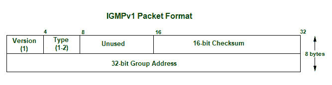
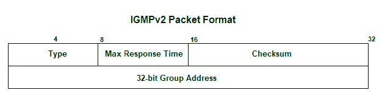
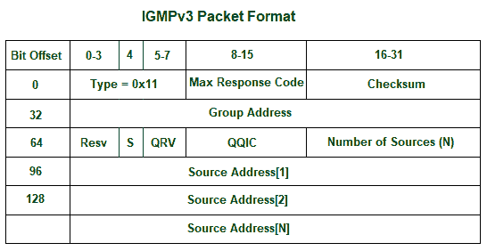
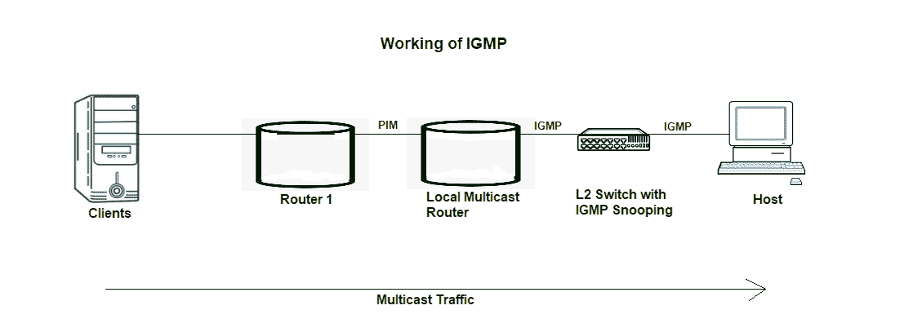

# 什么是 IGMP(互联网组管理协议)？

> 原文:[https://www . geesforgeks . org/what-is-igmpiinternet-group-management-protocol/](https://www.geeksforgeeks.org/what-is-igmpinternet-group-management-protocol/)

**IGMP** 是**互联网群组管理协议**的首字母缩写。IGMP 是主机和相邻路由器使用的一种通信协议，用于与 IP 网络进行多播通信，并有效地使用资源来传输消息/数据包。多播通信可以具有单个或多个发送器和接收器，因此，IGMP 可以用于流式视频、游戏或网络会议工具。该协议用于 IPv4 网络，为了在 IPv6 上使用该协议，组播由组播侦听器发现(MLD)管理。像其他网络协议一样，IGMP 在网络层使用。MLDv1 在功能上与 IGMPv2 几乎相同，MLDv2 与 IGMPv3 几乎相似。

通信协议 IGMPv1 于 1989 年在斯坦福大学开发。IGMPv1 于 1997 年更新为 IGMPv2，并于 2002 年再次更新为 IGMPv3。

**应用:**

*   **流式传输–**
    多播路由协议用于网络上的音频和视频流，即一对多或多对多。
*   **Gaming–**
    互联网群组管理协议常用于网络上有多个用户的模拟游戏，如网络游戏。
*   **网络会议工具–**
    视频会议是一种在你方便的时候与人见面的新方法，IGMP 连接用户进行会议，并高效地传输消息/数据包。

**类型:**
IGMP 有 3 个版本。这些版本向后兼容。以下是 IGMP 的版本:

**1。igmp v1:**
IGMP 通信协议版本允许所有支持主机使用成员请求加入多播组，并包括一些基本功能。但是，主机不能自己离开组，必须等待超时才能离开组。
igmp v1 中的报文分组格式:



*   **版本–**
    设为 1。
*   **键入–**
    1 进行主机成员资格查询和主机成员资格报告。
*   **未使用–**
    8 位零，无用。
*   **校验和–**
    是 IGMP 报文总和的补码。
*   **群组地址–**
    群组地址字段在成员资格查询消息中发送时为零，接收时忽略。在成员报告消息中，组地址字段采用被报告组的 ip 主机组地址。

**2。IGMPv2 :**
IGMPv2 是 IGMPv1 通信协议的修订版。它增加了使用组成员身份离开多播组的功能。
igmp v2 中的消息包格式:



**型–**

```
0x11 for Membership Query
0x12 for IGMPv1 Membership Report
0x16 for IGMPv2 Membership Report
0x22 for IGMPv3 Membership Report
0x17 for Leave Group 
```

*   **最大响应时间–**
    除成员资格查询之外的消息类型忽略此字段。对于成员资格查询类型，这是发送响应报告之前允许的最长时间。该值以 0.1 秒为单位。

*   **校验和–**
    是 IGMP 报文总和的补码。*   **Group Address –**
    It is set as 0 when sending a general query. Otherwise, multicast address for group-specific or source-specific queries.

    **3。IGMPv3 :**
    IGMPv2 修改为 IGMPv3，增加了特定源组播和成员报告聚合。这些报告将发送到 224.0.0.22。

    IGMPv3 中的消息包格式:

    

    *   **最大响应时间–**
        除成员资格查询之外的消息类型忽略此字段。对于成员资格查询类型，这是发送响应报告之前允许的最长时间。该值以 0.1 秒为单位。
    *   **校验和–**
        是 IGMP 报文总和的补码。
    *   **组地址–**
        发送一般查询时设置为 0。否则，多播地址用于特定于组或特定于源的查询。
    *   **Resv–**
        发送时设置为零，接收时忽略。
    *   **S 标志–**
        表示抑制路由器侧处理标志。当该标志被设置时，它指示抑制多播路由器在接收到任何查询时执行的定时器更新。

    *   **QRV–**
    它代表了克雷耶的稳健变量。路由器继续从最近接收的查询中检索 QRV 值作为它们自己的值，直到最近接收的 QRV 为零。*   **QQIC–**
    代表查询者的查询区间代码。*   **源数量–**
    它表示查询中存在的源地址数量。对于常规查询或特定于组的查询，此字段为零；对于特定于组和源的查询，此字段非零。*   **Source Address[i] –**
    It represents the IP unicast address for N fields.

    **工作:**
    IGMP 在能够处理组播组和动态组播的设备上工作。这些设备允许主机加入或退出多播组。这些设备还允许在组中添加和删除客户端。该通信协议在主机和本地多播路由器之间运行。创建多播组时，多播组地址在 D 类(224-239) IP 地址的范围内，并作为数据包中的目的 IP 地址转发。

    

    L2 或交换机等二级设备被用在主机和组播路由器之间进行 IGMP 窥探。IGMP 监听是以受控方式监听 IGMP 网络流量的过程。交换机接收来自主机的消息，并将成员报告转发给本地多播路由器。使用 PIM(协议无关多播)将多播流量从本地多播路由器进一步转发到远程路由器，以便客户端可以接收消息/数据包。希望加入网络的客户端在查询中发送加入消息，交换机拦截该消息，并将客户端的端口添加到其多播路由表中。

    **优势:**

    *   IGMP 通信协议有效地将多播数据传输到接收器，因此，没有垃圾分组被传输到主机，这显示出优化的性能。
    *   由于所有共享链路都已连接，带宽被完全消耗。
    *   主机可以离开一个多播组并加入另一个多播组。

    **缺点:**

    *   它不能提供良好的过滤效率和安全性。
    *   由于缺少 TCP，可能会发生网络拥塞。
    *   IGMP 容易受到一些攻击，如拒绝服务攻击。