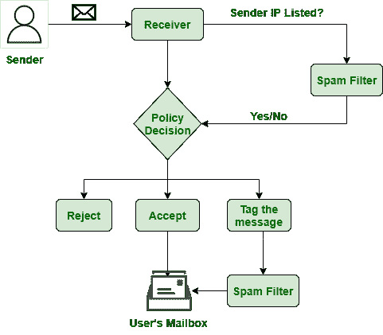

# 什么是 IP 块列表？

> 原文:[https://www.geeksforgeeks.org/what-is-ip-blocklisting/](https://www.geeksforgeeks.org/what-is-ip-blocklisting/)

IP 阻止列表，以前称为阻止列表，是计算机世界中最简单、最有效的访问拒绝类型之一。阻止列表是包含您想要禁止的 IP 地址范围或单个地址的列表。这些列表可以与防火墙、入侵防御系统(IPS)和其他用于保护系统安全的流量过滤软件结合使用。

**为什么一个 IP 地址会被封锁？**
在任何情况下，将 [IP 地址](https://www.geeksforgeeks.org/ip-addressing-classless-addressing/)添加到 IP 阻止列表大多是由于以下原因之一:

1.  垃圾邮件是故意发送的，或者超过了每日发送限制，
2.  电子邮件接收者将收到的通信标记为垃圾邮件。
3.  邮件服务器遭到黑客攻击，被用来大规模发送垃圾邮件或有害电子邮件。
4.  网络罪犯控制了一个域，并将其用于非法目的。
5.  网络上有人感染了恶意软件。
6.  这个小工具感染了可疑的软件。
7.  该 IP 地址链接到一个潜在的危险网站。
8.  一个先前的用户以不利的方式使用了该 IP 地址。

**IP 封锁列表的类型:**
有四种类型的 IP 封锁列表–

1.  **基于电子邮件的阻止列表–**
    电子邮件阻止列表起到垃圾邮件过滤器的作用，确保潜在危险或垃圾邮件不会到达预期收件人。
2.  **域名系统/基于 DNS 的阻止列表–**
    基于 DNS 的阻止列表通过将域名与可能涉及垃圾邮件或可能危险的电子邮件的 IP 地址进行匹配来运行。
3.  **基于网络钓鱼的阻止列表–**
    类似于 Google Safe Browsing、PhishTank 和 OpenPhish 提供的阻止列表是为了检测网站上的网络钓鱼和恶意软件相关活动而创建的
4.  **基于恶意软件的阻止列表–**
    当网站因有害行为而被阻止列表时，数据库会提醒被标记网站的站长注意即将到来的 IP 阻止列表。

知识产权封锁清单

**DNS 封锁列表**和**邮件封锁列表**链接。类似地，**钓鱼阻止列表**和**恶意软件阻止列表**是链接的。

**挑战:**
虽然封锁列表是限制特定 IP 地址访问您网络的有效策略，但也不是没有缺陷。这是因为攻击者设计了各种方法来规避阻止列表。这些战略的几个例子如下:

1.  **更改 IP 地址–**
    为了避免被封杀，很多攻击者不断更改自己的 IP 地址。犯罪分子可能有多种地址可供选择，如果其中一个地址被封锁，他们就可以转移地址。
2.  **IP 欺骗–**
    在网络层攻击(例如 DDoS 攻击)中，攻击者可以利用 IP 欺骗使其看起来像是通过不同的 IP 地址连接的。这使得他们在隐藏身份的同时避免被列入黑名单。
3.  **僵尸网络–**
    成千上万的终端用户设备或物联网(IoT)设备被许多攻击者用于巨大的僵尸网络中。攻击者侵入这些设备并获得对它们的控制，或者在许多情况下租用僵尸网络作为黑暗网络上的服务。
4.  **误报–**
    误报是您在使用阻止列表时可能遇到的另一个问题。尽管事实上这些问题与攻击者或安全性无关，但它们仍然会破坏生产效率。
5.  **不准确的 IP 检测–**
    当许多人共享同一个 IP 地址时，又出现了另一个问题。当动态分配 IP 地址时，无法知道当前谁在使用该地址。这意味着阻止一个用户的滥用行为可能会禁止一个真正的用户在未来访问您的网络。