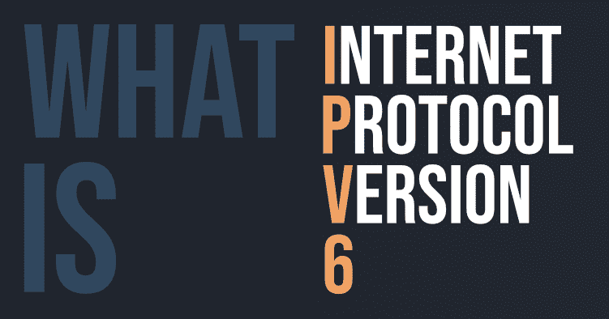

# 什么是 IPv6？

> 原文:[https://www.geeksforgeeks.org/what-is-ipv6/](https://www.geeksforgeeks.org/what-is-ipv6/)

IP 地址是你的数字身份。这是你电脑的网络地址，所以互联网知道在哪里给你发送电子邮件、数据等。

> IP 地址决定了你在数十亿连接到互联网的数字设备网络中的位置和身份。



IPv6 或互联网协议版本 6 是一种网络层协议，允许通过网络进行通信。IPv6 是由互联网工程任务组(IETF)于 1998 年 12 月设计的，由于全球互联网用户呈指数级增长，其目的是取代 IPv4。

#### IPv4 与 IPv6

常见的 IP 地址类型(对于“版本 4”，称为 IPv4)。下面是一个 IP 地址的示例:

```
25.59.209.224
```

IPv4 地址由四个数字组成，每个数字包含一到三个数字，并带有一个点(。)分隔每个数字或数字组。这四个数字的范围可以从 0 到 255。这组分开的数字创建了地址，让您和全球的每个人都可以通过我们的互联网连接发送和检索数据。IPv4 使用 32 位地址方案，允许存储超过 40 亿个地址的 2^32 地址。迄今为止，它被认为是主要的互联网协议，承载 94%的互联网流量。
最初，人们认为它永远不会耗尽地址，但目前的情况为 IPv6 铺平了新的道路，让我们看看为什么？

IPv6 地址由八组四个十六进制数字组成。下面是一个 IPv6 地址示例:

```
3001:0da8:75a3:0000:0000:8a2e:0370:7334
```

这个新的 IP 地址版本正在部署，以满足对更多互联网地址的需求。它旨在解决与 IPv4 相关的问题。128 位地址空间，它允许 340 个不定的唯一地址空间。IPv6 也叫 IPng(互联网协议下一代)。

> IPv6 理论上支持最大值为 340、282、366、920、938、463、463、374、607、431、768、211、456。直截了当地说，我们永远不会再用完 IP 地址。

#### IPv6 地址类型

现在我们已经知道了什么是 IPv6 地址，让我们来看看它的不同类型。

*   **单播地址**
    它标识网络上唯一的节点，通常指单个发送方或单个接收方。
*   **组播地址**
    它代表一组 IP 设备，只能用作数据报的目的地。
*   **选播地址**
    它被分配给一组通常属于不同节点的接口。

#### IPv6 的优势

*   可靠性
*   **更快的速度:** IPv6 支持组播，而不是 IPv4 中的广播。此功能允许带宽密集型数据包流(如多媒体流)同时发送到多个目的地。
*   **Stringer Security:** 提供机密性和数据完整性的 IPSecurity 嵌入到 IPv6 中。
*   路由效率
*   最重要的是，它是全球网络中不断增长的节点的最终解决方案。

#### IPv6 的缺点

*   **转换:**由于目前广泛使用 IPv4，完全转向 IPv6 需要很长时间。
*   **通信:** IPv4 和 IPv6 机器之间不能直接通信。他们需要一种中间技术来实现这一点。