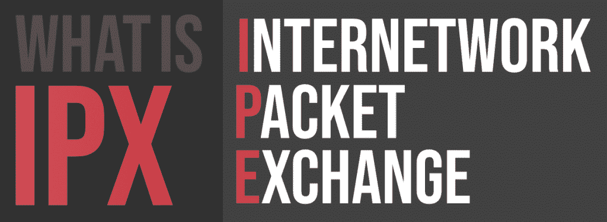

# 什么是 IPX(网间分组交换)？

> 原文:[https://www . geesforgeks . org/what-is-ipxinternawk-packet-exchange/](https://www.geeksforgeeks.org/what-is-ipxinternetwork-packet-exchange/)

**IPX** 是一种网络协议，用于处理端到端的活动和事务，以便及时、受管理和保护数据。最初由 Novell NetWare 操作系统使用，后来被 Windows 采用。随着它们取代了网络软件局域网，它们在部署微软视窗局域网的网络上得到了广泛的应用。

IPX/SPX 或网间分组交换/顺序分组交换是由 Novell 开发的，是对 TCP/IP 协议套件的替代。这是在 20 世纪 80 年代早期由 Novell 的网络软件 Netware 引入的。20 世纪 80 年代引进的 IPX 直到 20 世纪 90 年代仍然相当受欢迎。此后，TCP/IP 协议在很大程度上取代了它。

#### IPX 的工作

IPX 是网络层，而 SPX 是 IPX/SPX 网络协议的传输层。IPX 协议和 IP 协议具有相似的功能，这定义了设备之间如何发送和接收数据。传输层协议或 SPX 协议用于建立和维护设备之间的连接。它们可以一起用于传输数据和在系统之间创建网络连接。
当数据包从一个系统发送到另一个系统时，IPX 不要求保持一致的连接，这就是所谓的无连接。它可以从由于连接不良或断电而中断的位置恢复传输。

#### 应用程序

IPX 提供点对点支持连接。像 IP 一样，IPX 也包含最终用户数据，并且是无连接的，就像网络地址一样。
Novell 最初的 NetWare 客户端是为 DOS 编写的。20 世纪 90 年代，IPX 支持像《地震》、《下凡》和《魔兽争霸 2》这样的电子游戏进行网络游戏。Kali 是一种服务的名称，它被用作模拟器，让玩家在线游戏

#### 优势

*   IPX/SPX 主要是为局域网设计的，仅用于局域网时非常有效。
*   IPX 的地址空间更大:48 位，而不是 IPv4 中的 32 位。
*   IPX 地址包含本地媒体访问控制地址:与 IPv4 的“地址分配”相比。
*   IPX 没有 BootP 或 DHCP。(DHCP 是从 BootP was 发明的，因此 IPv4 可以像 IPX 那样允许“即插即用”的网络寻址。它后来被添加到 IPv6 中。)

#### 不足之处

*   如今，IPX 已经落伍了。TCP/IP 之所以被广泛使用，主要是因为它在广域网和互联网上的卓越性能，以及它是一种基于同样目的而创建的更成熟的协议。TCP/IP 的真正优势是互操作性和独立于供应商的开放标准。
*   随着 IPX 应用程序和互联网的使用，如果您实施虚拟专用网络，成本会更高。
*   将 IPX 帧封装和加密在一个 IP 数据包中需要比执行直接的 IPSec VPN 更昂贵的硬件。