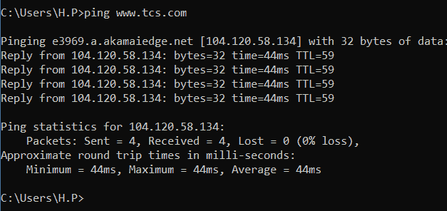
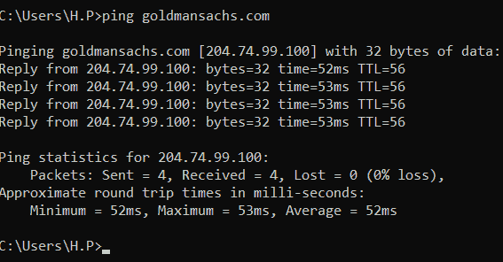

# 什么是潜伏期？

> 原文:[https://www.geeksforgeeks.org/what-is-latency/](https://www.geeksforgeeks.org/what-is-latency/)

**什么是潜伏期？**

*   简单延迟意味着无论何时您向系统提供输入，以及提供输出所需的总时间周期，因此特定的时间周期/间隔称为延迟。
*   实际上，延迟是计算机的中间处理时间，因为你们中的一些人可能认为，每当某个系统与另一个系统连接时，它会直接发生，但不会，信号或数据会遵循正确的跟踪路线到达其最终目的地。
*   如今，光纤电缆被用来以光速将信号/数据从一个地方传输到另一个地方，但很明显，在到达最终目的地之前，数据/信号必须通过许多检查点或哨所，并遵循适当的跟踪路线，因此需要一些时间才能从接收器获得响应，这一轮总时间被称为延迟。
*   如果你想知道从一个地方到另一个地方最快的网络连接，那么我们假设光是一种媒介，因为光只需要 100 毫秒(大约。)来兜一圈地球。因此，根据数据，如果你让光作为媒介，那么你可以在世界的另一边每秒发送 20 个数据包。

**什么是平？**

*   为了让大家更加清楚，我们将在这里使用 ping，ping 不仅仅是一个概念或解决方案，用于检查系统之间的连接中产生的延迟值。Ping 只需向用户提供的地址发送 4 个数据包来检查 ping，然后计算响应到达的总时间，即所谓的延迟，从而检查延迟值。
*   使用语法“Ping <space>网站名称”，从命令提示符检查窗口 ping，从终端检查 MAC。</space>

**示例–**
我们举一个真实的例子，这里我们将 ping 通 2 个网站，一个在我附近，名为 ***【塔塔咨询服务】*** 一个在海外，名为 ***【高盛】*** ，看看会发生什么。

相对于上行链路的传输控制系统 ping(印度)

高盛集团(印度)

现在，您可以观察到 ***【塔塔咨询服务】*** 的最大延迟将达到 44 毫秒，而 ***【高盛】*** 的最大延迟为 53 毫秒，这是因为要测量 ping 的起始位置。你也可以说任何特定网站的 ping 与距离成正比。

**一些常见的延迟原因:**

1.  **传输介质–**
    传输数据或信号的介质的材料/性质会影响延迟。
2.  **内存空间不足–**
    内存空间不足给操作系统维持内存需求带来了问题。
3.  **传播–**
    信号将数据从一个源传输到另一个源所需的时间。
4.  **多台路由器–**
    正如我之前所讨论的，数据通过完整的 traceroute 传输意味着它会从一台路由器传输到另一台路由器，从而增加延迟等。

**降低延迟的方法如下:**
**提高网速&带宽–**
要让互联网流畅运行，你需要至少 15mbps 的网络连接速度。现在，谈到带宽，如果其他成员在玩网络游戏、直播或视频通话，会对您的性能产生影响，因此您需要大量带宽来处理一切。

1.  **HTTP/2–**
    它通过减少信号的路径或路线来减少信号在接收方和发送方之间传输的时间。
2.  **CDN–**
    如果你使用 CDN，它将缓存来自世界各地的用户附近的所有数据或资源，允许信号从附近的资源中检索数据，而不是回到原点。
3.  **靠近你的路由器–**
    信号从一台路由器无线传输到下一台路由器，但它们可能会被墙壁、家具等物体中断或阻挡。将您的系统放在家中连接良好的地方。
4.  **升级宽带套餐–**
    有时候宽带连接提供商是个问题，所以如果你找到了比你目前使用的更好的方案，那就切换。
5.  **重启你的路由器–**
    如果你的路由器开了很长时间，重启一下刷新一下，缓解一下持续的压力。
6.  **关闭后台运行应用程序–**
    如果您正在使用亚马逊 Prime、网飞、Hotstar、YouTube 或直播，请将其关闭，因为它们会显著降低系统的 ping 速率。
7.  **在本地服务器上玩游戏–**
    为了确保良好的连接，请始终尝试在本地服务器上玩在线世界游戏。
8.  **使用以太网电缆–**
    使用有线连接进行互联网连接始终是一个不错的选择，但您将是唯一可以使用互联网的人；其他人将无法这样做。事实上，这是有益的，因为信号可以通过电线进入您系统的准确畅通路径，这意味着它们不必到处传播和遇到障碍，从而减少延迟。

你可以在 YouTube 上找到许多其他减少延迟的技巧和方法，并自担风险进行尝试。