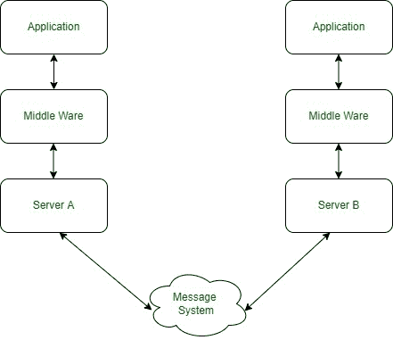
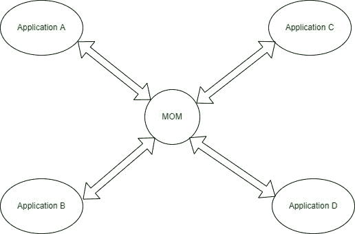
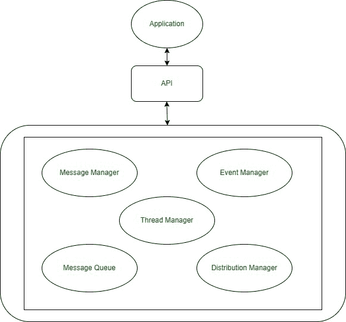

# 什么是面向消息的中间件(MOM)？

> 原文:[https://www . geesforgeks . org/什么是面向消息的中间件-mom/](https://www.geeksforgeeks.org/what-is-message-oriented-middleware-mom/)

**MOM 的完整形式是面向消息的中间件**，它是一个允许通信和交换数据(消息)的基础设施。它涉及应用程序之间的数据传递，使用的是一个携带独立信息单元(消息)的通信通道。在基于 MOM 的通信环境中，消息异步发送和接收。

MOM 提供[异步通信](https://www.geeksforgeeks.org/asynchronous-communication-interface/)，它只是发送消息并执行其异步操作。它由依赖异步消息传递的应用程序间通信软件组成，异步消息传递与请求-响应架构相反。因此，异步系统由一个消息队列组成，该队列提供了一个临时阶段，以便目标程序变得繁忙或可能无法连接。消息队列有助于在 MOM 平台上存储消息。MOM 客户端可以通过队列发送和接收消息。

队列是在 MOM 中实现异步交互的核心组件。

*   中间件是充当两个或多个对象之间的链接的软件
*   中间件简化了复杂的分布式应用程序，
*   它由 web 服务器、应用服务器等组成，是基于 [XML](https://www.geeksforgeeks.org/xml-basics/) 、 [SOAP](https://www.geeksforgeeks.org/basics-of-soap-simple-object-access-protocol/) 、[面向服务架构](https://www.geeksforgeeks.org/service-oriented-architecture/)的现代信息技术的集成。

### **中间件**的块表示:****

中间件

### **特性和功能**

1.  统一消息
2.  供应和监控
3.  动态缩放
4.  管理和控制工具
5.  动态缩放
6.  灵活的服务质量
7.  安全通信
8.  与其他工具的集成

### **消息队列在 MOM 中的结构和工作方式:**

消息队列

MOM 支持分布式组件之间的通信。中间件使分布式环境中的编程更加容易。它就像[分布式计算](https://www.geeksforgeeks.org/mpi-distributed-computing-made-easy/)架构的操作系统(OS)，并为应用程序提供透明性。

面向消息的中间件充当不同应用程序的中间件，例如:

MOM 部署

上图是一个面向消息的基于中间件的分布式系统部署，它提供了一种基于服务的进程间通信方法。MOM 的消息传递与邮政服务相同。

### 面向消息中间件的架构【T0:

妈妈的建筑

### **中间件类型:**

1.  数据库中间件
2.  应用服务器中间件
3.  消息中间件
4.  面向消息的中间件
5.  事务处理中间件

### **面向消息的**中间件**的角色**

1.  消息分发可以在复杂的信息技术系统上实现。
2.  它充当两个不同应用程序或平台的连接器。
3.  MOM 有助于在不同的 IT 组织之间实现消息传递。
4.  它将创建一个与各种操作系统兼容的分布式产品。
5.  MOM 允许各种软件组件可以相互对话。
6.  它是一种中间件，由连接到不同应用程序的几条线组成。
7.  它连接了不同的技术，包括消息来源和传递目的地。
8.  它连接前端和后端系统。

#### **示例:**

MQTT(用于遥测传输的消息队列):大多数 MQ 系统和协议都是针对备份和企业应用程序的，这些类型的技术不适合像传感器节点这样的受限设备。这类设备通常在内存、带宽和功耗方面受到限制。

MQTT 是一个面向消息的协议，面向无线传感器网络、M2M(mobile 2 mobile)等应用，最终面向物联网(大量节点和应用松散地通过一个消息传递系统)。

### **优势**

1.  松耦合
2.  可量测性
3.  快的
4.  可靠性
5.  有效性

### **劣势**

1.  在架构中需要额外的组件
2.  糟糕的编程抽象
3.  队列抽象的一对一通信
4.  未在某些平台上实现