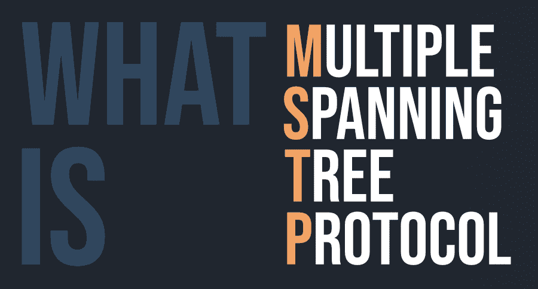

# 什么是 MSTP(多生成树协议)？

> 原文:[https://www . geesforgeks . org/what-is-MSTP multiple-生成树-protocol/](https://www.geeksforgeeks.org/what-is-mstpmultiple-spanning-tree-protocol/)

多生成树协议(MSTP)和算法通过桥接局域网为任何给定的虚拟局域网(VLAN)提供直接和完整的网络分配。MSTP 使用 BPDUs 在生成树一致的小工具之间交换数据，通过选择活动的和被阻止的方式，避免在每个 MSTI(多个生成树实例)和 CIST(公共和内部生成树)中出现循环。通常在 STP 中也是如此，不需要物理授权加固连接，也不需要脱离桥圈危险。

#### MSTP 原则

MSTP 可能是一种新的生成树协议，其特征是 IEEE 802.1。MSTP 使用不同的生成树实例和多生成树区域。MSTI 可能是虚拟局域网的集合。将不同的虚拟局域网正式分配到一个 MSTI 可以降低通信成本和资产利用率。每个 MSTI 的拓扑是自动计算的，并且活动可以在移动终端之间进行调整。具有相同拓扑的不同虚拟局域网可以映射到单个 MSTI。港口虚拟局域网的转发状态由 MSTI 内的港口国决定。

#### 多个生成树实例端口

*   **根:**给出从桥到 MSTI 区域根的最少提取路径。
*   **指定:**给出从连接的局域网通过网桥到区域根的最轻微的提取路径。
*   **主节点:**将区域的网络提供给位于区域外部的 CIST 根节点。桥港是西斯特地区根的西斯特根港，是整个 MSTI 的主港。
*   **备用或备份:**为网络提供其他网桥、网桥端口或局域网出现故障或被根除的可能性。

#### 优势

*   MSTP 让位于更好的缩放，因为桥需要执行的计算更少。
*   MSTP 允许许多虚拟局域网共享 STP 实例。
*   IEEE 在 802.1Q-2014 报告中对 MSTP 进行了标准化。
*   MSTP 是结构和功能良好的协议

#### 不足之处

*   MSTP 要求将虚拟局域网映射到协议中每个网桥上的 STP 保护。当手动执行时，这将是迟钝和错误倾向的。
*   MSTP 需要良好的网络知识