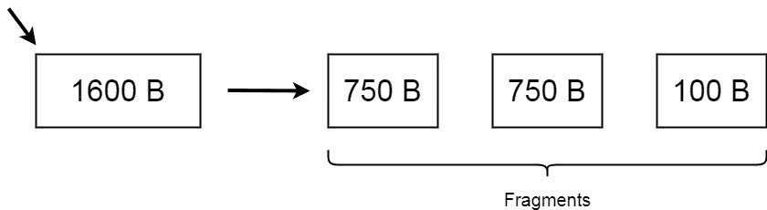
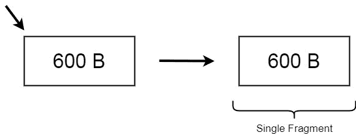

# 什么是 MTU(最大传输单位)？

> 原文:[https://www . geesforgeks . org/what-is-mtumaximum-transmission-unit/](https://www.geeksforgeeks.org/what-is-mtumaximum-transmission-unit/)

最大传输单位也称为 MTU，是网络和操作系统中使用的术语。它定义了在网络连接中作为单个实体传输的最大数据包大小。MTU 的大小决定了网络上可以传输的数据量(以字节为单位)。

更大的 MTU 导致单个连接期间更多的数据传输，因此降低了开销。另一方面，较小的 MTU 可以更快地传输，因为它的大小，从而减少网络中的延迟。因此，应该调整 MTU 的大小，以优化这两个要求。
最大传输单元默认大小为 1500 B，是以太网标准最大单元。

#### 特征

*   MTU 的大小与传输的数据量成正比。更大的 MTU 大小，更大的数据块一次从发送方传输到最终接收方。
*   MTU 大小基于网络管理的规范。
*   如果 MTU 的大小超过路由器的容量，它将再次被重新传输，从而导致延迟。
*   这是网络的最佳数据包大小。

#### MTU 的工作

让我们假设互联网的传输控制协议(TCP)指定了 MTU = 750 B 的大小，这是可以从源传送到目的地的最大协议数据单元大小。在这种情况下，可能会出现以下情况:

*   如果系统发送的数据包大于 MTU 的大小，即在这种情况下数据包大小> 750 B，那么系统数据包将被分段为更小的数据包，这样它们的大小不会超过最大的数据包大小。将一个大数据包分割成更小的数据块，使这些数据块都不超过最大帧大小的过程称为分片。这些数据稍后会在最终的客户端目的地重新组装。

*   如果系统在 MTU 大小内发送数据包，它们将在网络连接中作为单帧传输。但是，比 MTU 小得多的数据包可能会增加延迟并导致网络效率低下。在这种情况下，不需要重组数据包。

#### 应用程序

最大传输单位有以下应用:

*   MTU 通过互联网使用，主要由 TCP 确定最佳数据包大小。
*   它与以太网协议相关联，被称为协议数据单元(PDU)。