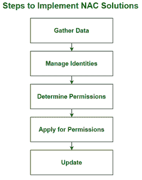

# 什么是网络访问控制？

> 原文:[https://www . geesforgeks . org/什么是网络访问控制/](https://www.geeksforgeeks.org/what-is-network-access-control/)

网络访问控制是一种安全解决方案，它使用一组协议将未经授权的用户和设备排除在专用网络之外，或者对符合网络安全策略的设备进行受限访问。也称为**网络准入控制。**它处理网络管理和安全，实施安全策略、合规性和网络访问控制管理。

NAC 通过识别连接到网络的不同设备在有线和无线网络上工作。对于设置 NAC 网络安全解决方案，管理员将确定协议，这些协议将决定如何为设备和用户授权正确的授权级别。访问规则通常基于标准，例如使用的设备、访问的位置、不同个人的访问权限，以及正在访问的特定数据和资源。

### **网络访问控制方案的组成部分:**

1.  **限制访问:**通过用户认证和授权控制限制对网络的访问。例如，如果没有访问受保护网络资源的权限，用户就不能访问该资源。
2.  **网络边界保护:**监控网络与外部网络的连通性。它包括受控接口、入侵检测和防病毒工具等工具。也叫外线防守。例如，[防火墙](https://www.geeksforgeeks.org/introduction-of-firewall-in-computer-network/)可用于防止网络外部对网络资源的未经授权的访问。

### **网络访问控制类型:**

1.  **预许可:**在用户或设备访问网络的请求初始化时，在允许访问网络之前发生。它评估访问尝试，并且仅当用户或设备符合组织安全策略并且被授权访问网络时才允许访问。
2.  **接纳后:**当用户或设备试图访问网络的不同部分时，它会在网络内发生。它通过为每个访问网络不同部分的请求请求重新认证来限制设备在网络内的横向移动。

### **实施 NAC 解决方案的步骤:**

实施 NAC 解决方案

1.  **收集数据:**进行详尽的调查，收集必须与网络资源连接的每台设备、用户和服务器的信息。
2.  **管理身份:**通过身份验证和授权验证组织内的用户身份。
3.  **确定权限:**创建权限策略，说明已识别用户组的不同访问级别。
4.  **申请权限:**对已识别的用户组应用权限策略，并在 NAC 系统中注册每个用户，以跟踪他们在网络中的访问级别和活动。
5.  **更新:**监控安全操作，根据组织随时间变化的需求对权限策略进行调整。

### **网络访问控制的重要性:**

在过去几年中，访问组织专用网络的移动设备数量呈指数级增长。这导致组织资源的安全风险增加，因此需要一些工具来提供可见性、访问控制和合规性，以加强网络安全基础设施。

NAC 系统可以拒绝不兼容设备的网络访问，或者只允许它们对计算资源进行受限访问，从而防止不安全节点感染网络。此外，NAC 产品可以处理大型企业网络，这些网络连接了大量不同类型的设备。

### **职责:**

1.  它只允许合规、经过身份验证的设备访问网络资源和基础架构。
2.  它控制和监控网络上连接设备的活动。
3.  它将私有组织的网络资源的可用性限制在遵循其安全策略的设备上。
4.  它规定了用户对网络资源的访问。
5.  它通过强制实施安全策略来减少网络威胁，这些策略可以在没有管理员注意的情况下阻止、隔离和修复不合规的计算机。

### **常见用例:**

1.  允许员工使用自己的设备或将公司设备带回家的组织使用 NAC 来确保网络安全。
2.  组织使用 NAC 将对不同网络资源的访问权授予组织外部的人员或设备，这些人员或设备受到不同的安全控制。
3.  NAC 通过将物联网设备分类到具有有限权限的组中，并持续监控其活动，来防止因使用物联网设备而导致的威胁。

### **优势:**

1.  可以要求用户通过多因素身份验证进行身份验证，这比基于 IP 地址或用户名和密码组合来识别用户要安全得多。
2.  它为网络的各个部分提供了额外的保护级别。

### **限制:**

1.  它在物联网设备和没有特定用户与之关联的设备中的可见性较低。
2.  它不能抵御网络内部的威胁。
3.  如果它与现有的安全控制不兼容，可能对组织不起作用。