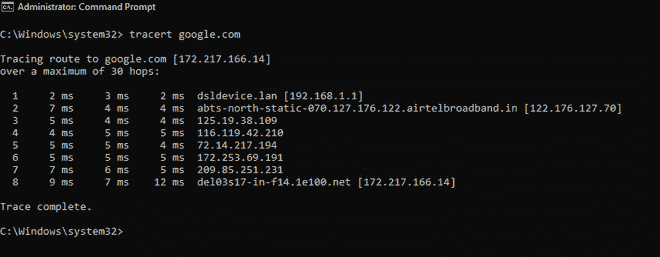

# 什么是网络拥塞？常见原因及解决方法？

> 原文:[https://www . geeksforgeeks . org/什么是网络拥塞-常见原因和修复方法/](https://www.geeksforgeeks.org/what-is-network-congestion-common-causes-and-how-to-fix-them/)

当流经网络的流量超过其最大容量时，就会发生网络拥塞。在大多数情况下，[拥塞](https://www.geeksforgeeks.org/congestion-control-in-computer-networks/)是由于流量突然激增而导致的网络暂时问题，但是，有时网络会持续拥塞，这表明问题更深。最终用户将网络拥塞视为网络速度变慢或处理请求时出现非常大的延迟。

网络拥塞也是以下潜在问题的促成因素:

*   **高延迟****–**
    在拥塞的网络中，数据包到达目的地所需的时间显著增加，因此观察到较高的延迟率。
*   **连接超时****–**
    理想情况下，服务应该等待数据包到达，但在某些情况下，连接会因超时而终止。
*   **丢包****–**
    如果网络拥塞，很多数据包无法到达目的地，最终会因超时而丢弃。

**网络拥塞原因:**

1.  **过度的带宽消耗–**
    网络上的某些用户或设备可能偶尔会比普通用户或设备使用更多的带宽。这会给网络及其路由设备(路由器、交换机和电缆)带来压力，导致网络拥塞。

2.  **糟糕的子网管理–**
    为了更好的资源管理，一个大网络被划分为多个子网。但是，如果子网没有根据使用模式和资源要求进行扩展，可能会出现网络拥塞。

3.  **广播风暴–**
    当网络请求数量突然激增时，就会出现广播风暴。因此，网络可能无法同时处理所有请求。

4.  **组播–**
    当一个网络允许多台计算机同时相互通信时，就会发生组播。在多播中，当两个数据包同时发送时，可能会发生冲突。如此频繁的冲突可能会导致网络拥塞。

5.  **边界网关协议–**
    所有流量都由 BGP 通过最短路径路由。但是，在路由数据包时，它不考虑路由中的流量。在这种情况下，所有数据包都有可能通过相同的路由进行路由，这可能会导致网络拥塞。

6.  **设备太多–**
    每个网络可以管理的数据量都有限制。该容量限制了在性能下降之前网络可以处理的带宽和流量。如果网络链接了太多设备，网络可能会因数据请求而不堪重负。

7.  **过时的硬件–**
    当数据通过旧的交换机、路由器、服务器和互联网交换机传输时，可能会出现瓶颈。由于硬件过时，数据传输可能会受阻或变慢。因此，会出现网络拥塞。

8.  **超额订购–**
    这是一种削减成本的策略，可能会导致网络被迫容纳远超其设计处理量的流量(同时)。

**网络拥塞的影响:**

1.  排队延迟
2.  数据包丢失
3.  慢速网络
4.  阻止新连接
5.  低吞吐量

**网络拥塞测试:**

*   以管理员身份运行命令提示符。
*   在 CMD 窗口中键入**tracert google.com**。

Tracert

*   记下到达最终服务器需要多少跳。
*   对于每一跳，检查 ping 的值。

**如何修复网络拥塞？**

1.  将您的网络划分为可根据流量调整大小的子网。
2.  应该调整 TCP/IP 设置，以平衡数据包发送/请求速度。
3.  通过将更多请求定向到边缘服务器，使用内容交付网络来节省时间。
4.  扼流包用于减少发送方设备的输出，有助于避免[网络拥塞。](https://www.geeksforgeeks.org/congestion-control-techniques-in-computer-networks/)
5.  如果默认路由出现拥塞，您可以使用多跳路由来管理流量。
6.  升级您的互联网计划，以允许更多设备和增加带宽。检查您的设备是否是最新的并且没有过时(甚至是电缆)。

一个好的做法是监控您的网络流量的任何异常变化。这有助于提前发现问题并计划改进。