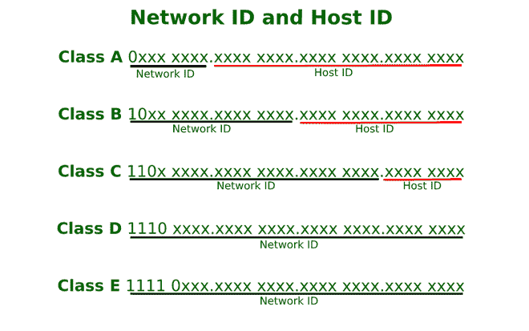
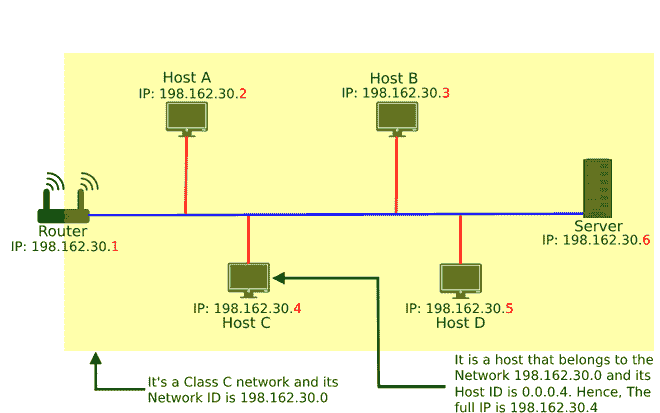

# 什么是 IP 地址中的“网络标识”和“主机标识”？

> 原文:[https://www . geesforgeks . org/什么是网络 id 和主机 id-in-ip 地址/](https://www.geeksforgeeks.org/what-is-network-id-and-host-id-in-ip-addresses/)

IP 地址分为 5 类，即 A 类、B 类、C 类、D 类、e 类，这个概念出现在 20 世纪 80 年代左右。哪里，

*   甲级通常用于大型网络，如互联网服务提供商网络。
*   B 类用于中大型网络，如一些大型组织。
*   C 类地址通常用于较小的网络。
*   D 类地址用于多播。
*   E 类地址是保留地址，用于实验目的。

**所有等级的范围:**

```
Class A: 1.0.0.0 to 127.255.255.255
Class B: 128.0.0.0 to 191.255.255.255
Class C: 192.0.0.0 to 223.255.255.255
Class D: 224.0.0.0 to 239.255.255.255
Class E: 240.0.0.0 to 255.255.255.255
```

**网络 ID:**

网络标识或网络标识是对指定主机的网络进行分类的 IP 地址片段，即它告诉我们主机属于哪个网络，通常由一到四个八位字节组成，以点分十进制表示。

在点分十进制表示中，一个 IP 地址被分成四个八位字节，根据 IP 地址属于哪个类别，其八位字节被进一步分成网络标识和主机标识。

对于 A 类，第一个八位字节表示网络标识，因为第一个八位字节的前缀是 0，它使用剩余的 7 位表示网络标识，对于 B 类，第一个和第二个八位字节表示网络标识，B 类的前缀是 10，因此它使用剩余的 14 位表示网络标识，对于 C 类，第一个、第二个和第三个八位字节表示网络标识，C 类的前缀是 110，因此它使用剩余的 21 位表示网络标识，保留 D 类和 E 类。



**主机 ID:**

它是一个 IP 地址的片段，唯一地对指定的 TCP/IP 网络上的主机进行分类。只需将二进制形式的 IP 地址与其各自的默认子网掩码(二进制形式)相加，就可以找到主机标识。IP 地址的另一个片段是网络标识，它标识主机所属的网络。



主机标识和网络标识

*例如*，在上图中，主机 C 的 IP 地址为 198.162.30.4，表示属于 C 类，因此其默认子网掩码为 255 . 255 . 255 . 0；现在在两者上应用 AND，它将给出主机 ID 0.0.0.4 和网络 ID 198.162.30.0。