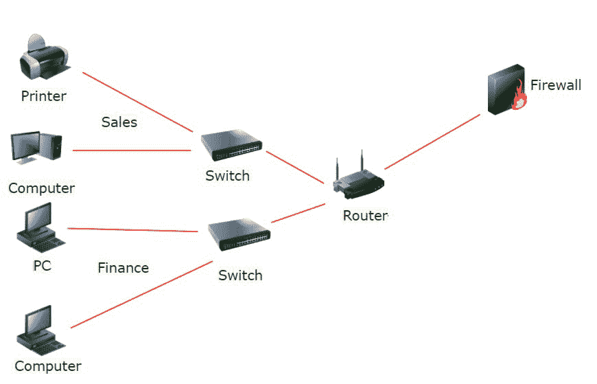

# 什么是网络细分？

> 原文:[https://www.geeksforgeeks.org/what-is-network-segmentation/](https://www.geeksforgeeks.org/what-is-network-segmentation/)

**什么是网络细分？**
在计算机网络中，分段是提高安全性和性能的重要思想。换句话说，网络分段是指在一个网络或网络中创建子网。有时，网络分段也称为网络隔离或网络隔离。如果你想了解更多关于计算机网络的知识，点击这里的[找到一个你选择的话题。](https://www.geeksforgeeks.org/computer-network-tutorials/)

让我们用一个例子来理解，GeekforGeeks 组织有不同的团队，比如销售和财务。两个团队都有自己的网络，但是他们不能访问彼此网络上的文件。如果销售团队希望访问财务团队的文件，则必须通过交换机、路由器，然后通过防火墙。下图清楚地展示了这一点。

组织中的网络细分

因此，在组织中，分割阻止团队之间共享信息。

**网络分段用于什么？**
网络细分对组织有几个好处。它没有单一的用途，但主要用于组织网络。分段还允许通过减少广播域的大小和消除网络上不必要的流量来更有效地利用带宽。分段网络的另一个好处是，它通过不将所有计算机放在同一个网络空间中来减少组织的攻击面，从而增强安全性。当您分离网络时，所有出站和入站流量都必须通过第 3 层设备、路由器和防火墙(如果有)。如果一个团队想通过网络联系另一个团队，流量会通过路由器和防火墙。因此，由于防火墙可以拒绝不必要的流量，因此分段可以让组织对流量有更多的控制。

因此，细分的主要好处可以概括为:

1.  对组织网络有用
2.  允许更有效地使用带宽
3.  增强安全性并降低网络攻击的风险
4.  提高运营绩效

**网络分段类型:**
要对网络进行分段，可以使用两种技术:

1.  物理分割
2.  虚拟分割

要对网络进行物理分段，必须将不同组的设备插入不同的交换机。另一方面，虚拟分段(也称为逻辑分段)意味着使用虚拟局域网(VLAN)。VLAN 设备必须连接到同一个第 2 层设备，通常是同一个交换机，但是位于不同的平台上，因为它们实际上是分开的。使用 VLAN 进行网络分段是一种流行的分段技术，因为它更容易实现。

网络分段还取决于网络中涉及的设备类型。根据业务需求，组织还可以使用多种细分技术的组合。