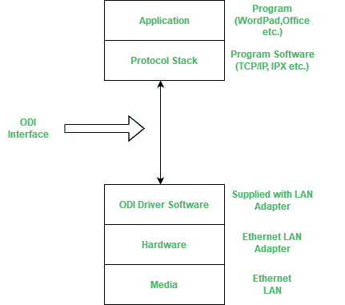

# 什么是 ODI(开放数据链路接口)？

> 原文:[https://www . geesforgeks . org/what-is-ODI open-data-link-interface/](https://www.geeksforgeeks.org/what-is-odiopen-data-link-interface/)

开放数据链路接口是由 Novell 和苹果公司推出的。它用于定义网络接口卡(NIC)驱动程序和网络协议之间的通信机制。它是一种软件接口，允许不同的数据链路层协议在计算机上共享相同的驱动程序或适配器。它位于现场视察模型的第 2 层，即数据链路层。开放数据链路接口(ODI)允许多个网卡绑定到多个协议。
为 ex。TCP/IP 和 IPX/SPX 是数据链路层的不同协议，通过使用 ODI，它们可以共享同一个设备适配器。

